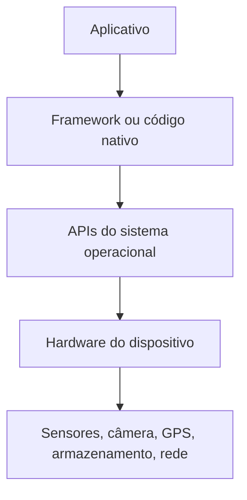
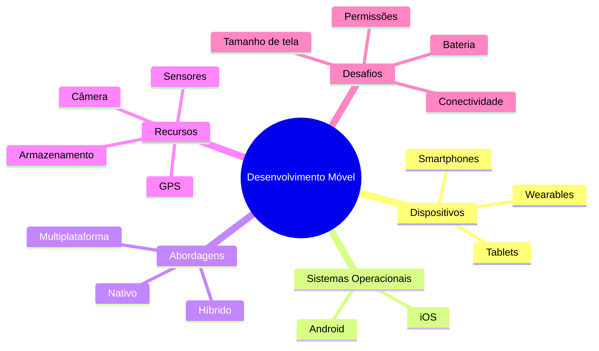

# Encontro 01 - Fundamentos do desenvolvimento para dispositivos móveis

## Visão do encontro

- Carga horária: 90 minutos.
- Objetivo central: construir uma visão geral sólida sobre o que é desenvolvimento móvel, quais tecnologias existem e quais são os principais desafios desse tipo de software.
- Ao final deste encontro, você deve ser capaz de explicar a diferença entre desenvolvimento nativo e multiplataforma, reconhecer o papel dos sistemas operacionais móveis e identificar os principais elementos do ecossistema de desenvolvimento.

## Roteiro

1. O que são dispositivos móveis e por que o desenvolvimento móvel é um campo próprio.
2. Características dos sistemas operacionais móveis.
3. Principais tipos de aplicativos móveis.
4. Desenvolvimento nativo.
5. Desenvolvimento multiplataforma.
6. Comparação entre tecnologias e escolha de stack.
7. Ferramentas básicas do fluxo de trabalho.
8. Exercícios de revisão.

## 1. O que é desenvolvimento para dispositivos móveis

Desenvolvimento para dispositivos móveis é a criação de software para equipamentos portáteis, conectados e sensíveis ao contexto de uso. Diferentemente de um computador tradicional, um dispositivo móvel é usado em movimento, com bateria limitada, tela pequena, conexão variável e forte integração com sensores físicos.

Quando falamos em dispositivos móveis, normalmente pensamos primeiro em smartphones e tablets, mas o ecossistema é maior. Também entram nessa categoria relógios inteligentes, coletores de dados, terminais embarcados, dispositivos vestíveis e, em alguns cenários, até equipamentos industriais com interface móvel.

Isso significa que desenvolver para mobile não é apenas "fazer um sistema caber em uma tela menor". É projetar software considerando:

- pouco espaço visual;
- interação por toque;
- uso intermitente;
- restrições de bateria;
- conectividade instável;
- permissões e privacidade;
- integração com câmera, GPS, sensores, microfone e armazenamento local.

## 2. Exemplos de dispositivos móveis

Veja alguns exemplos de dispositivos e características relevantes:

| Dispositivo | Exemplo de uso | Restrições comuns | Recursos importantes |
|---|---|---|---|
| Smartphone | apps bancários, redes sociais, delivery | tela pequena, bateria, conexão móvel | câmera, GPS, notificações, biometria |
| Tablet | educação, atendimento, catálogos | rotação de tela, múltiplos tamanhos | multitarefa, caneta, tela maior |
| Smartwatch | monitoramento, alertas rápidos | interface mínima, bateria muito limitada | sensores, vibração, proximidade |
| Coletor de dados | logística, estoque | hardware especializado | leitor de código, rede corporativa |
| Dispositivo vestível | saúde, fitness | pouca entrada de dados | sensores biométricos, bluetooth |

## 3. O que torna o software móvel diferente

Uma aplicação móvel precisa conviver com limitações e oportunidades que não aparecem com a mesma intensidade em outros ambientes.

### Restrições

- Menor poder de processamento em comparação com desktops e servidores.
- Menor quantidade de memória disponível.
- Bateria limitada.
- Variação forte de qualidade de rede.
- Diversidade de tamanhos de tela e densidade de pixels.

### Oportunidades

- Geolocalização em tempo real.
- Captura de imagem e vídeo.
- Sensores de movimento.
- Notificações push.
- Uso contextual e personalizado.

## 4. Sistemas operacionais móveis

Os dois sistemas operacionais móveis dominantes no mercado são Android e iOS. Eles desempenham papel semelhante ao Windows, Linux ou macOS em computadores, mas com foco em mobilidade, segurança, gestão de energia e integração com hardware embarcado.

### Android

Android é desenvolvido principalmente pelo Google e usado por diversos fabricantes. Por isso, existe grande variedade de aparelhos, preços, tamanhos de tela e características de hardware.

Pontos importantes do Android:

- maior diversidade de dispositivos;
- maior flexibilidade de publicação e configuração;
- fragmentação maior de versões e fabricantes;
- desenvolvimento nativo tradicionalmente com Kotlin ou Java.

### iOS

iOS é o sistema operacional da Apple para iPhone. O ecossistema é mais controlado, com menor variedade de hardware e maior padronização de comportamento entre dispositivos.

Pontos importantes do iOS:

- ecossistema mais homogêneo;
- diretrizes de interface mais rígidas;
- processo de publicação mais controlado;
- desenvolvimento nativo tradicionalmente com Swift.

## 5. Camadas de um sistema móvel

Um aplicativo móvel não é apenas a interface que você vê. Ele depende de várias camadas trabalhando em conjunto.



Em termos práticos:

- a interface mostra informação ao usuário;
- a lógica de negócio decide o comportamento;
- o sistema operacional oferece serviços;
- o hardware executa a operação física.

Por exemplo, quando um app tira uma foto:

1. a interface mostra o botão "capturar";
2. o aplicativo solicita acesso à câmera;
3. o sistema operacional verifica a permissão;
4. o hardware da câmera faz a captura;
5. a imagem retorna ao app.

## 6. Tipos de aplicativos móveis

Existem diferentes formas de construir software para dispositivos móveis. Antes de escolher uma tecnologia, é preciso entender a abordagem.

### Aplicativos nativos

São desenvolvidos com a linguagem e as ferramentas oficiais de cada plataforma.

- Android: Kotlin ou Java.
- iOS: Swift ou Objective-C.

Vantagens:

- melhor integração com recursos do sistema;
- melhor acesso a APIs nativas;
- alto desempenho;
- maior aderência aos padrões da plataforma.

Desvantagens:

- duas bases de código se o produto precisar rodar em Android e iOS;
- maior custo de manutenção em times pequenos;
- duplicação de esforço em algumas funcionalidades.

### Aplicativos multiplataforma

São desenvolvidos com tecnologias que permitem compartilhar parte relevante do código entre Android e iOS.

Exemplos:

- React Native;
- Flutter;
- Kotlin Multiplatform.

Vantagens:

- maior reaproveitamento de código;
- menor tempo inicial de desenvolvimento;
- mais facilidade para equipes pequenas.

Desvantagens:

- dependência do framework escolhido;
- algumas integrações nativas exigem ajustes adicionais;
- em certos casos, desempenho ou experiência podem exigir customização.

### Aplicativos híbridos ou web encapsulada

São aplicativos baseados em tecnologias web, como HTML, CSS e JavaScript, executados dentro de um contêiner.

Exemplos históricos ou relacionados:

- Cordova;
- Ionic;
- Capacitor.

Essa abordagem pode ser útil em alguns contextos, mas muitas aplicações modernas preferem frameworks com integração mais forte à camada nativa.

## 7. Comparando desenvolvimento nativo e multiplataforma

| Critério | Nativo | Multiplataforma |
|---|---|---|
| Linguagens | Kotlin/Swift | JS/TS, Dart, Kotlin |
| Reaproveitamento de código | Baixo entre plataformas | Alto |
| Desempenho | Muito alto | Alto, dependendo da solução |
| Acesso a recursos do sistema | Direto | Geralmente bom, mas nem sempre imediato |
| Curva para duas plataformas | Mais alta | Menor para times pequenos |
| Custo inicial | Maior | Menor |
| Controle fino da plataforma | Máximo | Médio a alto |

### Regra prática

- Se o projeto exige desempenho extremo, integração profunda com hardware ou experiência altamente específica da plataforma, a abordagem nativa costuma ser mais adequada.
- Se o projeto precisa de velocidade de entrega, equipe reduzida e presença em duas plataformas com o mesmo produto, a abordagem multiplataforma costuma ser uma escolha forte.

## 8. Principais tecnologias do mercado

## Logos das tecnologias citadas

As imagens abaixo ajudam a associar visualmente cada tecnologia ao seu ecossistema. Isso é útil porque, no mercado e na documentação oficial, essas logos aparecem com frequência em sites, repositórios, vídeos, artigos e vagas.

<p align="center">
  
  
  
  
  
</p>

Legenda rápida:

- Android: sistema operacional móvel amplamente usado em dispositivos de diversos fabricantes.
- iOS: sistema operacional móvel da Apple para iPhone.
- React Native: framework multiplataforma baseado em React.
- Flutter: framework multiplataforma mantido pelo Google.
- Kotlin: linguagem fortemente associada ao Android e também ao Kotlin Multiplatform.

### React Native

React Native usa JavaScript ou TypeScript e o modelo de componentes do React para construir interfaces móveis. É a base principal desta disciplina.

Características:

- muito usado por equipes web que migram para mobile;
- grande ecossistema;
- forte reaproveitamento de código;
- boa integração com Android e iOS.

Exemplo simples de componente:

```tsx
import { Text, View } from 'react-native';

export default function App() {
  return (
    <View>
      <Text>Olá, mundo mobile!</Text>
    </View>
  );
}
```

### Flutter

Flutter usa a linguagem Dart e oferece um motor gráfico próprio. É conhecido por alto controle visual e consistência entre plataformas.

Características:

- UI fortemente customizável;
- ótimo desempenho em vários cenários;
- ecossistema muito relevante no mercado atual.

Exemplo conceitual:

```dart
Widget build(BuildContext context) {
  return Scaffold(
    body: Center(
      child: Text('Olá, mundo mobile!'),
    ),
  );
}
```

### Kotlin Multiplatform

Kotlin Multiplatform compartilha principalmente lógica de negócio entre plataformas, preservando partes nativas de UI.

Características:

- forte integração com ecossistema Android;
- interessante quando se quer manter interface nativa;
- reaproveita mais a lógica do que a tela.

### Nativo com Kotlin e Swift

No desenvolvimento nativo, cada app é construído diretamente com as ferramentas oficiais da plataforma.

Exemplo conceitual em Kotlin para Android:

```kotlin
Text(text = "Olá Android")
```

Exemplo conceitual em Swift para iOS:

```swift
Text("Olá iPhone")
```

## 9. Como escolher uma tecnologia

Escolher tecnologia não é questão de moda. É decisão técnica baseada em contexto. Algumas perguntas ajudam:

1. O app precisa rodar em Android e iOS desde o início?
2. A equipe já domina web, Kotlin, Swift ou Dart?
3. O projeto depende muito de câmera, bluetooth, sensores ou processamento pesado?
4. O prazo é apertado?
5. A manutenção será feita por uma equipe pequena ou grande?

## 10. Componentes do ecossistema móvel

Para desenvolver um app, você normalmente precisa de:

- linguagem de programação;
- framework ou SDK;
- editor ou IDE;
- emulador ou simulador;
- dispositivo real para testes;
- gerenciador de dependências;
- sistema de versionamento, como Git.

No caso de React Native com Expo, um fluxo inicial comum é:

```bash
npx create-expo-app app-mobile
cd app-mobile
npm run start
```

Nesse fluxo:

- `npx` executa uma ferramenta temporariamente;
- `create-expo-app` cria o projeto;
- `npm run start` inicia o servidor de desenvolvimento;
- depois você pode abrir o app em emulador, simulador ou celular.

## 11. Emulador, simulador e dispositivo físico

Você encontrará três formas principais de testar um aplicativo:

### Emulador

Reproduz virtualmente um dispositivo, geralmente simulando também parte do hardware ou do ambiente.

### Simulador

Imita o comportamento do sistema operacional, mas nem sempre reproduz todo o hardware real com a mesma fidelidade.

### Dispositivo físico

É o teste no aparelho real. Esse é o cenário mais confiável para validar câmera, GPS, bateria, desempenho, sensores e experiência de uso.

### Comparação rápida

| Ambiente | Vantagem | Limitação |
|---|---|---|
| Emulador/simulador | rapidez para testar e depurar | nem sempre reproduz tudo |
| Dispositivo real | comportamento mais fiel | depende de cabo, instalação e aparelho disponível |

## 12. Conceitos iniciais importantes

Antes de programar de fato, alguns conceitos precisam ficar claros:

### Interface responsiva

A interface precisa se adaptar a diferentes tamanhos e orientações de tela.

### Persistência local

Nem todo dado fica na internet. Muitos apps guardam informações localmente.

### Conectividade

Seu app pode operar com internet rápida, lenta ou nenhuma internet.

### Permissões

Recursos como câmera, localização e microfone exigem autorização do usuário.

### Ciclo de vida

O app pode abrir, pausar, voltar, fechar ou ser interrompido pelo sistema.

## 13. Exemplo de análise de um app real

Pense em um aplicativo de transporte:

- usa GPS para localizar usuário e motorista;
- consome API para buscar corridas;
- usa mapas para exibir rota;
- envia notificações;
- trabalha com internet instável;
- exige interface simples e rápida.

Agora pense em um aplicativo de catálogo offline:

- talvez não precise de GPS;
- pode usar banco local;
- precisa de boa navegação e busca;
- pode funcionar sem internet.

Esses dois exemplos mostram que a tecnologia e a arquitetura dependem do tipo de problema que o app resolve.

## 14. Exemplo de comparação de cenário

### Cenário A: aplicativo institucional simples

Características:

- notícias;
- agenda;
- contatos;
- formulários simples;
- atualização eventual via API.

Escolha provável:

- multiplataforma faz muito sentido;
- desenvolvimento mais rápido;
- bom custo-benefício.

### Cenário B: aplicativo com uso intenso de hardware e performance crítica

Características:

- vídeo em tempo real;
- processamento pesado;
- integração avançada com sensores;
- exigência alta de otimização.

Escolha provável:

- desenvolvimento nativo pode ser mais adequado;
- maior controle da plataforma;
- maior possibilidade de otimização fina.

## 15. Mapa mental do conteúdo



## 16. Exercícios de Revisão

1. O que diferencia um software móvel de um software desktop tradicional?
2. Quais recursos do dispositivo podem ser explorados por um app móvel?
3. Qual é a principal diferença entre desenvolvimento nativo e multiplataforma?
4. Em quais situações o desenvolvimento nativo tende a ser mais indicado?
5. Por que um dispositivo físico continua importante mesmo quando existem emuladores?

## 17. Exercícios de Estudo

- Escreva com suas palavras o que é desenvolvimento móvel e cite três diferenças em relação ao desenvolvimento web tradicional.
- Monte uma tabela comparando Android e iOS em termos de ecossistema, linguagem nativa e perfil de dispositivos.
- Escolha um aplicativo que você usa no celular e liste quais recursos móveis ele utiliza.
- Explique qual abordagem você adotaria para construir um app acadêmico simples e por quê.
- Pesquise um exemplo de aplicativo que provavelmente exigiria desenvolvimento nativo e justifique sua resposta.

## 18. Resumo do encontro

Neste primeiro encontro, a ideia principal é construir repertório. Antes de aprender componentes, navegação e banco local, você precisa entender o ambiente em que o software móvel existe. Dispositivos móveis têm contexto de uso próprio, sistemas operacionais específicos, limitações reais e recursos poderosos. A escolha entre desenvolvimento nativo e multiplataforma depende do problema que você quer resolver, do prazo, da equipe e do nível de integração necessário com a plataforma.

## Materiais complementares

- React Native overview: <https://reactnative.dev/docs/getting-started>
- Expo documentation: <https://docs.expo.dev/>
- Android Developers: <https://developer.android.com/>
- Apple Developer: <https://developer.apple.com/>
- Flutter documentation: <https://docs.flutter.dev/>
- Kotlin Multiplatform: <https://kotlinlang.org/docs/multiplatform.html>
