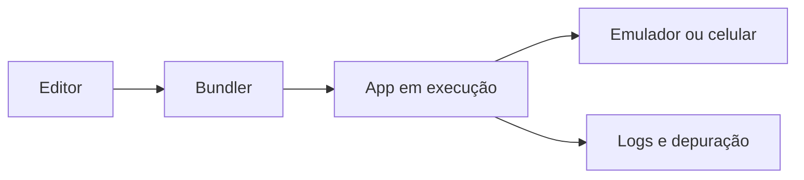

# Encontro 01 - Apresentação da disciplina, ementa, ferramentas e fluxo de trabalho

## Visão do encontro

- Carga horária: 90 minutos.
- Objetivo central: alinhar expectativas, apresentar a trilha da disciplina e preparar o estudante para um fluxo de trabalho profissional.
- Resultado esperado: estudante entende a organização do semestre, instala as ferramentas-base e reconhece o ciclo editar -> executar -> depurar.

## Roteiro didático

1. Abertura e contexto da disciplina.
2. Apresentação da ementa, unidades e critérios de avaliação.
3. Demonstração do ecossistema: Node.js, editor, emulador e dispositivo físico.
4. Introdução ao Git e ao repositório da disciplina.
5. Encerramento com checklist de preparação.

## Explicação técnica

Desenvolvimento móvel multiplataforma exige uma cadeia de ferramentas integrada. O código-fonte é escrito em JavaScript ou TypeScript, processado por um bundler, executado em um runtime JavaScript e conectado à camada nativa do dispositivo. O estudante precisa compreender desde o primeiro encontro que produtividade depende menos de decorar comandos e mais de dominar o fluxo de trabalho.



## Exemplo guiado

```bash
npx create-expo-app app-mobile
cd app-mobile
npm run start
```

Explique que `npx` executa pacotes sem instalação global, `create-expo-app` gera a estrutura inicial e `npm run start` inicia o servidor de desenvolvimento.

## Atividade em sala

- Mapear, em duplas, quais ferramentas cada estudante já usa.
- Montar um checklist de ambiente com sistema operacional, editor, Node.js e emulador.
- Registrar no repositório uma primeira anotação em Markdown sobre expectativas na disciplina.

## Materiais complementares

- Documentação Expo: <https://docs.expo.dev/>
- Introdução ao Git: <https://git-scm.com/doc>
- React Native overview: <https://reactnative.dev/docs/getting-started>
