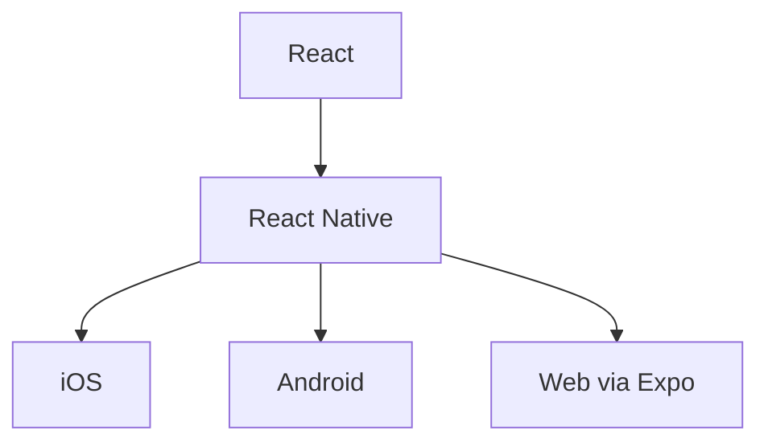

# Encontro 02 - Introdução ao React Native e ecossistema

## Objetivos

- Diferenciar React, React Native e Expo.
- Entender o papel do componente raiz.
- Concluir o setup mínimo do ambiente.

## Sequência pedagógica

1. Revisão do encontro anterior.
2. Discussão sobre aplicações nativas, híbridas e multiplataforma.
3. Criação de um projeto inicial.
4. Leitura comentada da estrutura de pastas.
5. Teste em emulador e em dispositivo físico.

## Explicação técnica

React Native usa o modelo declarativo do React para descrever interfaces, mas renderiza componentes nativos. Em vez de `div` e `span`, usamos `View`, `Text`, `Image` e outros blocos adaptados ao ambiente móvel.

```tsx
import { StatusBar } from 'expo-status-bar';
import { StyleSheet, Text, View } from 'react-native';

export default function App() {
  return (
    <View style={styles.container}>
      <Text>Primeiro app da disciplina</Text>
      <StatusBar style="auto" />
    </View>
  );
}

const styles = StyleSheet.create({
  container: { flex: 1, alignItems: 'center', justifyContent: 'center' },
});
```

## Imagem ou diagrama sugerido



## Exercício orientado

- Criar o projeto da turma.
- Executar no simulador.
- Alterar o texto inicial para exibir nome do estudante e curso.

## Materiais complementares

- Expo Router e ferramentas: <https://docs.expo.dev/router/introduction/>
- Core components: <https://reactnative.dev/docs/components-and-apis>
