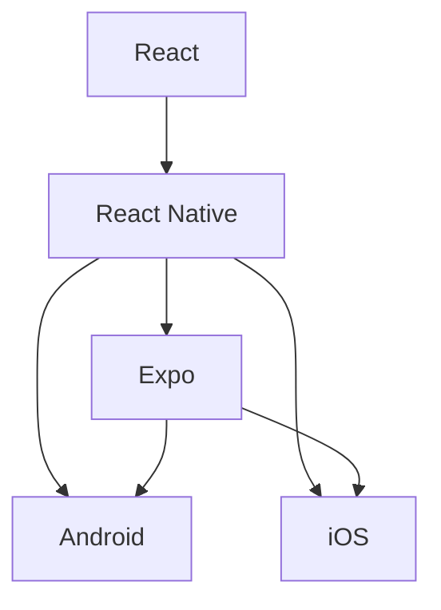
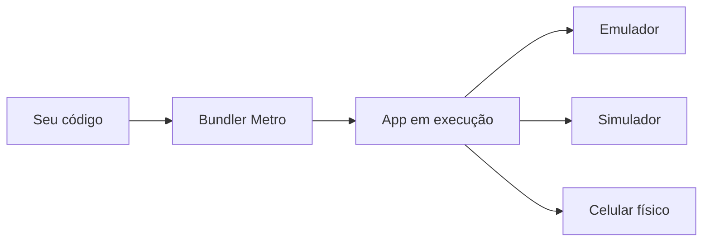

# Encontro 02 - Introdução ao React Native e ao ecossistema de desenvolvimento

## Visão do encontro

- **Objetivo:** compreender como o React Native se posiciona no ecossistema de desenvolvimento móvel e aprender os primeiros elementos práticos para criar, executar e entender um projeto inicial.
- Ao final deste encontro, você deve ser capaz de diferenciar `React`, `React Native` e `Expo`, entender a função do componente principal da aplicação e reconhecer a estrutura básica de um projeto.

## Roteiro

1. Revisão dos conceitos de desenvolvimento móvel vistos no encontro anterior.
2. O que é React.
3. O que é React Native.
4. O que é Expo e como ele simplifica o início do desenvolvimento.
5. Estrutura básica de um projeto.
6. Entendendo o arquivo principal da aplicação.
7. Executando o primeiro app.
8. Emulador, simulador e dispositivo físico no fluxo com React Native.
9. Exercícios de revisão.

## 1. Revisão

No encontro anterior, você estudou o panorama geral do desenvolvimento para dispositivos móveis, incluindo sistemas operacionais, tipos de dispositivos e diferenças entre desenvolvimento nativo e multiplataforma.

Agora o foco fica mais específico: entender uma das principais tecnologias multiplataforma do mercado, o `React Native`, e o ecossistema prático que permite transformar código em um aplicativo rodando no celular.

Em outras palavras:

- no encontro 01, a pergunta principal foi "o que é desenvolvimento móvel?";
- neste encontro, a pergunta principal é "como começamos a desenvolver um app móvel com React Native?".

## 2. O que é React

Antes de entender React Native, você precisa entender React. React é uma biblioteca JavaScript para construção de interfaces baseadas em componentes.

A ideia central do React é simples:

- a interface é dividida em pequenas partes reutilizáveis;
- cada parte pode receber dados;
- quando os dados mudam, a interface é atualizada.

Em vez de manipular manualmente cada detalhe visual da tela, você descreve o que deve aparecer. Essa abordagem é chamada de declarativa.

### Exemplo

```tsx
function Saudacao() {
  return <h1>Olá!</h1>;
}
```

Nesse exemplo:

- `Saudacao` é um componente;
- ele retorna uma descrição da interface;
- o React se encarrega de atualizar a tela quando necessário.

## 3. O que é React Native

React Native aplica a mesma ideia de componentes e interface declarativa ao ambiente móvel. A diferença principal é que, em vez de renderizar elementos de navegador, como `div`, `span` e `button`, ele trabalha com componentes voltados para apps móveis, como `View`, `Text`, `Image`, `TextInput` e `Pressable`.

<p align="center">
  
</p>

### Comparação rápida

| Conceito | React para web | React Native |
|---|---|---|
| Ambiente | navegador | Android e iOS |
| Elementos comuns | `div`, `p`, `button` | `View`, `Text`, `Pressable` |
| Estilo | CSS | objetos JavaScript com `StyleSheet` |
| Saída final | DOM | componentes nativos |

Observação: `DOM` significa `Document Object Model`. Na prática, é a estrutura em árvore que representa os elementos de uma página web no navegador, permitindo que o JavaScript leia e altere esses elementos dinamicamente.

### Exemplo simples em React Native

```tsx
import { Text, View } from 'react-native';

export default function App() {
  return (
    <View>
      <Text>Olá, React Native!</Text>
    </View>
  );
}
```

Nesse exemplo:

- `View` funciona como um contêiner visual;
- `Text` exibe texto na tela;
- `App` é o componente principal do aplicativo.

## 4. React, React Native e Expo: qual a diferença

Esse é um ponto que costuma gerar confusão no início.

### React

React é a base conceitual e a biblioteca de interface. Ele define componentes, estado, props e renderização declarativa.

### React Native

React Native usa os princípios do React para criar aplicativos móveis, conectando a interface declarativa à plataforma nativa.

### Expo

Expo é um conjunto de ferramentas e serviços que simplifica o desenvolvimento com React Native, especialmente no início. Ele ajuda na criação do projeto, no processo de execução, em testes no celular e no acesso a vários recursos do dispositivo.

<p align="center">
  
</p>

### Relação entre eles



Uma forma simples de pensar:

- React ensina como construir a interface;
- React Native leva essa ideia para o celular;
- Expo facilita a experiência de desenvolvimento com React Native.

## 5. Por que usar Expo no início

No começo da disciplina, usar Expo é uma escolha prática. Ele reduz barreiras de entrada e permite foco nos conceitos fundamentais da programação de apps móveis.

Algumas vantagens:

- criação rápida de projeto;
- execução mais simples em dispositivo físico;
- configuração inicial reduzida;
- várias APIs prontas para câmera, localização, arquivos e sensores.

Isso não significa que Expo resolve tudo automaticamente. O ponto é que ele remove boa parte da complexidade inicial, para que você concentre energia em entender os conceitos.

## 6. Fluxo básico de criação de um projeto

Um fluxo inicial típico com Expo é:

```bash
npx create-expo-app app-mobile
cd app-mobile
npm run start
```

### O que cada comando faz

`npx create-expo-app app-mobile`

- cria um projeto novo;
- baixa e usa a ferramenta de criação;
- monta a estrutura inicial da aplicação.

`cd app-mobile`

- entra na pasta do projeto.

`npm run start`

- inicia o servidor de desenvolvimento;
- abre a interface do Expo/Metro para execução e testes.

## 7. O que acontece quando você executa o projeto

Quando o projeto é iniciado, há um pequeno ecossistema trabalhando junto:



Em termos simples:

1. você altera o código;
2. o bundler processa os arquivos;
3. o app é recarregado;
4. a mudança aparece na tela.

Esse ciclo rápido é uma das grandes vantagens do desenvolvimento moderno com frameworks de interface.

## 8. Estrutura básica de um projeto React Native com Expo

Ao criar um projeto, você encontrará alguns arquivos e pastas importantes. A estrutura pode variar um pouco dependendo do template usado, mas a ideia geral é parecida com esta:

```text
app-mobile/
  app/
  assets/
  node_modules/
  package.json
  app.json
```

### `app/`

Guarda telas e rotas quando o projeto usa Expo Router (sistema de roteamento do Expo baseado em arquivos e pastas, no qual cada arquivo representa uma rota/tela).

### `assets/`

Guarda imagens, ícones, fontes e outros arquivos estáticos.

### `node_modules/`

Contém as dependências instaladas no projeto.

### `package.json`

Descreve o projeto e lista scripts e dependências.

### `app.json`

Armazena configurações da aplicação, como nome, slug, ícone e outras opções do app.

## 9. O componente principal da aplicação

Todo aplicativo precisa de um ponto de entrada. Em projetos mais simples, isso costuma ser um arquivo principal com um componente chamado `App`. 

Veja um exemplo simples:

```tsx
import { StatusBar } from 'expo-status-bar';
import { StyleSheet, Text, View } from 'react-native';

export default function App() {
  return (
    <View style={styles.container}>
      <Text>Primeiro app da disciplina</Text>
      <StatusBar style="auto" />
    </View>
  );
}

const styles = StyleSheet.create({
  container: {
    flex: 1,
    alignItems: 'center',
    justifyContent: 'center',
  },
});
```

### Onde criar esse componente `App` na prática

Crie o arquivo `App.tsx` na raiz do projeto, no mesmo nível de `package.json`.

Estrutura esperada:

```text
app-mobile/
  App.tsx
  assets/
  node_modules/
  package.json
  app.json
```

O componente `App` do exemplo deve ficar dentro de `App.tsx`.

# 10. Lendo esse código linha por linha

### Importações

```tsx
import { StatusBar } from 'expo-status-bar';
import { StyleSheet, Text, View } from 'react-native';
```

Aqui o código está importando:

- `StatusBar`, para controlar a barra de status;
- `StyleSheet`, para organizar estilos;
- `Text`, para exibir texto;
- `View`, para estruturar a interface.

### Componente principal

```tsx
export default function App() {
```

Essa linha define o componente principal e o exporta como padrão.

### Retorno da interface

```tsx
return (
  <View style={styles.container}>
    <Text>Primeiro app da disciplina</Text>
    <StatusBar style="auto" />
  </View>
);
```

Esse trecho diz que a tela mostrará:

- um contêiner principal;
- um texto;
- a barra de status configurada automaticamente.

### Estilos

```tsx
const styles = StyleSheet.create({
  container: {
    flex: 1,
    alignItems: 'center',
    justifyContent: 'center',
  },
});
```

Esse bloco define o estilo do contêiner:

- `flex: 1` faz a área ocupar o espaço disponível;
- `alignItems: 'center'` centraliza no eixo horizontal;
- `justifyContent: 'center'` centraliza no eixo vertical.

## 11. Primeiras diferenças em relação ao desenvolvimento web

Se você já conhece HTML, CSS e JavaScript para web, algumas diferenças aparecem logo no começo.

### Não usamos `div`

Em React Native, o papel de contêiner básico costuma ser feito por `View`.

### Não usamos CSS tradicional

Os estilos são escritos em objetos JavaScript.

### O texto precisa ficar dentro de `Text`

Na web, texto pode aparecer diretamente dentro de vários elementos. Em React Native, texto deve ficar em componentes de texto.

### Exemplo comparativo

Na web:

```html
<div class="container">
  <p>Olá</p>
</div>
```

No React Native:

```tsx
<View style={styles.container}>
  <Text>Olá</Text>
</View>
```

## 12. Componentes básicos mais usados no início

Alguns componentes aparecem com frequência:

| Componente | Função |
|---|---|
| `View` | organizar blocos visuais |
| `Text` | exibir texto |
| `Image` | mostrar imagens |
| `TextInput` | capturar entrada do usuário |
| `ScrollView` | permitir rolagem |
| `Pressable` ou `Button` | capturar interação |

Exemplo com imagem e texto:

```tsx
import { Image, Text, View } from 'react-native';

export default function Perfil() {
  return (
    <View>
      <Image
        source={{ uri: 'https://picsum.photos/200' }}
        style={{ width: 120, height: 120 }}
      />
      <Text>Perfil do estudante</Text>
    </View>
  );
}
```

## 13. Estrutura mental correta para começar

Ao iniciar seus estudos em React Native, tente organizar o raciocínio nesta ordem:

1. entender o problema que a tela resolve;
2. identificar os componentes visuais necessários;
3. montar a estrutura da interface;
4. aplicar estilo;
5. depois adicionar lógica e dados.

Essa ordem evita um erro comum de iniciantes: tentar resolver tudo de uma vez, misturando interface, regra de negócio e configuração sem clareza.

## 15. Erros comuns no início

### Confundir React com React Native

React é a base conceitual. React Native é a tecnologia usada para construir apps móveis com essa base.

### Esperar HTML e CSS exatamente iguais

A lógica é parecida, mas o ambiente é outro. Existem diferenças reais de componentes e estilização.

### Ignorar a estrutura do projeto

Criar arquivos sem organização dificulta o crescimento do app.

### Testar apenas em um único ambiente

Algo que funciona no simulador nem sempre se comporta igual no aparelho real.

## 16. Exemplo de pequena evolução do app inicial

Primeira versão:

```tsx
import { Text, View } from 'react-native';

export default function App() {
  return (
    <View>
      <Text>Olá, mundo!</Text>
    </View>
  );
}
```

Versão um pouco mais organizada:

```tsx
import { StyleSheet, Text, View } from 'react-native';

export default function App() {
  return (
    <View style={styles.container}>
      <Text style={styles.titulo}>Olá, mundo!</Text>
      <Text>Meu primeiro app com React Native</Text>
    </View>
  );
}

const styles = StyleSheet.create({
  container: {
    flex: 1,
    justifyContent: 'center',
    alignItems: 'center',
    padding: 24,
  },
  titulo: {
    fontSize: 24,
    fontWeight: 'bold',
    marginBottom: 8,
  },
});
```

Observe que, com poucas linhas a mais, o código fica mais legível e a interface já ganha melhor estrutura visual.

## 17. Exercícios de Revisão

1. Qual é a diferença entre React, React Native e Expo?
2. Por que `View` e `Text` são componentes tão importantes?
3. O que faz o componente principal de uma aplicação?
4. Qual é a função do `StyleSheet.create`?
5. Em que situações o dispositivo físico é mais confiável do que o simulador?

## 18. Exercícios de Estudo

- Explique com suas palavras a relação entre React, React Native e Expo.
- Crie um pequeno quadro comparando elementos web (`div`, `p`, `button`) com seus equivalentes mais comuns em React Native.
- Monte um projeto inicial e identifique quais arquivos parecem mais importantes.
- Altere o texto do app principal para mostrar seu nome, curso e uma frase de apresentação.
- Adicione um segundo texto e centralize os elementos da tela com `StyleSheet`.

## 19. Resumo do encontro

Neste encontro, o objetivo foi sair do panorama geral do desenvolvimento móvel e entrar em uma stack concreta. Você estudou que React é a base conceitual de componentes e renderização declarativa, React Native leva essa lógica para Android e iOS, e Expo simplifica bastante o início do desenvolvimento. Também viu como nasce um projeto, como ele é executado, quais arquivos são importantes e como ler um app inicial linha por linha.

## Materiais complementares

- React Native docs: <https://reactnative.dev/docs/getting-started>
- Expo documentation: <https://docs.expo.dev/>
- Core components and APIs: <https://reactnative.dev/docs/components-and-apis>
- Expo Router introduction: <https://docs.expo.dev/router/introduction/>
- React docs: <https://react.dev/>
