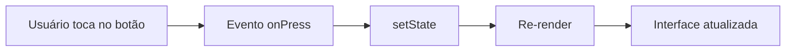

# Encontro 04 - Props, estado e eventos

## Objetivos de aprendizagem

- Diferenciar dados recebidos (`props`) de dados internos (`state`).
- Reagir a interações do usuário.
- Entender re-renderização.

## Explicação didática

`props` funcionam como parâmetros de entrada de um componente. Estado representa informação mutável ao longo do uso. Quando o estado muda, o React recalcula a interface. Esse ciclo é a base de quase toda a programação com React Native.

```tsx
import { useState } from 'react';
import { Button, Text, View } from 'react-native';

export default function Contador() {
  const [valor, setValor] = useState(0);

  return (
    <View>
      <Text>Cliques: {valor}</Text>
      <Button title="Incrementar" onPress={() => setValor((atual) => atual + 1)} />
    </View>
  );
}
```

## Fluxo visual



## Como estudar este tema

- Começar com um contador.
- Evoluir para seleção de cor ou alternância de tema.
- Discutir por que mutação direta de variável não atualiza a tela.

## Exercício

- Criar um componente de avaliação por estrelas.
- Exibir mensagem dinâmica de acordo com a nota escolhida.

## Materiais complementares

- State as a snapshot: <https://react.dev/learn/state-as-a-snapshot>
- Responding to events: <https://react.dev/learn/responding-to-events>
