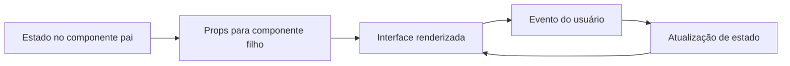

# Encontro 04 - Props, estado e eventos

## Visão do encontro

- **Objetivo central:** compreender como os dados circulam em uma aplicação React Native por meio de `props`, `estado` e `eventos`, conectando interface e comportamento de forma prática.
- Ao final deste encontro, você deve ser capaz de criar componentes reutilizáveis com `props`, controlar dados mutáveis com `useState` e responder a ações do usuário com `Pressable`, `Button` e `TextInput`.

## Roteiro

1. Retomada rápida do encontro 03.
2. Fluxo de dados em componentes React Native.
3. `props`: passagem de dados entre componentes.
4. Estado com `useState`.
5. Eventos de interação (`onPress`, `onChangeText`).
6. Integrando `props`, estado e eventos em uma tela funcional.
7. Prática 02 guiada.
8. Revisão e exercícios de fixação.

## 1. Revisão do encontro 03

No encontro anterior, o foco foi estrutura de projeto, componentização e JSX.

Progressão da disciplina até aqui:

- encontro 02: entender o ecossistema (`React`, `React Native`, `Expo`);
- encontro 03: organizar interface em componentes;
- encontro 04: dar comportamento à interface com dados e interação.

Em termos práticos: agora a tela deixa de ser apenas estática e passa a reagir ao usuário.

## 2. Mapa mental: como os dados circulam

Em React Native, o fluxo básico de dados é previsível:



Regra prática para o aluno:

- `props` levam dados para baixo (pai -> filho);
- eventos sobem intenção de mudança (ação do usuário);
- estado guarda o valor atual que muda ao longo do uso.

## 3. Props: parâmetros dos componentes

`Props` são dados recebidos por um componente para personalizar sua saída.

Exemplo simples:

```tsx
import { Text } from 'react-native';

type SaudacaoProps = {
  nome: string;
};

export function Saudacao({ nome }: SaudacaoProps) {
  return <Text>Olá, {nome}!</Text>;
}
```

Uso no `App.tsx`:

```tsx
<Saudacao nome="Turma TSI" />
```

### Quando usar props

- para reaproveitar um componente com conteúdos diferentes;
- para evitar duplicação de código;
- para separar apresentação e lógica.

## 4. Estado com `useState`

Estado é o dado que pode mudar durante a execução da tela.

Exemplo com contador:

```tsx
import { useState } from 'react';
import { Button, Text, View } from 'react-native';

export default function App() {
  const [contador, setContador] = useState(0);

  return (
    <View>
      <Text>Cliques: {contador}</Text>
      <Button title="Incrementar" onPress={() => setContador(contador + 1)} />
    </View>
  );
}
```

Pontos-chave:

- `contador` é o valor atual;
- `setContador` atualiza o valor;
- ao atualizar estado, a interface renderiza novamente.

## 5. Eventos: conectando ação e atualização

Evento é a resposta da interface a uma interação do usuário.

Eventos frequentes neste início:

- `onPress` em `Button` ou `Pressable`;
- `onChangeText` em `TextInput`.

Exemplo com `TextInput`:

```tsx
import { useState } from 'react';
import { Text, TextInput, View } from 'react-native';

export default function App() {
  const [nome, setNome] = useState('');

  return (
    <View>
      <TextInput
        placeholder="Digite seu nome"
        value={nome}
        onChangeText={setNome}
      />
      <Text>Nome informado: {nome}</Text>
    </View>
  );
}
```

## 6. Integrando props, estado e eventos

Exemplo: componente `CardAluno` recebe dados via `props` e um evento para atualizar presença.

`src/components/CardAluno.tsx`

```tsx
import { Pressable, StyleSheet, Text, View } from 'react-native';

type CardAlunoProps = {
  nome: string;
  presente: boolean;
  onAlternarPresenca: () => void;
};

export function CardAluno({ nome, presente, onAlternarPresenca }: CardAlunoProps) {
  return (
    <View style={styles.card}>
      <Text style={styles.nome}>{nome}</Text>
      <Text style={styles.status}>{presente ? 'Presente' : 'Ausente'}</Text>

      <Pressable style={styles.botao} onPress={onAlternarPresenca}>
        <Text style={styles.botaoTexto}>Alternar presença</Text>
      </Pressable>
    </View>
  );
}

const styles = StyleSheet.create({
  card: {
    backgroundColor: '#ffffff',
    borderRadius: 10,
    padding: 16,
    gap: 8,
  },
  nome: {
    fontSize: 18,
    fontWeight: '700',
  },
  status: {
    fontSize: 14,
    color: '#374151',
  },
  botao: {
    marginTop: 8,
    backgroundColor: '#0f766e',
    paddingVertical: 10,
    borderRadius: 8,
    alignItems: 'center',
  },
  botaoTexto: {
    color: '#ffffff',
    fontWeight: '600',
  },
});
```

`App.tsx`

```tsx
import { useState } from 'react';
import { StyleSheet, View } from 'react-native';
import { CardAluno } from './src/components/CardAluno';

export default function App() {
  const [presente, setPresente] = useState(false);

  function alternarPresenca() {
    setPresente((valorAtual) => !valorAtual);
  }

  return (
    <View style={styles.container}>
      <CardAluno
        nome="Aluno Exemplo"
        presente={presente}
        onAlternarPresenca={alternarPresenca}
      />
    </View>
  );
}

const styles = StyleSheet.create({
  container: {
    flex: 1,
    justifyContent: 'center',
    padding: 20,
    backgroundColor: '#f3f4f6',
  },
});
```

Nesse cenário:

- o estado (`presente`) fica no componente pai;
- o valor atual vai para o filho por `props`;
- o filho dispara o evento;
- o pai atualiza o estado;
- a UI reflete o novo valor.

## 7. Prática

### Objetivo

Construir uma tela chamada **Painel de Participação** usando componentes, `props`, estado e eventos.

### Requisitos mínimos

1. Projeto Expo sem Expo Router (mesmo padrão do encontro 03).
2. Criar componente `CabecalhoAula` com props (`titulo`, `subtitulo`).
3. Criar componente `CardParticipacao` com props (`nome`, `participacoes`).
4. No `App.tsx`, controlar estado `participacoes` com `useState`.
5. Adicionar botão para incrementar participações.
6. Adicionar botão para zerar participações.
7. Exibir mensagem dinâmica:
   - `participacoes === 0`: "Vamos começar?";
   - `participacoes` entre 1 e 3: "Boa participação!";
   - `participacoes >= 4`: "Excelente ritmo hoje!".
8. Organizar componentes em `src/components/`.
9. Aplicar estilização básica com `StyleSheet`.

### Entrega esperada

- Código funcionando em execução local;
- interface sem erros de renderização;
- organização mínima em arquivos separados;
- uso correto de tipagem em props.

## 8. Checklist de validação do aluno

- o app inicia com `npm run start`;
- a tela renderiza sem erro;
- os componentes recebem props tipadas;
- ao tocar no botão, o estado é atualizado;
- a mensagem dinâmica muda conforme o estado;
- o código está organizado e legível.

## 9. Erros comuns

### Tentar alterar props diretamente

`props` são somente leitura. Quem altera dados mutáveis é o estado.

### Confundir variável comum com estado

Variável comum não dispara nova renderização da interface.

### Esquecer de tipar props em TypeScript

Sem tipagem, surgem erros mais difíceis de rastrear.

### Chamar função no `onPress` de forma incorreta

Errado:

```tsx
onPress={incrementar()}
```

Correto:

```tsx
onPress={incrementar}
```

## 10. Exercícios de revisão

1. Qual a diferença entre `props` e estado?
2. Por que o estado normalmente fica no componente pai?
3. O que acontece na interface quando `setState` é executado?
4. Qual a função do `onPress`?
5. Em que situação usar `TextInput` com `onChangeText`?

## 11. Exercícios de estudo

- Crie um componente `CardMeta` que receba via props uma meta de estudos.
- Adicione um botão de decremento no contador da prática.
- Mostre data e turma no cabeçalho usando props.
- Explique, em até 8 linhas, o fluxo: estado -> props -> evento -> novo estado.

## 12. Resumo do encontro

Neste encontro, a interface evoluiu de estática para interativa. Você praticou `props` para parametrizar componentes, `useState` para armazenar dados que mudam e eventos para conectar ação do usuário com atualização da tela. Essa base é essencial para os próximos conteúdos, especialmente layout com Flexbox, formulários e listas.

## Materiais complementares

- React docs (Passing Props to a Component): <https://react.dev/learn/passing-props-to-a-component>
- React docs (State: A Component's Memory): <https://react.dev/learn/state-a-components-memory>
- React Native docs (Handling Touches): <https://reactnative.dev/docs/handling-touches>
- React Native docs (TextInput): <https://reactnative.dev/docs/textinput>
