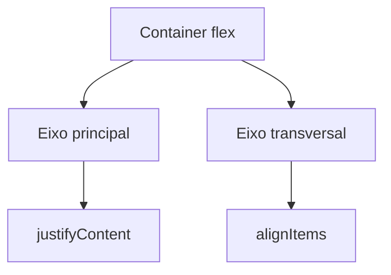

# Encontro 05 - Layout com Flexbox e estilos

## Resultados esperados

- Compreender `flex`, alinhamento e distribuição de espaço.
- Aplicar `StyleSheet` e estilos inline com critério.
- Construir layouts adaptáveis para diferentes telas.

## Conteúdo técnico

Em React Native, o layout padrão é Flexbox com direção de eixo principal em coluna. Isso difere do CSS web, em que a direção padrão é linha. Esse detalhe é importante porque afeta diretamente a forma como você organiza blocos na tela.

```tsx
const styles = StyleSheet.create({
  container: { flex: 1, padding: 16, gap: 12 },
  linha: { flexDirection: 'row', justifyContent: 'space-between' },
  card: { flex: 1, backgroundColor: '#dde7f2', padding: 16, borderRadius: 12 },
});
```

## Exemplo guiado

```tsx
<View style={styles.container}>
  <View style={styles.linha}>
    <View style={styles.card}><Text>A</Text></View>
    <View style={styles.card}><Text>B</Text></View>
  </View>
</View>
```

## Imagem didática



## Atividade

- Reproduzir a interface de um mini dashboard com cabeçalho, cards e barra inferior.
- Testar em modo retrato e paisagem.

## Materiais complementares

- Flexbox no React Native: <https://reactnative.dev/docs/flexbox>
- Style guide: <https://reactnative.dev/docs/style>
