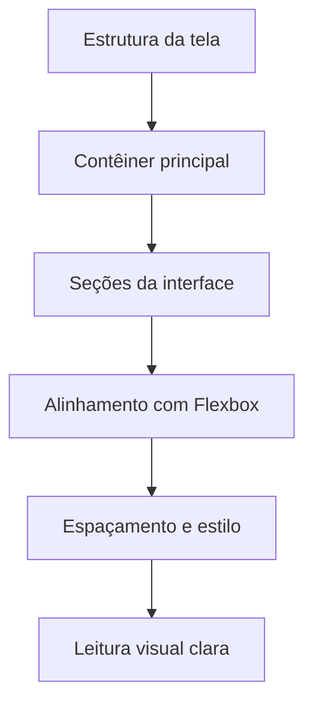

# Encontro 05 - Layout com Flexbox e estilos

## Visão do encontro

- **Objetivo central:** dominar a construção de layout em React Native com `Flexbox` e `StyleSheet`, organizando interfaces legíveis, consistentes e adaptáveis para diferentes tamanhos de tela.
- Ao final deste encontro, você deve ser capaz de estruturar telas com `View`, controlar alinhamento e espaçamento com propriedades de `Flexbox` e aplicar estilos reutilizáveis em componentes.

## Roteiro

1. Como pensar layout em React Native.
2. Fundamentos de `Flexbox` (eixos, direção e distribuição).
3. Alinhamento de elementos com `justifyContent` e `alignItems`.
4. Espaçamento, dimensões e organização visual.
5. Boas práticas de `StyleSheet`.
6. Construção de uma tela completa com layout responsivo.
7. Prática 03 guiada.
8. Revisão e exercícios de fixação.

## 1. Como pensar layout em React Native

No início, muitos alunos tentam "desenhar" a tela sem estratégia. Em React Native, é melhor pensar por blocos:

1. definir contêiner principal;
2. separar áreas da tela (cabeçalho, conteúdo, rodapé);
3. organizar cada área com `Flexbox`;
4. aplicar espaçamento e hierarquia visual.

Mapa mental simplificado:



## 2. Fundamentos de `Flexbox`

React Native usa `Flexbox` como base de posicionamento.

Propriedades mais importantes para começar:

- `flexDirection`: direção dos itens (`column` ou `row`);
- `justifyContent`: distribuição no eixo principal;
- `alignItems`: alinhamento no eixo transversal;
- `flex`: quanto espaço um bloco ocupa em relação aos irmãos;
- `gap`: distância entre elementos irmãos.

Observação importante:

- em React Native, o padrão de `flexDirection` é `column`.

Exemplo básico:

```tsx
import { StyleSheet, Text, View } from 'react-native';

export default function App() {
  return (
    <View style={styles.container}>
      <View style={styles.blocoA}><Text>Bloco A</Text></View>
      <View style={styles.blocoB}><Text>Bloco B</Text></View>
      <View style={styles.blocoC}><Text>Bloco C</Text></View>
    </View>
  );
}

const styles = StyleSheet.create({
  container: {
    flex: 1,
    padding: 16,
    gap: 12,
    backgroundColor: '#f3f4f6',
  },
  blocoA: { backgroundColor: '#dbeafe', padding: 12, borderRadius: 8 },
  blocoB: { backgroundColor: '#dcfce7', padding: 12, borderRadius: 8 },
  blocoC: { backgroundColor: '#fee2e2', padding: 12, borderRadius: 8 },
});
```

### Leitura linha por linha (exemplo básico)

1.  `flex: 1,`: faz o contêiner ocupar toda a área disponível.
2. `padding: 16,`: adiciona espaçamento interno de 16.
3. `gap: 12,`: define espaço entre os filhos do contêiner.
4. `backgroundColor: '#f3f4f6',`: aplica cor de fundo da tela.
5. `blocoA: { backgroundColor: '#dbeafe', padding: 12, borderRadius: 8 },`: define cor, espaço interno e borda arredondada do bloco A.
6. `blocoB: { backgroundColor: '#dcfce7', padding: 12, borderRadius: 8 },`: define os mesmos padrões para bloco B com outra cor.
7. `blocoC: { backgroundColor: '#fee2e2', padding: 12, borderRadius: 8 },`: define os mesmos padrões para bloco C com outra cor.

## 3. Alinhamento com `justifyContent` e `alignItems`

Resumo prático:

- `justifyContent` organiza no eixo principal;
- `alignItems` organiza no eixo transversal.

Se `flexDirection: 'column'`:

- eixo principal = vertical;
- eixo transversal = horizontal.

Se `flexDirection: 'row'`:

- eixo principal = horizontal;
- eixo transversal = vertical.

Exemplo em linha:

```tsx
linha: {
  flexDirection: 'row',
  justifyContent: 'space-between',
  alignItems: 'center',
}
```

### Leitura do Código 

1. `flexDirection: 'row',`: define que os elementos filhos serão organizados horizontalmente.
2. `justifyContent: 'space-between',`: distribui os itens com espaço entre eles no eixo principal.
3. `alignItems: 'center',`: centraliza verticalmente os itens dentro da linha.

Usos comuns de `justifyContent`:

- `flex-start`: itens no início;
- `center`: itens centralizados;
- `space-between`: espaço entre itens;
- `space-around`: espaço ao redor dos itens.

Usos comuns de `alignItems`:

- `flex-start`: encosta no início do eixo transversal;
- `center`: centraliza;
- `stretch`: estica itens (quando possível).

## 4. Espaçamento, dimensões e organização visual

Layout bom não depende só de alinhamento. Espaçamento consistente é fundamental.

Propriedades importantes:

- `padding`: espaço interno do componente;
- `margin`: espaço externo;
- `gap`: distância entre filhos do mesmo contêiner;
- `borderRadius`: suaviza blocos visuais;
- `width` e `height`: usar com moderação;
- `flex`: preferir para adaptação de tela.

Regra prática de organização:

- use espaçamentos em escala (ex.: 4, 8, 12, 16, 24);
- evite valores aleatórios em cada componente;
- mantenha padrão de cores e tamanho de fonte.

## 5. Boas práticas com `StyleSheet`

`StyleSheet.create` melhora legibilidade e ajuda a manter padrão visual.

Exemplo com estilos reutilizáveis:

```tsx
const colors = {
  fundo: '#f8fafc',
  card: '#ffffff',
  titulo: '#0f172a',
  texto: '#334155',
  destaque: '#0f766e',
};

const spacing = {
  xs: 4,
  sm: 8,
  md: 12,
  lg: 16,
  xl: 24,
};

const styles = StyleSheet.create({
  container: {
    flex: 1,
    backgroundColor: colors.fundo,
    padding: spacing.lg,
    gap: spacing.md,
  },
  card: {
    backgroundColor: colors.card,
    borderRadius: 12,
    padding: spacing.lg,
    gap: spacing.sm,
  },
  titulo: {
    fontSize: 18,
    fontWeight: '700',
    color: colors.titulo,
  },
  texto: {
    fontSize: 14,
    color: colors.texto,
  },
});
```

### Leitura linha por linha (tokens de estilo)

1. `xs: 4,`: menor espaçamento.
2. `sm: 8,`: espaçamento pequeno.
3. `md: 12,`: espaçamento médio.
4. `lg: 16,`: espaçamento grande.
5. `xl: 24,`: espaçamento extra grande.
6. `padding: spacing.lg,`: aplica espaçamento interno grande.
7. `gap: spacing.md,`: define distância média entre os blocos internos.
8. `padding: spacing.lg,`: adiciona espaçamento interno grande.
9. `gap: spacing.sm,`: define separação pequena entre conteúdo interno.

## 6. Exemplo completo: painel de aula com layout flexível

Objetivo: montar uma tela com cabeçalho, indicadores em linha e lista de avisos.

`App.tsx`

```tsx
import { StyleSheet, Text, View } from 'react-native';

function Indicador({ titulo, valor }: { titulo: string; valor: string }) {
  return (
    <View style={styles.cardIndicador}>
      <Text style={styles.cardTitulo}>{titulo}</Text>
      <Text style={styles.cardValor}>{valor}</Text>
    </View>
  );
}

function Aviso({ texto }: { texto: string }) {
  return (
    <View style={styles.avisoItem}>
      <Text style={styles.avisoTexto}>{texto}</Text>
    </View>
  );
}

export default function App() {
  return (
    <View style={styles.container}>
      <View style={styles.cabecalho}>
        <Text style={styles.titulo}>Painel da Turma</Text>
        <Text style={styles.subtitulo}>Encontro 05 • Layout e estilos</Text>
      </View>

      <View style={styles.linhaIndicadores}>
        <Indicador titulo="Presentes" valor="24" />
        <Indicador titulo="Atividades" valor="03" />
      </View>

      <View style={styles.listaAvisos}>
        <Text style={styles.secaoTitulo}>Avisos</Text>
        <Aviso texto="Prática 03 será entregue até sexta-feira." />
        <Aviso texto="Revisar materiais do encontro 04." />
        <Aviso texto="Trazer dispositivo para testes presenciais." />
      </View>
    </View>
  );
}

const styles = StyleSheet.create({
  container: {
    flex: 1,
    backgroundColor: '#f1f5f9',
    padding: 16,
    gap: 12,
  },
  cabecalho: {
    backgroundColor: '#0f172a',
    borderRadius: 12,
    padding: 16,
    gap: 4,
  },
  titulo: {
    fontSize: 20,
    fontWeight: '700',
    color: '#ffffff',
  },
  subtitulo: {
    fontSize: 13,
    color: '#cbd5e1',
  },
  linhaIndicadores: {
    flexDirection: 'row',
    gap: 10,
  },
  cardIndicador: {
    flex: 1,
    backgroundColor: '#ffffff',
    borderRadius: 10,
    padding: 14,
    alignItems: 'center',
    gap: 4,
  },
  cardTitulo: {
    fontSize: 13,
    color: '#475569',
  },
  cardValor: {
    fontSize: 22,
    fontWeight: '700',
    color: '#0f766e',
  },
  listaAvisos: {
    backgroundColor: '#ffffff',
    borderRadius: 12,
    padding: 14,
    gap: 8,
  },
  secaoTitulo: {
    fontSize: 16,
    fontWeight: '700',
    color: '#0f172a',
    marginBottom: 4,
  },
  avisoItem: {
    borderWidth: 1,
    borderColor: '#e2e8f0',
    borderRadius: 8,
    padding: 10,
  },
  avisoTexto: {
    color: '#334155',
    fontSize: 14,
  },
});
```

### Leitura do Código


Neste exemplo:

- `linhaIndicadores` usa `row` para colocar cards lado a lado;
- cada indicador usa `flex: 1` para dividir espaço igualmente;
- `gap`, `padding` e `borderRadius` aumentam clareza visual;
- a hierarquia de tipografia orienta leitura da tela.

## 7. Prática 03

### Objetivo

Criar uma tela chamada **Painel de Acompanhamento da Turma** aplicando layout com `Flexbox` e padrões de estilo.

### Requisitos mínimos

1. Usar projeto Expo sem Expo Router.
2. Criar componente `CabecalhoTurma` com título e subtítulo.
3. Criar componente `ResumoAula` com 3 indicadores em linha (`Presentes`, `Faltas`, `Atividades`).
4. Criar componente `ListaTarefas` com pelo menos 4 itens.
5. Organizar a tela com as seções: cabeçalho, resumo e tarefas.
6. Usar `flexDirection`, `justifyContent`, `alignItems` e `gap` em pelo menos um trecho.
7. Aplicar padrão visual consistente (cores, espaçamentos e tipografia).
8. Organizar arquivos em `src/components/`.

### Entrega esperada

- interface renderizando sem quebras;
- layout coerente em diferentes tamanhos de tela;
- uso correto de `Flexbox`;
- código organizado e legível.

## 8. Checklist de validação do aluno

- o app inicia com `npm run start`;
- a tela está dividida em seções claras;
- os indicadores estão alinhados corretamente;
- há consistência de espaçamentos e cores;
- o código usa `StyleSheet.create`;
- os componentes estão separados por responsabilidade.

## 9. Erros comuns

### Tentar posicionar tudo com valores fixos

Muitos `width` e `height` fixos reduzem adaptação em telas diferentes.

### Confundir `justifyContent` e `alignItems`

Lembre que cada um atua em um eixo diferente.

### Exagerar em estilos inline

Estilo inline em excesso dificulta manutenção e leitura.

### Misturar padrões visuais sem critério

Sem escala de espaçamento e tipografia, a interface fica inconsistente.

## 10. Exercícios de revisão

1. Qual a diferença entre eixo principal e eixo transversal no `Flexbox`?
2. O que muda quando usamos `flexDirection: 'row'`?
3. Qual a função de `flex: 1` em um card dentro de uma linha?
4. Quando usar `padding` e quando usar `margin`?
5. Por que `StyleSheet.create` é recomendado?

## 11. Exercícios de estudo

- Recrie a prática usando uma paleta de cores diferente, mantendo legibilidade.
- Adicione uma área de rodapé fixa no final da tela.
- Crie uma variação de layout com os indicadores em coluna.
- Explique, em até 8 linhas, como você decidiu a hierarquia visual da tela.

## 12. Resumo do encontro

Neste encontro, você consolidou a base de layout para React Native. Aprendeu como o `Flexbox` organiza componentes, como controlar alinhamento e distribuição de espaço e como usar `StyleSheet` para manter padrão visual. Essa etapa prepara o próximo conteúdo: formulários com `TextInput`, validação e feedback para o usuário.

## Materiais complementares

- React Native docs (Flexbox): <https://reactnative.dev/docs/flexbox>
- React Native docs (Style): <https://reactnative.dev/docs/style>
- React Native docs (StyleSheet): <https://reactnative.dev/docs/stylesheet>
- Expo docs (Layout with React Native): <https://docs.expo.dev/tutorial/introduction/>
