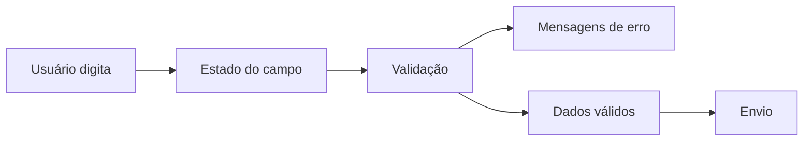

# Encontro 06 - Interfaces em estilo formulário (`TextInput` e validação)

## Visão do encontro

- **Objetivo central:** construir formulários funcionais em React Native usando `TextInput`, estado controlado e validação básica de campos.
- Ao final deste encontro, você deve ser capaz de criar interfaces de entrada de dados com feedback de erro, controlar valores com `useState` e preparar o fluxo para envio seguro das informações.

## Roteiro

1. Docker no contexto da disciplina e execução do projeto.
2. O que caracteriza um formulário em React Native.
3. `TextInput`: propriedades essenciais no início.
4. Formulário controlado com estado.
5. Validação básica de campos.
6. Exibição de mensagens de erro e feedback visual.
7. Exemplo completo de formulário.
8. Prática 04 guiada.
9. Revisão e exercícios de fixação.

## 1. Docker no contexto do React Native

Docker ajuda a padronizar o ambiente da turma: todos usam a mesma versão de Node e as mesmas dependências.

Resumo prático para este encontro:

- use Docker para instalar dependências e iniciar o bundler;
- para testar no celular, prefira Expo Go;
- em ambiente de container, use `--tunnel` no Expo para facilitar conexão;
- em geral, emulador Android/iOS não roda dentro do container da aula.

Passo a passo rápido (Expo):

1. Crie (ou use) um `Dockerfile` na raiz do projeto:

```dockerfile
FROM node:20-bullseye
WORKDIR /app
COPY package*.json ./
RUN npm install
COPY . .
EXPOSE 8081 19000 19001 19002
CMD ["npx", "expo", "start", "--tunnel"]
```

2. Crie um arquivo `docker-compose.yml` na raiz do projeto:

```yaml
services:
  app:
    build: .
    container_name: rn-formulario-aula
    command: npx expo start --tunnel
    ports:
      - "8081:8081"
      - "19000:19000"
      - "19001:19001"
      - "19002:19002"
    volumes:
      - .:/app
      - /app/node_modules
    stdin_open: true
    tty: true
```

3. Suba o projeto:

```bash
docker compose up --build
```

4. Leia o QR Code no terminal com o app Expo Go e abra o projeto no celular.

5. Para encerrar:

```bash
docker compose down
```

## 2. O que caracteriza um formulário em React Native

Um formulário é um conjunto de campos para entrada, validação e envio de dados.

Fluxo mental recomendado:

1. definir campos necessários;
2. criar estado para cada campo (ou objeto de formulário);
3. atualizar estado a cada digitação;
4. validar regras de negócio;
5. exibir erros de forma clara;
6. só permitir envio quando estiver válido.

Mapa mental do fluxo:



## 3. `TextInput`: propriedades essenciais

`TextInput` é o componente principal para entrada de dados no React Native.

Propriedades mais usadas neste início:

- `value`: valor atual do campo;
- `onChangeText`: função chamada ao digitar;
- `placeholder`: dica visual do conteúdo esperado;
- `keyboardType`: tipo de teclado (`default`, `email-address`, `numeric`);
- `secureTextEntry`: oculta texto (senha);
- `autoCapitalize`: controle de maiúsculas automáticas;
- `maxLength`: limite de caracteres.

Exemplo simples:

```tsx
import { useState } from 'react';
import { StyleSheet, TextInput, View } from 'react-native';

export default function App() {
  const [nome, setNome] = useState('');

  return (
    <View style={styles.container}>
      <TextInput
        style={styles.input}
        placeholder="Digite seu nome"
        value={nome}
        onChangeText={setNome}
      />
    </View>
  );
}

const styles = StyleSheet.create({
  container: {
    flex: 1,
    justifyContent: 'center',
    padding: 16,
  },
  input: {
    borderWidth: 1,
    borderColor: '#cbd5e1',
    borderRadius: 8,
    paddingHorizontal: 12,
    paddingVertical: 10,
  },
});
```

## 4. Formulário controlado com estado

Formulário controlado significa que o valor exibido no campo vem do estado.

Estrutura comum:

```tsx
const [form, setForm] = useState({
  nome: '',
  email: '',
  turma: '',
});

function atualizarCampo(campo: 'nome' | 'email' | 'turma', valor: string) {
  setForm((estadoAnterior) => ({
    ...estadoAnterior,
    [campo]: valor,
  }));
}
```

### Leitura do Código

1. `const [form, setForm] = useState({`: cria estado único para agrupar campos.
2. `function atualizarCampo(campo: 'nome' | 'email' | 'turma', valor: string) {`: cria função para atualizar qualquer campo permitido.
3. `setForm((estadoAnterior) => ({`: atualiza estado com base no valor anterior.
4. `...estadoAnterior,`: mantém os campos que não foram alterados.
5. `[campo]: valor,`: sobrescreve apenas o campo recebido.

Vantagens:

- previsibilidade dos dados;
- validação centralizada;
- envio com dados organizados;
- facilidade para resetar formulário.

## 5. Validação básica de campos

Neste estágio inicial, vamos começar com validações manuais simples.

Exemplos de regras:

- campo obrigatório: não pode estar vazio;
- tamanho mínimo: ex.: nome com pelo menos 3 caracteres;
- formato básico de e-mail: contém `@` e `.`;
- número mínimo/máximo para quantidade.

Exemplo de função de validação:

```tsx
type FormData = {
  nome: string;
  email: string;
  vagas: string;
};

type FormErrors = {
  nome?: string;
  email?: string;
  vagas?: string;
};

function validar(dados: FormData): FormErrors {
  const erros: FormErrors = {};

  if (!dados.nome.trim()) {
    erros.nome = 'Informe o nome.';
  } else if (dados.nome.trim().length < 3) {
    erros.nome = 'Nome deve ter ao menos 3 caracteres.';
  }

  if (!dados.email.includes('@') || !dados.email.includes('.')) {
    erros.email = 'Informe um e-mail válido.';
  }

  const vagasNumero = Number(dados.vagas);
  if (!dados.vagas || Number.isNaN(vagasNumero) || vagasNumero <= 0) {
    erros.vagas = 'Informe um número de vagas maior que zero.';
  }

  return erros;
}
```

### Leitura do Código

1. `type FormData = {`: declara tipo dos dados do formulário.
2. `type FormErrors = {`: declara tipo dos erros de validação.
3. `nome?: string;`: erro opcional de nome.
4. `email?: string;`: erro opcional de email.
5. `vagas?: string;`: erro opcional de vagas.
6. `function validar(dados: FormData): FormErrors {`: função recebe dados e devolve objeto de erros.
7. `const erros: FormErrors = {};`: inicia sem erros.
8. `if (!dados.nome.trim()) {`: verifica se nome está vazio (desconsiderando espaços).
9. `erros.nome = 'Informe o nome.';`: registra erro de campo obrigatório.
10. `} else if (dados.nome.trim().length < 3) {`: se não está vazio, verifica tamanho mínimo.
11. `erros.nome = 'Nome deve ter ao menos 3 caracteres.';`: registra erro de tamanho.
12. `if (!dados.email.includes('@') || !dados.email.includes('.')) {`: valida formato básico de email.
13. `erros.email = 'Informe um e-mail válido.';`: registra erro de email.
14. `const vagasNumero = Number(dados.vagas);`: converte texto para número.
15. `if (!dados.vagas || Number.isNaN(vagasNumero) || vagasNumero <= 0) {`: verifica vazio, não numérico ou valor inválido.
16. `erros.vagas = 'Informe um número de vagas maior que zero.';`: registra erro de vagas.

## 6. Feedback de erro na interface

Boa validação não é apenas regra de código. O desenvolvedor precisa mostrar erro no lugar certo e com mensagem clara.

Estratégia prática:

- exibir erro abaixo do campo;
- destacar borda do campo com cor de erro;
- evitar mensagem genérica para todos os casos;
- bloquear envio quando houver erro.

Exemplo de estilo condicional:

```tsx
<TextInput
  style={[styles.input, erros.email && styles.inputErro]}
  value={form.email}
  onChangeText={(texto) => atualizarCampo('email', texto)}
  placeholder="Email"
  keyboardType="email-address"
  autoCapitalize="none"
/>
{erros.email ? <Text style={styles.textoErro}>{erros.email}</Text> : null}
```

## 7. Exemplo completo: formulário de inscrição

`App.tsx`

```tsx
import { useState } from 'react';
import { Alert, Pressable, StyleSheet, Text, TextInput, View } from 'react-native';

type FormData = {
  nome: string;
  email: string;
  turma: string;
};

type FormErrors = {
  nome?: string;
  email?: string;
  turma?: string;
};

function validar(dados: FormData): FormErrors {
  const erros: FormErrors = {};

  if (!dados.nome.trim()) {
    erros.nome = 'Nome é obrigatório.';
  } else if (dados.nome.trim().length < 3) {
    erros.nome = 'Nome deve ter ao menos 3 caracteres.';
  }

  if (!dados.email.includes('@') || !dados.email.includes('.')) {
    erros.email = 'E-mail inválido.';
  }

  if (!dados.turma.trim()) {
    erros.turma = 'Informe a turma.';
  }

  return erros;
}

export default function App() {
  const [form, setForm] = useState<FormData>({
    nome: '',
    email: '',
    turma: '',
  });

  const [erros, setErros] = useState<FormErrors>({});

  function atualizarCampo(campo: keyof FormData, valor: string) {
    setForm((estadoAnterior) => ({
      ...estadoAnterior,
      [campo]: valor,
    }));
  }

  function enviar() {
    const errosEncontrados = validar(form);
    setErros(errosEncontrados);

    if (Object.keys(errosEncontrados).length > 0) {
      return;
    }

    Alert.alert('Cadastro realizado', `Aluno: ${form.nome}`);

    setForm({ nome: '', email: '', turma: '' });
    setErros({});
  }

  return (
    <View style={styles.container}>
      <Text style={styles.titulo}>Inscrição na prática</Text>

      <TextInput
        style={[styles.input, erros.nome && styles.inputErro]}
        placeholder="Nome"
        value={form.nome}
        onChangeText={(texto) => atualizarCampo('nome', texto)}
      />
      {erros.nome ? <Text style={styles.textoErro}>{erros.nome}</Text> : null}

      <TextInput
        style={[styles.input, erros.email && styles.inputErro]}
        placeholder="E-mail"
        value={form.email}
        onChangeText={(texto) => atualizarCampo('email', texto)}
        keyboardType="email-address"
        autoCapitalize="none"
      />
      {erros.email ? <Text style={styles.textoErro}>{erros.email}</Text> : null}

      <TextInput
        style={[styles.input, erros.turma && styles.inputErro]}
        placeholder="Turma"
        value={form.turma}
        onChangeText={(texto) => atualizarCampo('turma', texto)}
      />
      {erros.turma ? <Text style={styles.textoErro}>{erros.turma}</Text> : null}

      <Pressable style={styles.botao} onPress={enviar}>
        <Text style={styles.botaoTexto}>Enviar inscrição</Text>
      </Pressable>
    </View>
  );
}

const styles = StyleSheet.create({
  container: {
    flex: 1,
    backgroundColor: '#f8fafc',
    padding: 16,
    justifyContent: 'center',
    gap: 8,
  },
  titulo: {
    fontSize: 20,
    fontWeight: '700',
    color: '#0f172a',
    marginBottom: 8,
  },
  input: {
    borderWidth: 1,
    borderColor: '#cbd5e1',
    borderRadius: 8,
    backgroundColor: '#ffffff',
    paddingHorizontal: 12,
    paddingVertical: 10,
  },
  inputErro: {
    borderColor: '#dc2626',
  },
  textoErro: {
    color: '#dc2626',
    fontSize: 12,
    marginBottom: 2,
  },
  botao: {
    marginTop: 10,
    backgroundColor: '#0f766e',
    borderRadius: 8,
    paddingVertical: 12,
    alignItems: 'center',
  },
  botaoTexto: {
    color: '#ffffff',
    fontWeight: '700',
  },
});
```


## 8. Prática 04

### Objetivo

Construir uma tela chamada **Cadastro de Participação em Oficina** com formulário validado.

### Requisitos mínimos

1. Criar formulário com campos: `nome`, `email`, `tema` e `quantidade de vagas`.
2. Usar `TextInput` com estado controlado para todos os campos.
3. Aplicar `keyboardType` adequado em `email` e `quantidade de vagas`.
4. Validar campos obrigatórios.
5. Validar tamanho mínimo do nome (3 caracteres).
6. Validar formato básico de e-mail.
7. Exibir mensagem de erro abaixo de cada campo inválido.
8. Ao enviar com sucesso, mostrar mensagem de confirmação e limpar formulário.

### Entrega esperada

- formulário funcional e sem travamentos;
- validações funcionando corretamente;
- feedback visual dos erros;
- código organizado e legível.

## 9. Checklist de validação do aluno

- o app inicia com `npm run start`;
- todos os campos atualizam o estado corretamente;
- campos inválidos mostram mensagens claras;
- o envio não ocorre com dados inválidos;
- após envio válido, os campos são limpos;
- a interface mantém padrão visual consistente.

## 10. Erros comuns

### Não controlar o valor do `TextInput`

Sem `value` e `onChangeText`, o estado do formulário fica inconsistente.

### Validar apenas no visual e esquecer regra em código

A borda vermelha ajuda, mas a regra precisa estar implementada logicamente.

### Usar `keyboardType` inadequado

Tipo de teclado errado piora experiência de digitação no celular.

### Exibir mensagens de erro genéricas demais

Mensagem específica acelera correção pelo usuário.

## 11. Exercícios de revisão

1. O que é um formulário controlado?
2. Qual o papel de `onChangeText` no fluxo de dados?
3. Por que validar antes do envio?
4. Como destacar visualmente um campo com erro?
5. Em que casos usar `keyboardType="numeric"`?

## 12. Exercícios de estudo

- Adicione campo de senha com `secureTextEntry` e validação de tamanho mínimo.
- Inclua botão "Limpar" para resetar formulário manualmente.
- Faça validação em tempo real no campo de e-mail (durante digitação).
- Explique, em até 10 linhas, a diferença entre feedback visual e validação de regra.

## 13. Resumo do encontro

Neste encontro, você evoluiu para um dos blocos mais importantes de interfaces móveis: formulários. Praticou `TextInput`, controle de estado por campo, validações manuais e apresentação de erros de forma clara. Essa base será usada no próximo encontro para formulários mais completos, com padrões de controle e refinamentos de entrada.

## Materiais complementares

- React Native docs (`TextInput`): <https://reactnative.dev/docs/textinput>
- React Native docs (Handling Touches): <https://reactnative.dev/docs/handling-touches>
- React docs (Updating Objects in State): <https://react.dev/learn/updating-objects-in-state>
- Expo docs (Forms and user input): <https://docs.expo.dev/tutorial/create-your-first-app/>
