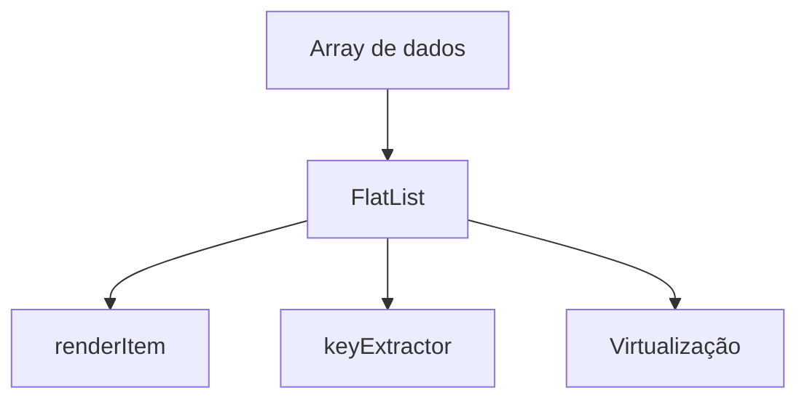

# Encontro 08 - Listas (FlatList, SectionList, desempenho)

## Objetivos

- Renderizar coleções de dados com eficiência.
- Diferenciar `ScrollView`, `FlatList` e `SectionList`.
- Trabalhar chave única, item renderizado e desempenho.

## Conceitos centrais

`FlatList` renderiza itens sob demanda, evitando custo alto de memória. Esse ponto é crítico em dispositivos móveis. A turma deve compreender que desempenho não é apenas velocidade percebida, mas também consumo de bateria e responsividade.

```tsx
import { FlatList, Text, View } from 'react-native';

const tarefas = [
  { id: '1', titulo: 'Configurar projeto' },
  { id: '2', titulo: 'Criar componentes' },
];

<FlatList
  data={tarefas}
  keyExtractor={(item) => item.id}
  renderItem={({ item }) => (
    <View>
      <Text>{item.titulo}</Text>
    </View>
  )}
/>;
```

## Diagrama



## Atividade prática

- Criar uma lista de contatos.
- Adicionar campo de busca.
- Comparar comportamento de `ScrollView` e `FlatList`.

## Materiais complementares

- FlatList: <https://reactnative.dev/docs/flatlist>
- Optimizing FlatList configuration: <https://reactnative.dev/docs/optimizing-flatlist-configuration>
