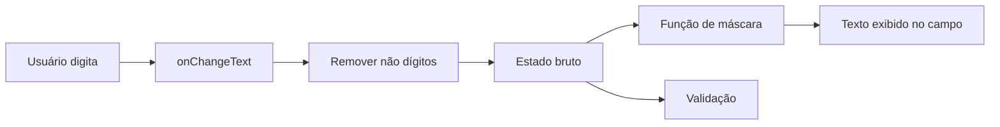

# Encontro 09 - Formulários controlados e máscaras

## Visão do encontro

- **Objetivo central:** evoluir formulários em React Native com uso de máscaras de entrada, mantendo estado controlado, legibilidade dos dados e validação consistente.
- Ao final deste encontro, você deve ser capaz de implementar campos mascarados (`CPF`, `telefone`, `CEP`) sem perder o controle do estado, separar valor bruto de valor exibido e validar os dados antes do envio.

## Roteiro

1. Retomada do conteúdo-base do encontro 06.
2. O papel das máscaras em formulários móveis.
3. Estratégia de estado: valor bruto e valor exibido.
4. Funções de máscara para `CPF`, `telefone` e `CEP`.
5. Aplicação das máscaras em `TextInput` controlado.
6. Validação combinada: estrutura + regra de negócio.
7. Exemplo completo de formulário com máscaras.
8. Exercício guiado.
9. Revisão e exercícios de fixação.

## 1. Retomada do conteúdo-base do encontro 06

Antes da atividade avaliativa e da correção guiada, o último conteúdo-base trabalhado foi a construção de formulários com:

- `TextInput` controlado;
- estado com `useState`;
- validação básica de campos;
- mensagens de erro na interface.

Progressão até aqui:

- encontro 05: layout e organização visual;
- encontro 06: formulário e validação básica;
- encontro 07: atividade avaliativa;
- encontro 08: correção comentada da atividade;
- encontro 09: formulário mais realista com máscaras de entrada.

## 2. O papel das máscaras em formulários móveis

Máscara é um formato visual aplicado durante a digitação para orientar o usuário.

Exemplos:

- `CPF`: `000.000.000-00`;
- telefone: `(00) 00000-0000`;
- `CEP`: `00000-000`.

Benefícios práticos:

- reduz erro de preenchimento;
- melhora leitura imediata dos dados;
- padroniza entrada para validação.

Cuidados importantes:

- máscara **não substitui** validação;
- o ideal é armazenar dados limpos (apenas dígitos) no estado;
- formatação deve ser aplicada na exibição do campo.

## 3. Estratégia: valor bruto x valor exibido

Para manter o formulário previsível:

1. guardar no estado o valor bruto (sem pontuação);
2. aplicar função de máscara no `value` do `TextInput`;
3. limpar entrada (`\D`) no `onChangeText`;
4. validar regras usando o valor bruto.

Fluxo recomendado:



## 4. Funções de máscara

Exemplo de utilitários para `CPF`, telefone e `CEP`:

```tsx
function apenasDigitos(valor: string) {
  return valor.replace(/\D/g, '');
}

function formatarCPF(valor: string) {
  const digitos = apenasDigitos(valor).slice(0, 11);

  if (digitos.length <= 3) return digitos;
  if (digitos.length <= 6) return `${digitos.slice(0, 3)}.${digitos.slice(3)}`;
  if (digitos.length <= 9) {
    return `${digitos.slice(0, 3)}.${digitos.slice(3, 6)}.${digitos.slice(6)}`;
  }

  return `${digitos.slice(0, 3)}.${digitos.slice(3, 6)}.${digitos.slice(6, 9)}-${digitos.slice(9)}`;
}

function formatarTelefone(valor: string) {
  const digitos = apenasDigitos(valor).slice(0, 11);

  if (digitos.length <= 2) return `(${digitos}`;
  if (digitos.length <= 6) return `(${digitos.slice(0, 2)}) ${digitos.slice(2)}`;
  if (digitos.length <= 10) {
    return `(${digitos.slice(0, 2)}) ${digitos.slice(2, 6)}-${digitos.slice(6)}`;
  }

  return `(${digitos.slice(0, 2)}) ${digitos.slice(2, 7)}-${digitos.slice(7)}`;
}

function formatarCEP(valor: string) {
  const digitos = apenasDigitos(valor).slice(0, 8);

  if (digitos.length <= 5) return digitos;
  return `${digitos.slice(0, 5)}-${digitos.slice(5)}`;
}
```

### Leitura do Código

1. `apenasDigitos`: remove tudo que não for número.
2. `.slice(0, limite)`: limita quantidade máxima de dígitos por campo.
3. `formatarCPF`: aplica pontos e hífen conforme tamanho digitado.
4. `formatarTelefone`: adapta formato para número com 10 ou 11 dígitos.
5. `formatarCEP`: aplica hífen após os 5 primeiros dígitos.

## 5. Aplicando máscara em `TextInput` controlado

Padrão recomendado para cada campo mascarado:

```tsx
<TextInput
  style={styles.input}
  placeholder="CPF"
  keyboardType="numeric"
  value={formatarCPF(form.cpf)}
  onChangeText={(texto) => atualizarCampo('cpf', apenasDigitos(texto))}
  maxLength={14}
/>
```

O que acontece nesse fluxo:

- usuário vê `CPF` formatado;
- estado guarda só números;
- validação fica mais simples (`form.cpf.length === 11`).

## 6. Validação combinada: estrutura e regra

Com máscara, a validação mínima precisa conferir:

- campo obrigatório;
- quantidade de dígitos esperada;
- regra de faixa quando necessário.

Exemplo:

```tsx
type FormData = {
  nome: string;
  cpf: string;
  telefone: string;
  cep: string;
};

type FormErrors = Partial<Record<keyof FormData, string>>;

function validar(dados: FormData): FormErrors {
  const erros: FormErrors = {};

  if (!dados.nome.trim() || dados.nome.trim().length < 3) {
    erros.nome = 'Nome deve ter ao menos 3 caracteres.';
  }

  if (dados.cpf.length !== 11) {
    erros.cpf = 'CPF deve conter 11 dígitos.';
  }

  if (dados.telefone.length < 10 || dados.telefone.length > 11) {
    erros.telefone = 'Telefone deve ter 10 ou 11 dígitos.';
  }

  if (dados.cep.length !== 8) {
    erros.cep = 'CEP deve conter 8 dígitos.';
  }

  return erros;
}
```

## 7. Exemplo completo: cadastro com máscaras

Estrutura recomendada:

```text
src/
  App.tsx
  styles.ts
```

`src/App.tsx`

```tsx
import { useState } from 'react';
import { Alert, Pressable, Text, TextInput, View } from 'react-native';
import { styles } from './styles';

type FormData = {
  nome: string;
  cpf: string;
  telefone: string;
  cep: string;
};

type FormErrors = Partial<Record<keyof FormData, string>>;

function apenasDigitos(valor: string) {
  return valor.replace(/\D/g, '');
}

function formatarCPF(valor: string) {
  const digitos = apenasDigitos(valor).slice(0, 11);
  if (digitos.length <= 3) return digitos;
  if (digitos.length <= 6) return `${digitos.slice(0, 3)}.${digitos.slice(3)}`;
  if (digitos.length <= 9) {
    return `${digitos.slice(0, 3)}.${digitos.slice(3, 6)}.${digitos.slice(6)}`;
  }
  return `${digitos.slice(0, 3)}.${digitos.slice(3, 6)}.${digitos.slice(6, 9)}-${digitos.slice(9)}`;
}

function formatarTelefone(valor: string) {
  const digitos = apenasDigitos(valor).slice(0, 11);
  if (digitos.length <= 2) return `(${digitos}`;
  if (digitos.length <= 6) return `(${digitos.slice(0, 2)}) ${digitos.slice(2)}`;
  if (digitos.length <= 10) {
    return `(${digitos.slice(0, 2)}) ${digitos.slice(2, 6)}-${digitos.slice(6)}`;
  }
  return `(${digitos.slice(0, 2)}) ${digitos.slice(2, 7)}-${digitos.slice(7)}`;
}

function formatarCEP(valor: string) {
  const digitos = apenasDigitos(valor).slice(0, 8);
  if (digitos.length <= 5) return digitos;
  return `${digitos.slice(0, 5)}-${digitos.slice(5)}`;
}

function validar(dados: FormData): FormErrors {
  const erros: FormErrors = {};

  if (!dados.nome.trim() || dados.nome.trim().length < 3) {
    erros.nome = 'Nome deve ter ao menos 3 caracteres.';
  }

  if (dados.cpf.length !== 11) {
    erros.cpf = 'CPF deve conter 11 dígitos.';
  }

  if (dados.telefone.length < 10 || dados.telefone.length > 11) {
    erros.telefone = 'Telefone deve ter 10 ou 11 dígitos.';
  }

  if (dados.cep.length !== 8) {
    erros.cep = 'CEP deve conter 8 dígitos.';
  }

  return erros;
}

export default function App() {
  const [form, setForm] = useState<FormData>({
    nome: '',
    cpf: '',
    telefone: '',
    cep: '',
  });
  const [erros, setErros] = useState<FormErrors>({});

  function atualizarCampo(campo: keyof FormData, valor: string) {
    setForm((estadoAnterior) => ({
      ...estadoAnterior,
      [campo]: valor,
    }));
  }

  function enviar() {
    const errosEncontrados = validar(form);
    setErros(errosEncontrados);

    if (Object.keys(errosEncontrados).length > 0) return;

    Alert.alert('Cadastro concluído', `Participante: ${form.nome}`);
    setForm({ nome: '', cpf: '', telefone: '', cep: '' });
    setErros({});
  }

  return (
    <View style={styles.container}>
      <Text style={styles.titulo}>Cadastro com Máscaras</Text>

      <TextInput
        style={[styles.input, erros.nome && styles.inputErro]}
        placeholder="Nome completo"
        value={form.nome}
        onChangeText={(texto) => atualizarCampo('nome', texto)}
      />
      {erros.nome ? <Text style={styles.textoErro}>{erros.nome}</Text> : null}

      <TextInput
        style={[styles.input, erros.cpf && styles.inputErro]}
        placeholder="CPF"
        keyboardType="numeric"
        maxLength={14}
        value={formatarCPF(form.cpf)}
        onChangeText={(texto) => atualizarCampo('cpf', apenasDigitos(texto))}
      />
      {erros.cpf ? <Text style={styles.textoErro}>{erros.cpf}</Text> : null}

      <TextInput
        style={[styles.input, erros.telefone && styles.inputErro]}
        placeholder="Telefone"
        keyboardType="phone-pad"
        maxLength={15}
        value={formatarTelefone(form.telefone)}
        onChangeText={(texto) => atualizarCampo('telefone', apenasDigitos(texto))}
      />
      {erros.telefone ? <Text style={styles.textoErro}>{erros.telefone}</Text> : null}

      <TextInput
        style={[styles.input, erros.cep && styles.inputErro]}
        placeholder="CEP"
        keyboardType="numeric"
        maxLength={9}
        value={formatarCEP(form.cep)}
        onChangeText={(texto) => atualizarCampo('cep', apenasDigitos(texto))}
      />
      {erros.cep ? <Text style={styles.textoErro}>{erros.cep}</Text> : null}

      <Pressable style={styles.botao} onPress={enviar}>
        <Text style={styles.botaoTexto}>Enviar cadastro</Text>
      </Pressable>
    </View>
  );
}
```

`src/styles.ts`

```tsx
import { StyleSheet } from 'react-native';

export const styles = StyleSheet.create({
  container: {
    flex: 1,
    backgroundColor: '#f8fafc',
    padding: 16,
    justifyContent: 'center',
    gap: 8,
  },
  titulo: {
    fontSize: 20,
    fontWeight: '700',
    color: '#0f172a',
    marginBottom: 8,
  },
  input: {
    borderWidth: 1,
    borderColor: '#cbd5e1',
    borderRadius: 8,
    backgroundColor: '#ffffff',
    paddingHorizontal: 12,
    paddingVertical: 10,
  },
  inputErro: {
    borderColor: '#dc2626',
  },
  textoErro: {
    color: '#dc2626',
    fontSize: 12,
    marginBottom: 2,
  },
  botao: {
    marginTop: 10,
    backgroundColor: '#0f766e',
    borderRadius: 8,
    paddingVertical: 12,
    alignItems: 'center',
  },
  botaoTexto: {
    color: '#ffffff',
    fontWeight: '700',
  },
});
```

Com esse padrão, o componente concentra lógica e renderização, enquanto o arquivo de estilo centraliza aparência e facilita manutenção.

## 8. Exercício guiado

### Objetivo

Construir uma tela chamada **Ficha de Participante** com formulário controlado e máscaras.

### Requisitos mínimos

1. Criar campos: `nome`, `cpf`, `telefone`, `cep` e `curso`.
2. Manter estado controlado para todos os campos.
3. Aplicar máscaras em `cpf`, `telefone` e `cep`.
4. Armazenar no estado apenas dígitos para campos mascarados.
5. Validar obrigatoriedade de todos os campos.
6. Validar tamanhos mínimos: `cpf` (11), `telefone` (10 ou 11), `cep` (8).
7. Exibir mensagens de erro abaixo do campo inválido.
8. Ao enviar com sucesso, exibir confirmação e limpar o formulário.
9. Separar estilos em arquivo próprio (`styles.ts`) e importar no componente principal.

### Entrega esperada

- formulário funcional, sem travamentos;
- máscaras funcionando durante a digitação;
- erros exibidos em campo correto;
- código organizado e legível.

## 9. Checklist de validação do aluno

- o app inicia com `npm run start`;
- campos mascarados exibem formato correto;
- estado mantém dados limpos (somente dígitos);
- validação bloqueia envio inválido;
- mensagens de erro são específicas por campo;
- estilos estão em arquivo separado e importados no componente;
- envio válido limpa o formulário.

## 10. Erros comuns

### Aplicar máscara e armazenar valor mascarado no estado

Isso dificulta validação e reaproveitamento dos dados.

### Usar `maxLength` incompatível com formato exibido

Exemplo: `CPF` precisa permitir até 14 caracteres com pontuação.

### Confiar apenas na máscara e ignorar validação

A máscara ajuda no formato, mas não garante que o dado esteja válido.

### Misturar responsabilidades no `onChangeText`

Organize em etapas: limpar -> salvar no estado -> exibir formatado.

## 11. Exercícios de revisão

1. Qual a diferença entre valor bruto e valor exibido em um campo mascarado?
2. Por que máscara não substitui validação?
3. Em que momento aplicar `apenasDigitos` no fluxo do campo?
4. Como validar telefone com 10 ou 11 dígitos?
5. Qual a vantagem de manter funções de máscara separadas do componente?

## 12. Exercícios de estudo

- Adicione campo `data de nascimento` com máscara `DD/MM/AAAA`.
- Crie botão "Limpar" para reset manual do formulário.
- Mostre contador de dígitos para `CPF` e `CEP`.
- Implemente validação no `onBlur` além da validação no envio.

## 13. Resumo do encontro

Neste encontro, você retomou o eixo de formulários para aprofundar o uso de máscaras de entrada de forma segura e previsível. A principal ideia foi separar estado bruto (dados limpos) da exibição formatada para manter validação simples e código organizado. Essa base prepara o caminho para formulários maiores e integração com listas e navegação nos próximos encontros.

## Materiais complementares

- React Native docs (`TextInput`): <https://reactnative.dev/docs/textinput>
- React docs (State as a snapshot): <https://react.dev/learn/state-as-a-snapshot>
- MDN (`String.prototype.replace`): <https://developer.mozilla.org/docs/Web/JavaScript/Reference/Global_Objects/String/replace>
