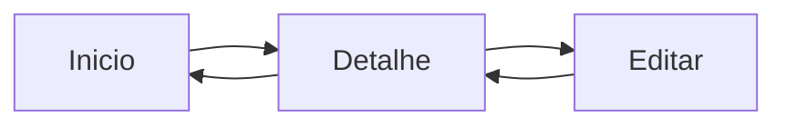

# Encontro 10 - Navegação por pilha (stack navigation)

## Objetivos

- Entender o modelo de navegação em pilha.
- Registrar telas e navegar entre elas.
- Trabalhar histórico e retorno de navegação.

## Explicação técnica

No padrão stack, cada nova tela é empilhada sobre a anterior. O estudante deve visualizar isso como uma pilha de execução de interface: entrar adiciona uma tela, voltar remove a tela do topo. Esse modelo combina muito bem com fluxos sequenciais, detalhes e formulários.

```tsx
import { NavigationContainer } from '@react-navigation/native';
import { createNativeStackNavigator } from '@react-navigation/native-stack';

const Stack = createNativeStackNavigator();

export default function App() {
  return (
    <NavigationContainer>
      <Stack.Navigator>
        <Stack.Screen name="Inicio" component={TelaInicial} />
        <Stack.Screen name="Detalhe" component={TelaDetalhe} />
      </Stack.Navigator>
    </NavigationContainer>
  );
}
```

## Diagrama



## Atividade

- Criar app com tela inicial, lista e detalhe.
- Testar navegação com botão e gesto de retorno.

## Materiais complementares

- React Navigation: <https://reactnavigation.org/docs/getting-started>
- Native stack navigator: <https://reactnavigation.org/docs/native-stack-navigator>
