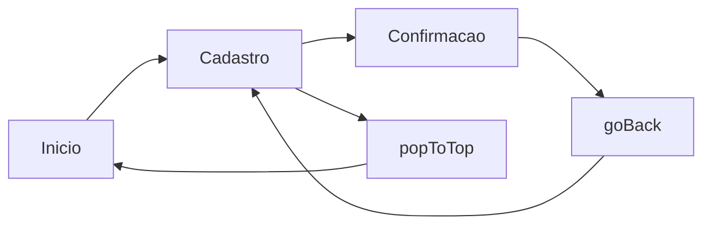

# Encontro 10 - Navegação por pilha (`stack navigation`)

## Visão do encontro

- **Objetivo central:** implementar navegação entre múltiplas telas com `React Navigation` usando `native stack`, organizando rotas, fluxo de ida e volta e estrutura mínima de app multijanelas.
- Ao final deste encontro, você deve ser capaz de configurar a pilha de navegação, registrar telas, navegar com segurança entre elas e aplicar ações como `navigate`, `push`, `goBack` e `popToTop`.

## Roteiro

1. Retomada da progressão até aqui.
2. O que é navegação por pilha.
3. Instalação e preparação do projeto.
4. Estrutura recomendada de arquivos.
5. Tipagem de rotas com TypeScript.
6. Montagem do `Stack Navigator`.
7. Ações essenciais de navegação.
8. Exemplo completo com três telas.
9. Prática 06 guiada.
10. Revisão e exercícios de fixação.

## 1. Retomada da progressão até aqui

Até o encontro 09, o foco foi construir telas robustas com formulário controlado, validação e máscara. Agora o próximo passo natural é conectar telas e criar fluxo real de aplicativo.

Progressão recente:

- encontro 06: formulário e validação básica;
- encontro 07: atividade avaliativa;
- encontro 08: correção guiada da atividade;
- encontro 09: formulários com máscaras;
- encontro 10: navegação por pilha entre telas.

## 2. O que é navegação por pilha

Navegação por pilha funciona como estrutura `LIFO` (Last In, First Out):

- ao abrir uma nova tela, ela entra no topo da pilha;
- ao voltar, removemos a tela do topo;
- a tela anterior reaparece automaticamente.

Fluxo mental:



Vantagens no início:

- simples de entender;
- combina bem com fluxos lineares;
- facilita apps com etapas (inicio -> formulario -> confirmação).

## 3. Instalação e preparação do projeto

Se o projeto ainda não tem navegação, instale as dependências:

```bash
npx expo install @react-navigation/native
npx expo install @react-navigation/native-stack
npx expo install react-native-screens react-native-safe-area-context
```

Em seguida, organize uma estrutura mínima com pasta para `navigation` e para `screens`.

## 4. Estrutura recomendada de arquivos

```text
src/
  navigation/
    AppStack.tsx
  screens/
    InicioScreen.tsx
    CadastroScreen.tsx
    ConfirmacaoScreen.tsx
  styles.ts
App.tsx
```

Responsabilidade de cada parte:

- `App.tsx`: ponto de entrada da aplicação;
- `AppStack.tsx`: define rotas e opções do stack;
- `screens/`: telas reais do fluxo;
- `styles.ts`: centraliza aparência.

## 5. Tipando rotas com TypeScript

No começo, podemos criar uma lista simples de rotas sem parâmetros.

```tsx
export type RootStackParamList = {
  Inicio: undefined;
  Cadastro: undefined;
  Confirmacao: undefined;
};
```

Esse tipo garante:

- nomes de telas consistentes;
- navegação com autocompletar;
- menos erro de digitação em nomes de rota.

## 6. Montando o `Stack Navigator`

Arquivo `src/navigation/AppStack.tsx`:

```tsx
import { NavigationContainer } from '@react-navigation/native';
import { createNativeStackNavigator } from '@react-navigation/native-stack';
import { CadastroScreen } from '../screens/CadastroScreen';
import { ConfirmacaoScreen } from '../screens/ConfirmacaoScreen';
import { InicioScreen } from '../screens/InicioScreen';

export type RootStackParamList = {
  Inicio: undefined;
  Cadastro: undefined;
  Confirmacao: undefined;
};

const Stack = createNativeStackNavigator<RootStackParamList>();

export function AppStack() {
  return (
    <NavigationContainer>
      <Stack.Navigator
        initialRouteName="Inicio"
        screenOptions={{
          headerStyle: { backgroundColor: '#0f172a' },
          headerTintColor: '#f8fafc',
          headerTitleStyle: { fontWeight: '700' },
          contentStyle: { backgroundColor: '#f8fafc' },
        }}
      >
        <Stack.Screen
          name="Inicio"
          component={InicioScreen}
          options={{ title: 'Painel Inicial' }}
        />
        <Stack.Screen
          name="Cadastro"
          component={CadastroScreen}
          options={{ title: 'Nova Visita' }}
        />
        <Stack.Screen
          name="Confirmacao"
          component={ConfirmacaoScreen}
          options={{ title: 'Confirmação', headerBackVisible: false }}
        />
      </Stack.Navigator>
    </NavigationContainer>
  );
}
```

## 7. Ações essenciais de navegação

Com `native stack`, as ações mais usadas no início são:

- `navigate('Cadastro')`: vai para a tela informada (ou volta a ela, se já existir no topo apropriado);
- `push('Cadastro')`: empilha uma nova instância da mesma tela;
- `goBack()`: volta para a tela anterior;
- `popToTop()`: retorna para a primeira tela da pilha;
- `replace('Confirmacao')`: troca a tela atual por outra.

Exemplo prático:

```tsx
navigation.navigate('Cadastro');
navigation.push('Cadastro');
navigation.goBack();
navigation.popToTop();
navigation.replace('Confirmacao');
```

## 8. Exemplo completo: fluxo com três telas

Estrutura usada:

```text
src/
  navigation/AppStack.tsx
  screens/
    InicioScreen.tsx
    CadastroScreen.tsx
    ConfirmacaoScreen.tsx
  styles.ts
App.tsx
```

`App.tsx`

```tsx
import { AppStack } from './src/navigation/AppStack';

export default function App() {
  return <AppStack />;
}
```

`src/screens/InicioScreen.tsx`

```tsx
import type { NativeStackScreenProps } from '@react-navigation/native-stack';
import { Pressable, Text, View } from 'react-native';
import type { RootStackParamList } from '../navigation/AppStack';
import { styles } from '../styles';

type Props = NativeStackScreenProps<RootStackParamList, 'Inicio'>;

export function InicioScreen({ navigation }: Props) {
  return (
    <View style={styles.container}>
      <Text style={styles.titulo}>Controle de Visitas</Text>
      <Text style={styles.subtitulo}>
        Use o fluxo abaixo para abrir cadastro, confirmar envio e voltar ao início.
      </Text>

      <Pressable style={styles.botaoPrimario} onPress={() => navigation.navigate('Cadastro')}>
        <Text style={styles.botaoPrimarioTexto}>Ir para cadastro</Text>
      </Pressable>

      <Pressable style={styles.botaoSecundario} onPress={() => navigation.push('Cadastro')}>
        <Text style={styles.botaoSecundarioTexto}>Empilhar outro cadastro (push)</Text>
      </Pressable>
    </View>
  );
}
```

`src/screens/CadastroScreen.tsx`

```tsx
import type { NativeStackScreenProps } from '@react-navigation/native-stack';
import { Alert, Pressable, Text, TextInput, View } from 'react-native';
import { useState } from 'react';
import type { RootStackParamList } from '../navigation/AppStack';
import { styles } from '../styles';

type Props = NativeStackScreenProps<RootStackParamList, 'Cadastro'>;

export function CadastroScreen({ navigation }: Props) {
  const [nome, setNome] = useState('');
  const [setor, setSetor] = useState('');

  function salvar() {
    if (!nome.trim() || !setor.trim()) {
      Alert.alert('Atenção', 'Preencha nome e setor para continuar.');
      return;
    }

    navigation.replace('Confirmacao');
  }

  return (
    <View style={styles.container}>
      <Text style={styles.titulo}>Nova visita</Text>

      <TextInput
        style={styles.input}
        placeholder="Nome do visitante"
        value={nome}
        onChangeText={setNome}
      />

      <TextInput
        style={styles.input}
        placeholder="Setor de destino"
        value={setor}
        onChangeText={setor => setSetor(setor)}
      />

      <Pressable style={styles.botaoPrimario} onPress={salvar}>
        <Text style={styles.botaoPrimarioTexto}>Salvar visita</Text>
      </Pressable>

      <Pressable style={styles.botaoSecundario} onPress={() => navigation.goBack()}>
        <Text style={styles.botaoSecundarioTexto}>Voltar sem salvar</Text>
      </Pressable>
    </View>
  );
}
```

`src/screens/ConfirmacaoScreen.tsx`

```tsx
import type { NativeStackScreenProps } from '@react-navigation/native-stack';
import { Pressable, Text, View } from 'react-native';
import type { RootStackParamList } from '../navigation/AppStack';
import { styles } from '../styles';

type Props = NativeStackScreenProps<RootStackParamList, 'Confirmacao'>;

export function ConfirmacaoScreen({ navigation }: Props) {
  return (
    <View style={styles.container}>
      <Text style={styles.titulo}>Registro concluído</Text>
      <Text style={styles.subtitulo}>
        A visita foi registrada com sucesso. Você pode retornar ao início para iniciar novo fluxo.
      </Text>

      <Pressable style={styles.botaoPrimario} onPress={() => navigation.popToTop()}>
        <Text style={styles.botaoPrimarioTexto}>Voltar ao início</Text>
      </Pressable>
    </View>
  );
}
```

`src/styles.ts`

```tsx
import { StyleSheet } from 'react-native';

export const styles = StyleSheet.create({
  container: {
    flex: 1,
    backgroundColor: '#f8fafc',
    padding: 16,
    justifyContent: 'center',
    gap: 10,
  },
  titulo: {
    fontSize: 22,
    fontWeight: '700',
    color: '#0f172a',
  },
  subtitulo: {
    fontSize: 14,
    color: '#475569',
    marginBottom: 8,
  },
  input: {
    borderWidth: 1,
    borderColor: '#cbd5e1',
    borderRadius: 10,
    backgroundColor: '#ffffff',
    paddingHorizontal: 12,
    paddingVertical: 10,
  },
  botaoPrimario: {
    marginTop: 8,
    backgroundColor: '#0f766e',
    borderRadius: 10,
    paddingVertical: 12,
    alignItems: 'center',
  },
  botaoPrimarioTexto: {
    color: '#ffffff',
    fontWeight: '700',
  },
  botaoSecundario: {
    borderWidth: 1,
    borderColor: '#0f766e',
    borderRadius: 10,
    paddingVertical: 12,
    alignItems: 'center',
  },
  botaoSecundarioTexto: {
    color: '#0f766e',
    fontWeight: '600',
  },
});
```

Com esse exemplo, você já cobre:

- configuração base de navegação;
- fluxo com 3 telas;
- ida, volta, substituição e retorno ao topo da pilha;
- organização mínima de arquivos para crescer o app.

## 9. Prática 06

### Objetivo

Construir um app chamado **Fluxo de Atendimento** com navegação por pilha e três telas funcionais.

### Requisitos mínimos

1. Criar telas `Inicio`, `Atendimento` e `Conclusao`.
2. Configurar `native stack` com `NavigationContainer`.
3. Definir `Inicio` como rota inicial.
4. Navegar da tela `Inicio` para `Atendimento` com botão.
5. Na tela `Atendimento`, incluir ao menos dois `TextInput` controlados.
6. Validar preenchimento mínimo antes de continuar.
7. Após validação, ir para `Conclusao` usando `replace`.
8. Na tela `Conclusao`, adicionar botão para voltar ao início com `popToTop`.
9. Organizar arquivos em `navigation/`, `screens/` e `styles.ts`.

### Entrega esperada

- navegação funcionando sem travamentos;
- rotas registradas corretamente;
- fluxo completo início -> atendimento -> conclusão;
- código legível com tipagem de rotas.

## 10. Checklist de validação do aluno

- o app inicia com `npm run start`;
- o botão da tela inicial abre a tela correta;
- a tela intermediária valida dados antes de avançar;
- `replace` remove retorno indevido para tela anterior;
- o botão final retorna ao topo da pilha;
- nomes de rota no código coincidem com os do stack;
- estilos estão em arquivo separado.

## 11. Erros comuns

### Esquecer `NavigationContainer` envolvendo o navigator

Sem ele, a árvore de navegação não funciona.

### Registrar tela no arquivo, mas usar nome diferente no `navigate`

Qualquer divergência de nome quebra a navegação.

### Usar `goBack` em fluxo que exigia impedir retorno

Nesses casos, prefira `replace` para não manter a tela anterior na pilha.

### Concentrar todas as telas no `App.tsx`

No começo até funciona, mas cresce mal. Separe por responsabilidade desde já.

## 12. Exercícios de revisão

1. Qual a diferença prática entre `navigate` e `push`?
2. Em que cenário `replace` é melhor que `navigate`?
3. O que o `popToTop` resolve em um fluxo de confirmação?
4. Por que tipar as rotas com `RootStackParamList`?
5. Qual o papel do `NavigationContainer`?

## 13. Exercícios de estudo

- Adicione uma quarta tela chamada `Historico` e navegue para ela após a conclusão.
- Crie uma opção no header da tela `Atendimento` para limpar os campos.
- Personalize títulos e cores do header por tela.
- Escreva um parágrafo explicando quando usar `goBack`, `replace` e `popToTop`.

## 14. Resumo do encontro

Neste encontro, você deu o passo de tela única para app multijanelas com `stack navigation`. A base foi configurar `React Navigation`, tipar rotas e dominar as ações centrais de fluxo (`navigate`, `push`, `goBack`, `replace`, `popToTop`). Esse domínio prepara o próximo avanço: navegação por abas/drawer e, em seguida, envio de parâmetros entre telas.

## Materiais complementares

- React Navigation (Getting Started): <https://reactnavigation.org/docs/getting-started>
- React Navigation (Native Stack Navigator): <https://reactnavigation.org/docs/native-stack-navigator>
- Expo docs (Using React Navigation): <https://docs.expo.dev/develop/routing/>
- React Native docs (`Pressable`): <https://reactnative.dev/docs/pressable>
