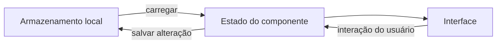
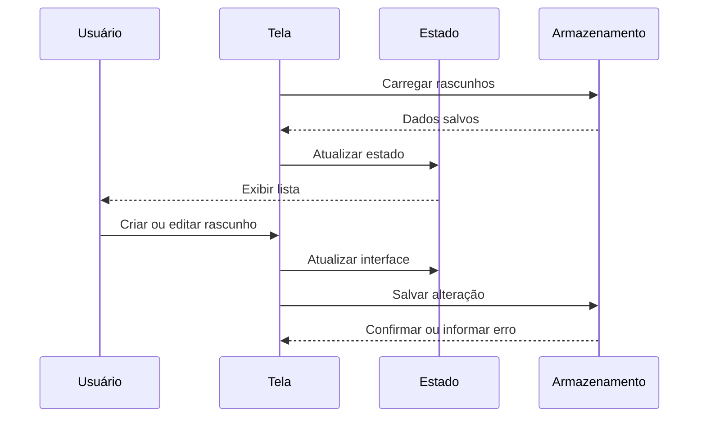
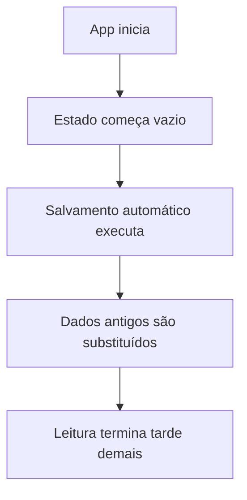

# Encontro 15 - Introdução à persistência local

## Visão do encontro

- **Objetivo central:** compreender por que o estado mantido apenas em memória não é suficiente para aplicativos móveis e planejar uma estratégia de persistência local adequada ao tipo de dado.
- Ao final deste encontro, você deve ser capaz de diferenciar estado temporário de dado persistente, reconhecer as principais opções de armazenamento local, preparar dados para serialização e descrever o fluxo de salvar, carregar, atualizar e remover informações no dispositivo.

## Roteiro

1. Retomada da Unidade 1.
2. Estado em memória x dado persistente.
3. Por que persistir dados em aplicativos móveis.
4. Ciclo de vida básico de um dado local.
5. Principais opções de armazenamento no React Native.
6. Critérios para escolher a tecnologia.
7. Serialização e modelagem dos dados.
8. Operações assíncronas e estados da interface.
9. Organização da camada de persistência.
10. Prática: rascunhos que desaparecem.
11. Revisão e exercícios de fixação.

## 1. Relembrando...

Nos encontros anteriores, nós vimos o seguinte:

- formulários controlados produzem dados;
- listas e telas apresentam esses dados;
- navegação e parâmetros transportam dados entre telas.

Até aqui, porém, os dados ficaram principalmente no estado dos componentes ou nos parâmetros de rota.

Exemplo:

```tsx
const [observacao, setObservacao] = useState('');
```

Esse valor existe enquanto a instância do componente e o processo JavaScript permanecem ativos. Se o aplicativo for recarregado ou encerrado, o estado pode ser perdido.

## 2. Estado em memória x dado persistente

Estado e persistência resolvem problemas diferentes.

| Característica | Estado em memória | Persistência local |
|---|---|---|
| Exemplo | `useState` | AsyncStorage ou SQLite |
| Duração típica | durante a execução atual | entre execuções do app |
| Acesso | imediato pelo componente | normalmente assíncrono |
| Uso principal | controlar a interface | conservar informações |
| Após recarregar o app | pode ser perdido | deve ser recuperado |

Considere um formulário de atendimento:

```tsx
const [cliente, setCliente] = useState('');
const [descricao, setDescricao] = useState('');
```

Esses estados são adequados para controlar a digitação. Entretanto, se o usuário precisa continuar o preenchimento depois de fechar o aplicativo, o rascunho também precisa ser salvo em algum armazenamento persistente.

Uma estratégia comum combina as duas camadas:



O estado continua sendo usado para renderizar a tela. A persistência permite reconstruir esse estado em uma execução futura.

## 3. Por que persistir dados em aplicativos móveis

Aplicativos móveis lidam com interrupções frequentes:

- o usuário alterna para outro aplicativo;
- o sistema coloca o app em segundo plano;
- o processo pode ser encerrado para liberar memória;
- o dispositivo pode ficar sem conexão;
- a bateria pode acabar;
- o usuário pode reiniciar o aparelho.

Por isso, dados importantes não devem depender apenas da permanência de uma tela aberta.

Casos comuns de persistência local:

- preferências de tema, idioma ou filtros;
- rascunho de formulário;
- itens favoritos;
- histórico de pesquisas;
- registros produzidos sem internet;
- dados aguardando sincronização;
- banco local de um aplicativo offline.

Persistir localmente não significa conservar tudo para sempre. Cada dado precisa de uma política:

- quando será salvo;
- quando será carregado;
- quando será atualizado;
- quando será removido;
- por quanto tempo ainda será válido.

## 4. Ciclo de vida básico de um dado local

Um dado persistente normalmente passa por quatro operações principais:

1. **criar/salvar:** registrar um novo valor;
2. **ler/carregar:** recuperar o valor armazenado;
3. **atualizar:** substituir ou alterar o valor;
4. **remover:** apagar o valor quando ele não for mais necessário.

Esse conjunto é frequentemente chamado de CRUD:

- `Create`;
- `Read`;
- `Update`;
- `Delete`.

Em um app de atendimentos, o fluxo pode ser:



Observe que a interface precisa lidar com dois momentos diferentes:

- o dado ainda está sendo carregado;
- o dado já está disponível para uso.

## 5. Principais opções de armazenamento no React Native

Não existe uma única tecnologia ideal para todos os dados.

### Estado em memória

Use `useState`, `useReducer` ou outro gerenciador de estado quando o dado:

- só precisa existir durante a execução atual;
- pertence à interação temporária da interface;
- pode ser reconstruído sem prejuízo.

Exemplos: campo em digitação, modal aberto, aba selecionada e mensagem temporária.

### AsyncStorage

É um armazenamento:

- persistente;
- assíncrono;
- baseado em pares chave-valor;
- não criptografado.

É adequado para dados simples, como:

- preferências;
- pequenos rascunhos;
- filtros recentes;
- listas pequenas serializadas em JSON.

O estudo detalhado de instalação, leitura, gravação e remoção será feito no encontro 16.

### SQLite

É um banco de dados relacional local. É adequado quando:

- existem muitos registros;
- os dados possuem campos e relações;
- são necessárias consultas, filtros e ordenação;
- haverá operações frequentes de CRUD;
- o app precisa trabalhar de forma offline com dados estruturados.

O SQLite será implementado nos encontros 17 e 18.

### SecureStore

É voltado ao armazenamento local criptografado de pequenos pares chave-valor. Pode ser usado para informações sensíveis, como tokens de autenticação e outros segredos pequenos.

Não deve ser tratado como banco de dados nem como local para grandes coleções.

### Arquivos

O sistema de arquivos é mais apropriado para:

- fotos;
- documentos;
- áudio;
- conteúdo binário;
- arquivos exportados ou importados.

Em vez de armazenar uma imagem inteira como texto em uma chave, normalmente guardamos o arquivo e persistimos apenas seu caminho ou identificador.

## 6. Critérios para escolher a tecnologia

Antes de escolher uma biblioteca, faça perguntas sobre o dado.

| Pergunta | Possível decisão |
|---|---|
| O dado pode desaparecer ao fechar o app? | Estado em memória |
| É uma configuração ou estrutura pequena? | AsyncStorage |
| É uma coleção crescente de registros? | SQLite |
| Precisa de filtros e consultas por campos? | SQLite |
| É um segredo pequeno? | SecureStore |
| É foto, áudio ou documento? | Sistema de arquivos |
| Precisa existir em vários dispositivos? | API remota + estratégia local |

Exemplos:

| Dado | Opção inicial | Justificativa |
|---|---|---|
| Tema claro/escuro | AsyncStorage | valor simples e não sensível |
| Rascunho de observação | AsyncStorage | pequeno e fácil de serializar |
| Milhares de atendimentos | SQLite | coleção consultável e crescente |
| Token de acesso | SecureStore | informação sensível e pequena |
| Foto da vistoria | Arquivo | conteúdo binário |
| Resultado temporário de validação | Estado | não precisa sobreviver ao app |

### Decisão importante

AsyncStorage é persistente, mas não é criptografado. Portanto, não armazene nele:

- senha em texto puro;
- número completo de cartão;
- segredo de API;
- token sensível sem avaliar o modelo de segurança;
- dados pessoais além do necessário.

Persistência também envolve responsabilidade sobre privacidade e descarte.

## 7. Serialização e modelagem dos dados

Armazenamentos chave-valor normalmente trabalham com texto. Para salvar objetos e arrays, precisamos transformá-los em uma representação textual.

Considere este tipo:

```tsx
type RascunhoAtendimento = {
  id: string;
  cliente: string;
  descricao: string;
  prioridade: 'normal' | 'alta';
  atualizadoEm: string;
};
```

Objeto em memória:

```tsx
const rascunho: RascunhoAtendimento = {
  id: 'rascunho-001',
  cliente: 'Ana Souza',
  descricao: 'Verificar equipamento sem conexão.',
  prioridade: 'alta',
  atualizadoEm: new Date().toISOString(),
};
```

Transformação para texto:

```tsx
const texto = JSON.stringify(rascunho);
```

Reconstrução do objeto:

```tsx
const dado = JSON.parse(texto) as RascunhoAtendimento;
```

### Leitura do código

1. `JSON.stringify(...)` serializa o objeto para texto.
2. `JSON.parse(...)` interpreta o texto e produz um novo objeto.
3. `as RascunhoAtendimento` informa um tipo ao TypeScript, mas não valida o conteúdo em tempo de execução.
4. `toISOString()` registra data e hora como texto padronizado.

### Cuidados com JSON

- `Date` volta do `JSON.parse` como `string`, não como objeto `Date`;
- funções não são representadas;
- propriedades com `undefined` podem desaparecer;
- referências circulares causam erro no `JSON.stringify`;
- texto inválido causa erro no `JSON.parse`;
- dados antigos podem ter formato diferente do código atual.

Por isso, é útil incluir campos estáveis e explícitos:

```tsx
type DadosLocais = {
  versao: 1;
  rascunhos: RascunhoAtendimento[];
};
```

O campo `versao` ajuda o app a reconhecer o formato salvo e, no futuro, migrar dados antigos.

## 8. Operações assíncronas e estados da interface

Uma **operação assíncrona** é uma tarefa cujo resultado não fica disponível imediatamente. Em vez de bloquear toda a aplicação enquanto espera, o JavaScript pode continuar executando outras ações e tratar o resultado quando a tarefa terminar. Leituras no armazenamento, requisições de rede e acesso a arquivos são exemplos comuns.

Essas operações normalmente retornam uma `Promise`, que representa um resultado futuro. A palavra-chave `await` permite aguardar esse resultado dentro de uma função `async`, mantendo o código mais fácil de ler. Durante essa espera, a interface pode continuar respondendo ao usuário.

Leitura e gravação no dispositivo normalmente são operações assíncronas. Elas podem demorar ou falhar.

Formato conceitual:

```tsx
async function carregarDados() {
  try {
    const dados = await armazenamento.ler('rascunhos');
    return dados;
  } catch (erro) {
    console.error('Não foi possível carregar os dados.', erro);
    return null;
  }
}
```

### Leitura do código

1. `async` permite usar `await` dentro da função.
2. `await` aguarda a conclusão da leitura.
3. `try/catch` impede que a falha seja ignorada ou quebre o fluxo sem tratamento.
4. Retornar `null` permite representar ausência de dado ou uma estratégia de recuperação.

Durante a inicialização, a tela pode controlar:

```tsx
type EstadoCarregamento = 'carregando' | 'pronto' | 'erro';
```

Cada estado deve produzir um feedback:

- `carregando`: indicador ou mensagem de espera;
- `pronto`: conteúdo normal;
- `erro`: mensagem e possibilidade de tentar novamente.

### Evite sobrescrever dados antes da leitura

Um erro comum é salvar o estado inicial vazio antes que a leitura termine:



Uma solução é marcar quando a hidratação foi concluída:

```tsx
const [hidratado, setHidratado] = useState(false);
```

**Hidratação** é o processo de carregar dados persistidos e colocá-los novamente no estado usado pela interface.

## 9. Organização da camada de persistência

Evite espalhar chamadas de armazenamento por todas as telas. Defina uma responsabilidade clara para acesso aos dados.

Contrato conceitual:

```tsx
export interface ArmazenamentoLocal {
  salvar(chave: string, valor: string): Promise<void>;
  ler(chave: string): Promise<string | null>;
  remover(chave: string): Promise<void>;
}
```

A tela não precisa conhecer todos os detalhes da tecnologia. Ela pode chamar funções mais próximas do domínio:

```tsx
export async function salvarRascunhos(rascunhos: RascunhoAtendimento[]) {
  const dados: DadosLocais = {
    versao: 1,
    rascunhos,
  };

  const texto = JSON.stringify(dados);
  await armazenamento.salvar('@central-campo:rascunhos', texto);
}
```

Benefícios dessa separação:

- reduz repetição;
- centraliza nomes de chave;
- facilita tratamento de erro;
- permite trocar a tecnologia com menos impacto;
- prepara o projeto para testes e para uma camada de repositório.

### Convenção de chaves

Chaves devem ser previsíveis e específicas:

```text
@central-campo:preferencias
@central-campo:rascunhos
@central-campo:ultima-sincronizacao
```

Evite chaves genéricas:

```text
dados
lista
valor
```

## 10. Prática: rascunhos que desaparecem

O objetivo desta prática é observar o problema antes de instalar uma solução de persistência.

Crie uma tela simples de rascunhos mantidos apenas com `useState`.

Estrutura:

```text
App.tsx
styles.ts
```

`App.tsx`

```tsx
import { useState } from 'react';
import {
  Alert,
  FlatList,
  Pressable,
  Text,
  TextInput,
  View,
} from 'react-native';
import { styles } from './styles';

type Rascunho = {
  id: string;
  titulo: string;
};

export default function App() {
  const [titulo, setTitulo] = useState('');
  const [rascunhos, setRascunhos] = useState<Rascunho[]>([]);

  function adicionarRascunho() {
    const tituloLimpo = titulo.trim();

    if (!tituloLimpo) {
      Alert.alert('Atenção', 'Digite um título para o rascunho.');
      return;
    }

    const novoRascunho: Rascunho = {
      id: `${Date.now()}`,
      titulo: tituloLimpo,
    };

    setRascunhos((estadoAnterior) => [
      novoRascunho,
      ...estadoAnterior,
    ]);
    setTitulo('');
  }

  function removerRascunho(id: string) {
    setRascunhos((estadoAnterior) =>
      estadoAnterior.filter((item) => item.id !== id)
    );
  }

  return (
    <View style={styles.container}>
      <Text style={styles.titulo}>Rascunhos de Atendimento</Text>
      <Text style={styles.subtitulo}>
        Adicione itens e depois recarregue o aplicativo.
      </Text>

      <TextInput
        style={styles.input}
        placeholder="Título do rascunho"
        value={titulo}
        onChangeText={setTitulo}
      />

      <Pressable style={styles.botao} onPress={adicionarRascunho}>
        <Text style={styles.botaoTexto}>Adicionar rascunho</Text>
      </Pressable>

      <Text style={styles.contador}>
        {rascunhos.length} rascunho(s) somente em memória
      </Text>

      <FlatList
        data={rascunhos}
        keyExtractor={(item) => item.id}
        ListEmptyComponent={
          <Text style={styles.vazio}>Nenhum rascunho nesta execução.</Text>
        }
        renderItem={({ item }) => (
          <View style={styles.item}>
            <Text style={styles.itemTexto}>{item.titulo}</Text>

            <Pressable onPress={() => removerRascunho(item.id)}>
              <Text style={styles.removerTexto}>Remover</Text>
            </Pressable>
          </View>
        )}
      />
    </View>
  );
}
```

`styles.ts`

```tsx
import { StyleSheet } from 'react-native';

export const styles = StyleSheet.create({
  container: {
    flex: 1,
    backgroundColor: '#f8fafc',
    padding: 16,
    paddingTop: 56,
    gap: 10,
  },
  titulo: {
    color: '#0f172a',
    fontSize: 22,
    fontWeight: '700',
  },
  subtitulo: {
    color: '#475569',
    fontSize: 14,
    lineHeight: 20,
  },
  input: {
    borderWidth: 1,
    borderColor: '#cbd5e1',
    borderRadius: 10,
    backgroundColor: '#ffffff',
    paddingHorizontal: 12,
    paddingVertical: 10,
  },
  botao: {
    backgroundColor: '#0f766e',
    borderRadius: 10,
    paddingVertical: 12,
    alignItems: 'center',
  },
  botaoTexto: {
    color: '#ffffff',
    fontWeight: '700',
  },
  contador: {
    color: '#334155',
    fontWeight: '600',
    marginTop: 8,
  },
  vazio: {
    color: '#64748b',
    textAlign: 'center',
    marginTop: 24,
  },
  item: {
    borderWidth: 1,
    borderColor: '#e2e8f0',
    borderRadius: 10,
    backgroundColor: '#ffffff',
    padding: 12,
    marginTop: 8,
    flexDirection: 'row',
    justifyContent: 'space-between',
    alignItems: 'center',
    gap: 12,
  },
  itemTexto: {
    flex: 1,
    color: '#0f172a',
  },
  removerTexto: {
    color: '#dc2626',
    fontWeight: '600',
  },
});
```

### Roteiro de observação

1. Inicie o projeto com `npx expo start`.
2. Adicione pelo menos três rascunhos.
3. Alterne entre aplicativos e retorne ao projeto.
4. Observe que os itens podem continuar enquanto o processo está ativo.
5. Use a opção **Reload** do menu de desenvolvimento ou force o encerramento do app antes de abri-lo novamente.
6. Observe que a lista volta ao estado inicial vazio.

### O que o teste demonstra

- `useState` controla corretamente a interface;
- navegar ou alternar de aplicativo não significa, por si só, persistir;
- um novo ciclo de execução recria o estado inicial;
- precisamos carregar dados salvos quando o app inicia;
- precisamos salvar dados quando a coleção muda.

No encontro 16, esse mesmo problema será resolvido com `AsyncStorage`.

## 11. Checklist de compreensão

- consigo explicar por que `useState` não é persistência;
- sei diferenciar dado temporário de dado durável;
- reconheço quando usar AsyncStorage, SQLite, SecureStore ou arquivo;
- entendo que AsyncStorage não é criptografado;
- sei por que objetos precisam ser serializados;
- consigo explicar `JSON.stringify` e `JSON.parse`;
- reconheço que leitura e gravação podem falhar;
- sei o que significa hidratar o estado;
- consigo definir quando um dado deve ser salvo, carregado e removido.

## 13. Erros comuns

### Tratar estado global como persistência

Context, Redux ou outro gerenciador podem compartilhar estado entre telas, mas os dados ainda podem desaparecer quando o processo termina.

### Escolher SQLite para qualquer valor

Um banco relacional adiciona estrutura e complexidade. Para uma preferência simples, chave-valor costuma ser suficiente.

### Colocar uma coleção crescente em uma única chave

Serializar toda a coleção a cada alteração pode se tornar inadequado. Dados numerosos e consultáveis favorecem SQLite.

### Salvar informação sensível sem proteção

Persistência local não é sinônimo de armazenamento seguro. Avalie criptografia, necessidade e tempo de retenção.

### Ignorar erros de leitura e gravação

O armazenamento pode falhar. A interface precisa informar o problema ou aplicar uma recuperação segura.

### Confiar no tipo após `JSON.parse`

O TypeScript não valida dados recebidos em tempo de execução. Dados persistidos podem estar incompletos, antigos ou corrompidos.

### Testar apenas com Fast Refresh

O Fast Refresh pode preservar parte do estado durante o desenvolvimento. Para testar persistência, use recarga completa e reinício do aplicativo.

## 14. Exercícios de revisão

1. Qual é a diferença entre estado em memória e persistência local?
2. Por que parâmetros de rota não devem ser usados como banco de dados?
3. Em que situação AsyncStorage é mais adequado que SQLite?
4. Em que situação SQLite é mais adequado que AsyncStorage?
5. Por que AsyncStorage não é indicado para senhas?
6. O que `JSON.stringify` e `JSON.parse` fazem?
7. O que significa hidratar o estado da aplicação?
8. Por que a tela precisa de estados de carregamento e erro?
9. Qual é a vantagem de centralizar as chaves de armazenamento?
10. Que teste comprova que um dado realmente sobrevive ao reinício?

## 15. Exercícios de estudo

- Acrescente ao tipo `Rascunho` os campos `descricao`, `prioridade` e `atualizadoEm`.
- Escreva uma função que serialize uma lista de rascunhos.
- Escreva uma função que tente interpretar um JSON e retorne uma lista vazia em caso de erro.
- Classifique dez dados de um aplicativo entre estado, AsyncStorage, SQLite, SecureStore e arquivo.
- Desenhe o fluxo de hidratação de uma lista persistida.
- Explique por que um app offline ainda pode precisar de uma API remota posteriormente.

## 16. Resumo do encontro

Neste encontro, você identificou a diferença entre manter dados no estado e persistir informações no dispositivo. Também analisou o ciclo de vida dos dados, comparou AsyncStorage, SQLite, SecureStore e arquivos, praticou serialização com JSON e observou um aplicativo perder seus rascunhos após uma recarga completa. Essa base prepara o encontro 16, no qual a lista será carregada e salva com armazenamento chave-valor.

## Materiais complementares

- Expo docs (`AsyncStorage`): <https://docs.expo.dev/versions/latest/sdk/async-storage/>
- AsyncStorage docs: <https://react-native-async-storage.github.io/async-storage/>
- Expo docs (`SQLite`): <https://docs.expo.dev/versions/latest/sdk/sqlite/>
- Expo docs (`SecureStore`): <https://docs.expo.dev/versions/latest/sdk/securestore/>
- React Native docs (`AppState`): <https://reactnative.dev/docs/appstate>
- MDN (`JSON.stringify`): <https://developer.mozilla.org/docs/Web/JavaScript/Reference/Global_Objects/JSON/stringify>
- MDN (`JSON.parse`): <https://developer.mozilla.org/docs/Web/JavaScript/Reference/Global_Objects/JSON/parse>
