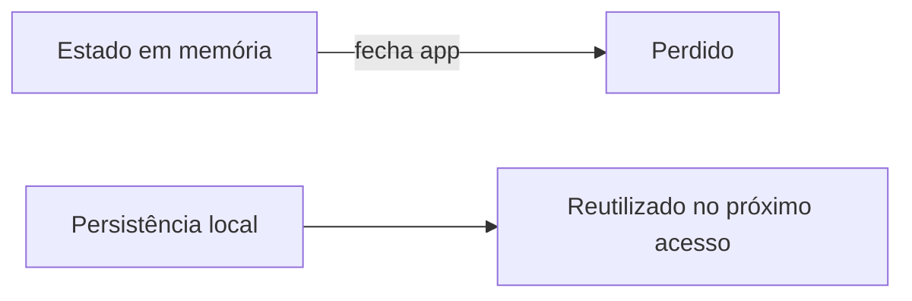

# Encontro 15 - Introdução à persistência local

## Objetivos

- Explicar por que apps móveis precisam persistir dados.
- Diferenciar memória volátil de armazenamento local.
- Mapear opções como AsyncStorage e SQLite.

## Explicação técnica

Estado em memória desaparece quando o app fecha. Persistência local preserva preferências, cache, sessões e registros criados offline. O professor deve destacar o trade-off entre simplicidade e estrutura: chave-valor é rápido para dados simples; banco relacional atende melhor cenários estruturados.



## Exemplo conceitual

```tsx
const preferencias = {
  tema: 'claro',
  idioma: 'pt-BR',
};
```

Discutir onde esse objeto vive em memória e onde ele deveria ser salvo.

## Atividade

- Classificar tipos de dados do app da turma em memória, cache ou banco local.

## Materiais complementares

- Data persistence overview: <https://developer.android.com/topic/libraries/architecture/saving-states>
- Expo storage options: <https://docs.expo.dev/versions/latest/>
