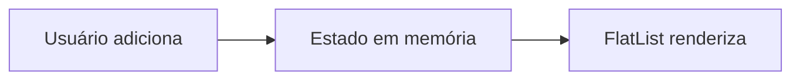
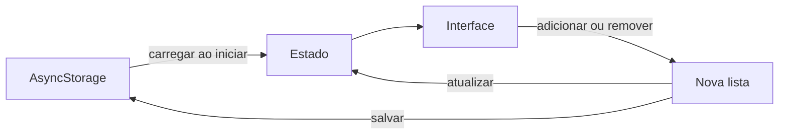
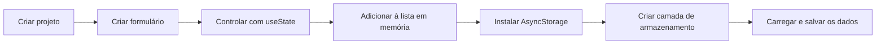
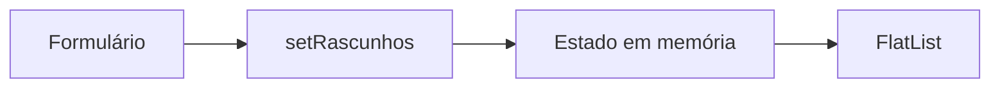
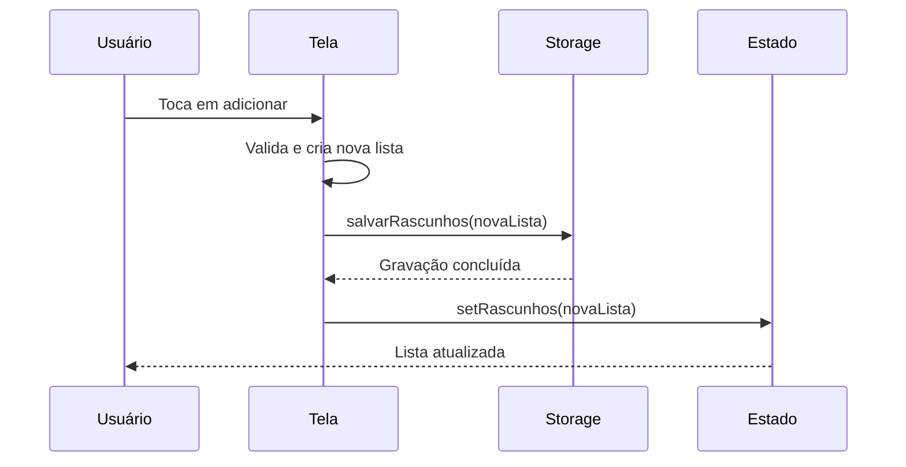

# Encontro 16 - AsyncStorage: armazenamento chave-valor

## Visão do encontro

- **Objetivo central:** criar um aplicativo com formulário controlado e evoluí-lo até a persistência local com `AsyncStorage`, sem misturar a interface com os detalhes do armazenamento.
- Ao final deste encontro, você deve ser capaz de criar o projeto, controlar formulário e lista com `useState`, instalar e usar o `AsyncStorage`, persistir objetos e arrays com JSON, hidratar o estado na inicialização e tratar carregamento, erro, gravação e remoção.

## Roteiro

1. Retomada do encontro 15.
2. Criação do app, formulário com `useState` e instalação do `AsyncStorage`.
3. Camada de persistência: chave, JSON e operações.
4. Hidratação do estado com `useEffect`.
5. Integração da interface com a persistência.
6. Teste completo da persistência.
7. Prática 08.
8. Checklist de validação.
9. Erros comuns.
10. Exercícios de revisão.
11. Exercícios de estudo.
12. Resumo do encontro.

## 1. Retomada do encontro anterior

No encontro anterior, construímos uma lista de rascunhos usando apenas `useState`.

O fluxo funcionava enquanto a execução atual permanecia ativa:



Depois de uma recarga completa ou do encerramento do aplicativo, a lista voltava ao estado inicial vazio.

Neste encontro, vamos completar o fluxo:



A interface ainda será controlada pelo estado. O `AsyncStorage` será responsável por reconstruir esse estado em execuções futuras.

## 2. Construir o app e preparar a persistência

Nesta prática, construiremos o aplicativo desde o início. Quem concluiu o encontro 15 também pode comparar cada etapa com a versão anterior, mas não é necessário reutilizar aquele projeto.

O desenvolvimento será dividido em checkpoints:



### Etapa 1 - Criar um novo aplicativo

No terminal, execute:

```bash
npx create-expo-app@latest rascunhos-persistentes --template blank-typescript
cd rascunhos-persistentes
```

O template `blank-typescript` cria um projeto simples, com TypeScript e um arquivo `App.tsx`, sem adicionar navegação que não será necessária nesta prática.

Inicie o projeto:

```bash
npx expo start
```

Abra o aplicativo no Expo Go, em um emulador ou em um simulador. Antes de continuar, confirme que a tela inicial do template aparece sem erros.

### Etapa 2 - Definir os dados do formulário

O formulário terá:

- um campo textual para o título;
- uma escolha entre prioridade normal e alta;
- uma lista com os rascunhos adicionados.

Cada informação que muda na tela precisa de um estado:

```tsx
const [titulo, setTitulo] = useState('');
const [prioridade, setPrioridade] =
  useState<Prioridade>('normal');
const [rascunhos, setRascunhos] =
  useState<Rascunho[]>([]);
```

Função de cada estado:

| Estado | Valor inicial | Responsabilidade |
|---|---|---|
| `titulo` | `''` | controlar o texto digitado |
| `prioridade` | `'normal'` | controlar a opção selecionada |
| `rascunhos` | `[]` | manter os itens da execução atual |

Os valores são lidos pela interface. As funções `setTitulo`, `setPrioridade` e `setRascunhos` solicitam uma nova renderização com os dados atualizados.

### Etapa 3 - Criar o formulário controlado

Substitua o conteúdo de `App.tsx` pelo código abaixo:

```tsx
import { useState } from 'react';
import {
  Alert,
  FlatList,
  Pressable,
  StyleSheet,
  Text,
  TextInput,
  View,
} from 'react-native';

type Prioridade = 'normal' | 'alta';

type Rascunho = {
  id: string;
  titulo: string;
  prioridade: Prioridade;
  atualizadoEm: string;
};

export default function App() {
  const [titulo, setTitulo] = useState('');
  const [prioridade, setPrioridade] =
    useState<Prioridade>('normal');
  const [rascunhos, setRascunhos] =
    useState<Rascunho[]>([]);

  function adicionarRascunho() {
    const tituloLimpo = titulo.trim();

    if (!tituloLimpo) {
      Alert.alert(
        'Atenção',
        'Digite um título para o rascunho.'
      );
      return;
    }

    const novoRascunho: Rascunho = {
      id: `${Date.now()}`,
      titulo: tituloLimpo,
      prioridade,
      atualizadoEm: new Date().toISOString(),
    };

    setRascunhos((listaAtual) => [
      novoRascunho,
      ...listaAtual,
    ]);
    setTitulo('');
    setPrioridade('normal');
  }

  return (
    <View style={styles.container}>
      <Text style={styles.titulo}>
        Rascunhos de Atendimento
      </Text>

      <Text style={styles.label}>Título</Text>
      <TextInput
        style={styles.input}
        placeholder="Título do rascunho"
        value={titulo}
        onChangeText={setTitulo}
      />

      <Text style={styles.label}>Prioridade</Text>
      <View style={styles.linha}>
        <Pressable
          style={[
            styles.botaoOpcao,
            prioridade === 'normal' &&
              styles.botaoOpcaoAtivo,
          ]}
          onPress={() => setPrioridade('normal')}
        >
          <Text>Normal</Text>
        </Pressable>

        <Pressable
          style={[
            styles.botaoOpcao,
            prioridade === 'alta' &&
              styles.botaoOpcaoAtivo,
          ]}
          onPress={() => setPrioridade('alta')}
        >
          <Text>Alta</Text>
        </Pressable>
      </View>

      <Pressable
        style={styles.botaoAdicionar}
        onPress={adicionarRascunho}
      >
        <Text style={styles.botaoAdicionarTexto}>
          Adicionar rascunho
        </Text>
      </Pressable>

      <Text style={styles.contador}>
        {rascunhos.length} rascunho(s)
      </Text>

      <FlatList
        data={rascunhos}
        keyExtractor={(item) => item.id}
        ListEmptyComponent={
          <Text style={styles.vazio}>
            Nenhum rascunho adicionado.
          </Text>
        }
        renderItem={({ item }) => (
          <View style={styles.item}>
            <Text style={styles.itemTitulo}>
              {item.titulo}
            </Text>
            <Text>Prioridade {item.prioridade}</Text>
          </View>
        )}
      />
    </View>
  );
}

const styles = StyleSheet.create({
  container: {
    flex: 1,
    backgroundColor: '#f8fafc',
    paddingHorizontal: 16,
    paddingTop: 56,
  },
  titulo: {
    color: '#0f172a',
    fontSize: 22,
    fontWeight: '700',
    marginBottom: 18,
  },
  label: {
    color: '#334155',
    fontWeight: '600',
    marginBottom: 6,
  },
  input: {
    borderWidth: 1,
    borderColor: '#cbd5e1',
    borderRadius: 10,
    backgroundColor: '#ffffff',
    paddingHorizontal: 12,
    paddingVertical: 10,
    marginBottom: 12,
  },
  linha: {
    flexDirection: 'row',
    gap: 8,
    marginBottom: 12,
  },
  botaoOpcao: {
    flex: 1,
    borderWidth: 1,
    borderColor: '#cbd5e1',
    borderRadius: 10,
    paddingVertical: 10,
    alignItems: 'center',
  },
  botaoOpcaoAtivo: {
    borderColor: '#0f766e',
    backgroundColor: '#ccfbf1',
  },
  botaoAdicionar: {
    borderRadius: 10,
    backgroundColor: '#0f766e',
    paddingVertical: 12,
    alignItems: 'center',
  },
  botaoAdicionarTexto: {
    color: '#ffffff',
    fontWeight: '700',
  },
  contador: {
    color: '#334155',
    fontWeight: '600',
    marginTop: 20,
    marginBottom: 4,
  },
  vazio: {
    color: '#64748b',
    textAlign: 'center',
    marginTop: 28,
  },
  item: {
    borderWidth: 1,
    borderColor: '#e2e8f0',
    borderRadius: 10,
    backgroundColor: '#ffffff',
    padding: 12,
    marginTop: 8,
    gap: 4,
  },
  itemTitulo: {
    color: '#0f172a',
    fontSize: 16,
    fontWeight: '700',
  },
});
```

### Leitura do formulário

1. `value={titulo}` faz o `TextInput` exibir o valor do estado.
2. `onChangeText={setTitulo}` atualiza o estado a cada alteração.
3. Os botões de prioridade chamam `setPrioridade` com a opção escolhida.
4. `adicionarRascunho` valida o título e cria um objeto.
5. `setRascunhos` cria um novo array com o item no início.
6. A `FlatList` renderiza o conteúdo do estado `rascunhos`.
7. Depois da adição, o formulário volta aos valores iniciais.

Neste ponto, o formulário está completo e a lista funciona, mas nenhum valor é persistido.

### Checkpoint 1 - Confirmar a limitação do `useState`

1. adicione dois ou três rascunhos;
2. confirme que eles aparecem na `FlatList`;
3. faça uma recarga completa pelo menu de desenvolvimento;
4. observe que a lista volta a ficar vazia.

O fluxo atual termina na memória:



O próximo passo será inserir o armazenamento entre a ação do usuário e as futuras execuções do aplicativo.

### Etapa 4 - Instalar e compreender o AsyncStorage

Agora existe um problema concreto: a lista funciona, mas desaparece depois da recarga. Para conservar os rascunhos no dispositivo, instale o `AsyncStorage`.

Interrompa o servidor com `Ctrl + C` e execute:

```bash
npx expo install @react-native-async-storage/async-storage
```

O comando `expo install` escolhe uma versão compatível com o SDK do projeto. Depois, inicie novamente:

```bash
npx expo start
```

Confirme que:

1. a dependência aparece no `package.json`;
2. o projeto inicia sem erro;
3. o aplicativo continua abrindo no Expo Go, emulador ou simulador.

O `AsyncStorage` oferece armazenamento:

- persistente entre execuções;
- assíncrono;
- organizado em pares chave-valor;
- não criptografado;
- adequado para configurações e pequenas coleções.

Cada dado é localizado por uma chave e armazenado como texto:

| Chave | Valor textual |
|---|---|
| `@central-campo:rascunhos` | JSON com os rascunhos |

Ele não é apropriado para senhas, segredos, grandes coleções ou dados que exigem consultas e relacionamentos. Nesses casos, outras soluções, como `SecureStore` ou SQLite, são mais adequadas.

### Etapa 5 - Organizar os arquivos

Ao final do tutorial, o projeto terá esta estrutura:

```text
rascunhos-persistentes/
  src/
    storage/
      rascunhosStorage.ts
    types.ts
  App.tsx
  styles.ts
```

Responsabilidades:

- `src/types.ts`: define o formato do rascunho;
- `src/storage/rascunhosStorage.ts`: conhece chave, JSON e `AsyncStorage`;
- `App.tsx`: controla estado, interação e feedback;
- `styles.ts`: centraliza a aparência.

Crie a pasta `src`, o arquivo `src/types.ts` e a pasta `src/storage`.

Mova os tipos que estavam no início do `App.tsx` para `src/types.ts`:

```tsx
export type Prioridade = 'normal' | 'alta';

export type Rascunho = {
  id: string;
  titulo: string;
  prioridade: Prioridade;
  atualizadoEm: string;
};
```

O campo `atualizadoEm` será armazenado como texto no formato ISO. Depois do `JSON.parse`, ele continuará sendo uma `string`.

No `App.tsx`, remova as declarações locais de `Prioridade` e `Rascunho` e importe os tipos:

```tsx
import type {
  Prioridade,
  Rascunho,
} from './src/types';
```

Execute novamente o aplicativo e confirme que o comportamento continua igual. Essa reorganização não adiciona persistência; apenas prepara as responsabilidades.

## 3. Etapa 6 - Criar a camada de persistência

Agora criaremos o módulo que será responsável por converter os dados, gravá-los e recuperá-los. A interface não acessará diretamente a chave nem executará `JSON.stringify` ou `JSON.parse`.

### Importar e escolher a chave

Crie o arquivo `src/storage/rascunhosStorage.ts`. Nele, a biblioteca será importada assim:

```tsx
import AsyncStorage from '@react-native-async-storage/async-storage';
```

Também precisamos definir uma chave:

```tsx
const CHAVE_RASCUNHOS = '@central-campo:rascunhos';
```

A chave deve ser específica para o aplicativo e para o tipo de dado. Ela ficará centralizada neste módulo para impedir diferenças entre a escrita e a leitura.

### Conhecer as operações necessárias

O módulo usará três operações:

| Operação | Uso no aplicativo |
|---|---|
| `setItem(chave, valor)` | salvar ou substituir a coleção |
| `getItem(chave)` | carregar a coleção |
| `removeItem(chave)` | apagar a coleção |

Todas são assíncronas, retornam `Promise` e serão chamadas com `await` dentro de funções `async`.

O `getItem` retorna:

- uma `string`, quando a chave existe;
- `null`, quando ainda não existe valor salvo.

Por isso, a primeira execução do aplicativo deve transformar `null` em uma lista vazia.

Para apagar somente os rascunhos, usaremos `removeItem`. O método `clear()` não é adequado aqui, pois pode remover todas as chaves conhecidas pelo `AsyncStorage`, inclusive as usadas por outras partes do aplicativo ou por bibliotecas.

### Converter objetos em texto

O `AsyncStorage` armazena apenas valores textuais. O array `Rascunho[]` precisa ser serializado na gravação e interpretado na leitura:

```tsx
const texto = JSON.stringify(dados);
await AsyncStorage.setItem(CHAVE_RASCUNHOS, texto);
```

```tsx
const texto = await AsyncStorage.getItem(CHAVE_RASCUNHOS);

if (texto !== null) {
  const valor = JSON.parse(texto);
}
```

Usaremos um envelope com a versão do formato:

```tsx
type DadosLocais = {
  versao: 1;
  rascunhos: Rascunho[];
};
```

O valor gravado terá esta estrutura:

```json
{
  "versao": 1,
  "rascunhos": [
    {
      "id": "1718123456789",
      "titulo": "Verificar roteador",
      "prioridade": "alta",
      "atualizadoEm": "2026-06-11T14:30:00.000Z"
    }
  ]
}
```

O campo `versao` permitirá reconhecer formatos antigos quando o modelo mudar.

O TypeScript não valida o resultado do `JSON.parse` durante a execução. Por isso, o módulo verificará a versão e os campos recuperados antes de entregar a lista para a tela.

### Escolher quando salvar

Neste tutorial, cada ação calculará a próxima lista e solicitará sua gravação explicitamente:

```tsx
const novaLista = [novoRascunho, ...rascunhos];

await salvarRascunhos(novaLista);
setRascunhos(novaLista);
```

Essa estratégia deixa claro quando a persistência acontece, facilita o tratamento de erros e evita que o estado inicial vazio seja salvo antes da leitura dos dados existentes.

Outra possibilidade seria observar `rascunhos` com um `useEffect` e salvar automaticamente. Essa alternativa exige uma variável de hidratação para impedir a sobrescrita prematura e ficará como exercício de aprofundamento.

### Arquivo `src/storage/rascunhosStorage.ts`

```tsx
import AsyncStorage from '@react-native-async-storage/async-storage';
import type { Rascunho } from '../types';

const CHAVE_RASCUNHOS = '@central-campo:rascunhos';

type DadosLocais = {
  versao: 1;
  rascunhos: Rascunho[];
};

function ehRascunho(valor: unknown): valor is Rascunho {
  if (typeof valor !== 'object' || valor === null) {
    return false;
  }

  const item = valor as Partial<Rascunho>;

  return (
    typeof item.id === 'string' &&
    typeof item.titulo === 'string' &&
    (item.prioridade === 'normal' ||
      item.prioridade === 'alta') &&
    typeof item.atualizadoEm === 'string'
  );
}

function ehDadosLocais(valor: unknown): valor is DadosLocais {
  if (typeof valor !== 'object' || valor === null) {
    return false;
  }

  const dados = valor as Partial<DadosLocais>;

  return (
    dados.versao === 1 &&
    Array.isArray(dados.rascunhos) &&
    dados.rascunhos.every(ehRascunho)
  );
}

export async function carregarRascunhos(): Promise<Rascunho[]> {
  const texto = await AsyncStorage.getItem(CHAVE_RASCUNHOS);

  if (texto === null) {
    return [];
  }

  const valor: unknown = JSON.parse(texto);

  if (!ehDadosLocais(valor)) {
    throw new Error('Formato local de rascunhos inválido.');
  }

  return valor.rascunhos;
}

export async function salvarRascunhos(
  rascunhos: Rascunho[]
): Promise<void> {
  const dados: DadosLocais = {
    versao: 1,
    rascunhos,
  };

  await AsyncStorage.setItem(
    CHAVE_RASCUNHOS,
    JSON.stringify(dados)
  );
}

export async function removerTodosRascunhos(): Promise<void> {
  await AsyncStorage.removeItem(CHAVE_RASCUNHOS);
}
```

### Leitura do código

1. `CHAVE_RASCUNHOS` fica centralizada e não é exportada.
2. `ehRascunho` verifica os campos de cada item em tempo de execução.
3. `ehDadosLocais` confirma a versão e valida todo o array.
4. `carregarRascunhos` devolve `[]` quando a chave ainda não existe.
5. Um JSON inválido ou incompatível produz erro em vez de entrar silenciosamente no estado.
6. `salvarRascunhos` cria o envelope e serializa os dados.
7. `removerTodosRascunhos` apaga somente a chave desta funcionalidade.

O módulo não exibe `Alert` nem altera componentes. Ele apenas realiza operações de dados e deixa os erros seguirem para a camada que sabe como informar o usuário.

## 4. Etapa 7 - Hidratar o estado com `useEffect`

**Hidratar** significa ler o dado persistido e colocá-lo novamente no estado usado pela interface.

Esse processo precisa acontecer quando o componente principal é montado:

```tsx
const carregarDados = useCallback(async () => {
  setEstadoTela('carregando');

  try {
    const dadosSalvos = await carregarRascunhos();
    setRascunhos(dadosSalvos);
    setEstadoTela('pronto');
  } catch (erro) {
    console.error('Erro ao carregar rascunhos:', erro);
    setEstadoTela('erro');
  }
}, []);

useEffect(() => {
  void carregarDados();
}, [carregarDados]);
```

### Leitura do código

1. `useEffect` executa a sincronização depois que o componente é montado.
2. `carregarDados` foi criado com `useCallback` para manter uma referência estável.
3. `void carregarDados()` inicia a função assíncrona sem transformar o efeito em uma função `async`.
4. A tela começa em `carregando`.
5. Em caso de sucesso, os dados entram no estado e a tela passa para `pronto`.
6. Em caso de falha, a tela entra em `erro` e pode oferecer nova tentativa.

Não declare diretamente:

```tsx
useEffect(async () => {
  // incorreto: o callback do efeito não deve retornar Promise
}, []);
```

O callback de um efeito pode retornar uma função de limpeza, mas não uma `Promise`.

## 5. Etapa 8 - Integrar a interface com a persistência

Agora vamos substituir a versão mantida apenas em memória pela versão completa. A tela permitirá:

- carregar rascunhos salvos;
- adicionar um item;
- escolher prioridade;
- remover um item;
- apagar toda a coleção;
- repetir uma leitura que falhou;
- informar quando uma gravação está em andamento.

Além dos três estados usados pelo formulário e pela lista, a versão persistente adicionará:

```tsx
const [estadoTela, setEstadoTela] =
  useState<EstadoTela>('carregando');
const [salvando, setSalvando] = useState(false);
```

| Estado | Responsabilidade |
|---|---|
| `estadoTela` | diferenciar carregamento, conteúdo pronto e erro de leitura |
| `salvando` | impedir ações concorrentes e informar que existe uma gravação |

O `useState` continua controlando a interface. O `AsyncStorage` não substitui os estados: ele conserva os dados necessários para reconstruí-los em outra execução.

### Mapa da integração

As alterações principais no `App.tsx` serão:

1. importar `useEffect`, `useCallback` e as funções do módulo de armazenamento;
2. carregar os rascunhos quando o componente for montado;
3. manter a tela de carregamento visível até a leitura terminar;
4. trocar a atualização direta da lista por `persistirNovaLista`;
5. executar `salvarRascunhos` antes de chamar `setRascunhos`;
6. persistir também as remoções;
7. usar `removeItem` para apagar toda a coleção;
8. exibir feedback e preservar o estado anterior quando uma operação falhar.

### Arquivo `App.tsx`

Substitua todo o conteúdo atual de `App.tsx` pelo código abaixo. Os estilos que estavam no próprio arquivo serão movidos para `styles.ts`.

```tsx
import {
  useCallback,
  useEffect,
  useState,
} from 'react';
import {
  ActivityIndicator,
  Alert,
  FlatList,
  Pressable,
  Text,
  TextInput,
  View,
} from 'react-native';
import {
  carregarRascunhos,
  removerTodosRascunhos,
  salvarRascunhos,
} from './src/storage/rascunhosStorage';
import type {
  Prioridade,
  Rascunho,
} from './src/types';
import { styles } from './styles';

type EstadoTela = 'carregando' | 'pronto' | 'erro';

export default function App() {
  const [titulo, setTitulo] = useState('');
  const [prioridade, setPrioridade] =
    useState<Prioridade>('normal');
  const [rascunhos, setRascunhos] =
    useState<Rascunho[]>([]);
  const [estadoTela, setEstadoTela] =
    useState<EstadoTela>('carregando');
  const [salvando, setSalvando] = useState(false);

  const carregarDados = useCallback(async () => {
    setEstadoTela('carregando');

    try {
      const dadosSalvos = await carregarRascunhos();
      setRascunhos(dadosSalvos);
      setEstadoTela('pronto');
    } catch (erro) {
      console.error('Erro ao carregar rascunhos:', erro);
      setEstadoTela('erro');
    }
  }, []);

  useEffect(() => {
    void carregarDados();
  }, [carregarDados]);

  async function persistirNovaLista(
    novaLista: Rascunho[]
  ): Promise<boolean> {
    setSalvando(true);

    try {
      await salvarRascunhos(novaLista);
      setRascunhos(novaLista);
      return true;
    } catch (erro) {
      console.error('Erro ao salvar rascunhos:', erro);
      Alert.alert(
        'Erro',
        'Não foi possível salvar os rascunhos.'
      );
      return false;
    } finally {
      setSalvando(false);
    }
  }

  async function adicionarRascunho() {
    const tituloLimpo = titulo.trim();

    if (!tituloLimpo) {
      Alert.alert(
        'Atenção',
        'Digite um título para o rascunho.'
      );
      return;
    }

    const novoRascunho: Rascunho = {
      id: `${Date.now()}`,
      titulo: tituloLimpo,
      prioridade,
      atualizadoEm: new Date().toISOString(),
    };

    const salvo = await persistirNovaLista([
      novoRascunho,
      ...rascunhos,
    ]);

    if (salvo) {
      setTitulo('');
      setPrioridade('normal');
    }
  }

  async function removerRascunho(id: string) {
    const novaLista = rascunhos.filter(
      (item) => item.id !== id
    );

    await persistirNovaLista(novaLista);
  }

  function solicitarRemocao(id: string) {
    Alert.alert(
      'Remover rascunho',
      'Deseja remover este item?',
      [
        {
          text: 'Cancelar',
          style: 'cancel',
        },
        {
          text: 'Remover',
          style: 'destructive',
          onPress: () => {
            void removerRascunho(id);
          },
        },
      ]
    );
  }

  async function apagarTodos() {
    setSalvando(true);

    try {
      await removerTodosRascunhos();
      setRascunhos([]);
    } catch (erro) {
      console.error('Erro ao apagar rascunhos:', erro);
      Alert.alert(
        'Erro',
        'Não foi possível apagar os rascunhos.'
      );
    } finally {
      setSalvando(false);
    }
  }

  function solicitarLimpeza() {
    Alert.alert(
      'Apagar todos',
      'Esta ação removerá todos os rascunhos salvos.',
      [
        {
          text: 'Cancelar',
          style: 'cancel',
        },
        {
          text: 'Apagar',
          style: 'destructive',
          onPress: () => {
            void apagarTodos();
          },
        },
      ]
    );
  }

  if (estadoTela === 'carregando') {
    return (
      <View style={[styles.container, styles.centralizado]}>
        <ActivityIndicator size="large" color="#0f766e" />
        <Text style={styles.feedback}>
          Carregando rascunhos...
        </Text>
      </View>
    );
  }

  if (estadoTela === 'erro') {
    return (
      <View style={[styles.container, styles.centralizado]}>
        <Text style={styles.erroTexto}>
          Não foi possível carregar os dados locais.
        </Text>

        <Pressable
          style={styles.botaoSecundario}
          onPress={() => {
            void carregarDados();
          }}
        >
          <Text style={styles.botaoSecundarioTexto}>
            Tentar novamente
          </Text>
        </Pressable>
      </View>
    );
  }

  return (
    <View style={styles.container}>
      <Text style={styles.titulo}>
        Rascunhos de Atendimento
      </Text>
      <Text style={styles.subtitulo}>
        Os itens permanecem disponíveis após reiniciar o app.
      </Text>

      <View style={styles.cardFormulario}>
        <Text style={styles.label}>Título</Text>
        <TextInput
          style={styles.input}
          placeholder="Título do rascunho"
          value={titulo}
          onChangeText={setTitulo}
          editable={!salvando}
        />

        <Text style={styles.label}>Prioridade</Text>
        <View style={styles.linhaPrioridades}>
          <Pressable
            style={[
              styles.botaoPrioridade,
              prioridade === 'normal' &&
                styles.botaoPrioridadeAtivo,
            ]}
            onPress={() => setPrioridade('normal')}
            disabled={salvando}
          >
            <Text
              style={[
                styles.textoPrioridade,
                prioridade === 'normal' &&
                  styles.textoPrioridadeAtivo,
              ]}
            >
              Normal
            </Text>
          </Pressable>

          <Pressable
            style={[
              styles.botaoPrioridade,
              prioridade === 'alta' &&
                styles.botaoPrioridadeAtivo,
            ]}
            onPress={() => setPrioridade('alta')}
            disabled={salvando}
          >
            <Text
              style={[
                styles.textoPrioridade,
                prioridade === 'alta' &&
                  styles.textoPrioridadeAtivo,
              ]}
            >
              Alta
            </Text>
          </Pressable>
        </View>

        <Pressable
          style={[
            styles.botaoPrincipal,
            salvando && styles.botaoDesabilitado,
          ]}
          onPress={() => {
            void adicionarRascunho();
          }}
          disabled={salvando}
        >
          <Text style={styles.botaoPrincipalTexto}>
            {salvando ? 'Salvando...' : 'Adicionar rascunho'}
          </Text>
        </Pressable>
      </View>

      <View style={styles.cabecalhoLista}>
        <Text style={styles.contador}>
          {rascunhos.length} rascunho(s) salvo(s)
        </Text>

        {rascunhos.length > 0 && (
          <Pressable
            onPress={solicitarLimpeza}
            disabled={salvando}
          >
            <Text style={styles.limparTexto}>
              Apagar todos
            </Text>
          </Pressable>
        )}
      </View>

      <FlatList
        style={styles.listaComponente}
        contentContainerStyle={styles.lista}
        data={rascunhos}
        keyExtractor={(item) => item.id}
        ListEmptyComponent={
          <Text style={styles.vazio}>
            Nenhum rascunho salvo.
          </Text>
        }
        renderItem={({ item }) => (
          <View style={styles.item}>
            <View style={styles.itemConteudo}>
              <Text style={styles.itemTitulo}>
                {item.titulo}
              </Text>
              <Text style={styles.metadados}>
                Atualizado em{' '}
                {new Date(item.atualizadoEm).toLocaleString(
                  'pt-BR'
                )}
              </Text>
              <Text
                style={[
                  styles.prioridade,
                  item.prioridade === 'alta'
                    ? styles.prioridadeAlta
                    : styles.prioridadeNormal,
                ]}
              >
                Prioridade {item.prioridade}
              </Text>
            </View>

            <Pressable
              onPress={() => solicitarRemocao(item.id)}
              disabled={salvando}
            >
              <Text style={styles.removerTexto}>
                Remover
              </Text>
            </Pressable>
          </View>
        )}
      />
    </View>
  );
}
```

### Fluxo de uma adição



O estado só recebe a nova lista depois que a gravação termina com sucesso. Se houver falha, a interface preserva a lista anterior e informa o problema.

### Arquivo `styles.ts`

```tsx
import { StyleSheet } from 'react-native';

export const styles = StyleSheet.create({
  container: {
    flex: 1,
    backgroundColor: '#f8fafc',
    paddingHorizontal: 16,
    paddingTop: 56,
  },
  centralizado: {
    justifyContent: 'center',
    alignItems: 'center',
    gap: 12,
  },
  titulo: {
    color: '#0f172a',
    fontSize: 22,
    fontWeight: '700',
  },
  subtitulo: {
    color: '#475569',
    fontSize: 14,
    lineHeight: 20,
    marginTop: 4,
    marginBottom: 16,
  },
  cardFormulario: {
    borderWidth: 1,
    borderColor: '#e2e8f0',
    borderRadius: 12,
    backgroundColor: '#ffffff',
    padding: 12,
    gap: 8,
  },
  label: {
    color: '#334155',
    fontWeight: '600',
  },
  input: {
    borderWidth: 1,
    borderColor: '#cbd5e1',
    borderRadius: 10,
    backgroundColor: '#ffffff',
    paddingHorizontal: 12,
    paddingVertical: 10,
  },
  linhaPrioridades: {
    flexDirection: 'row',
    gap: 8,
  },
  botaoPrioridade: {
    flex: 1,
    borderWidth: 1,
    borderColor: '#cbd5e1',
    borderRadius: 10,
    paddingVertical: 9,
    alignItems: 'center',
  },
  botaoPrioridadeAtivo: {
    borderColor: '#0f766e',
    backgroundColor: '#ccfbf1',
  },
  textoPrioridade: {
    color: '#475569',
    fontWeight: '600',
  },
  textoPrioridadeAtivo: {
    color: '#0f766e',
  },
  botaoPrincipal: {
    backgroundColor: '#0f766e',
    borderRadius: 10,
    paddingVertical: 12,
    alignItems: 'center',
    marginTop: 4,
  },
  botaoDesabilitado: {
    opacity: 0.55,
  },
  botaoPrincipalTexto: {
    color: '#ffffff',
    fontWeight: '700',
  },
  cabecalhoLista: {
    flexDirection: 'row',
    justifyContent: 'space-between',
    alignItems: 'center',
    marginTop: 18,
    marginBottom: 4,
  },
  contador: {
    color: '#334155',
    fontWeight: '600',
  },
  limparTexto: {
    color: '#dc2626',
    fontWeight: '600',
  },
  listaComponente: {
    flex: 1,
  },
  lista: {
    paddingBottom: 24,
  },
  vazio: {
    color: '#64748b',
    textAlign: 'center',
    marginTop: 28,
  },
  item: {
    borderWidth: 1,
    borderColor: '#e2e8f0',
    borderRadius: 10,
    backgroundColor: '#ffffff',
    padding: 12,
    marginTop: 8,
    flexDirection: 'row',
    justifyContent: 'space-between',
    alignItems: 'center',
    gap: 12,
  },
  itemConteudo: {
    flex: 1,
    gap: 4,
  },
  itemTitulo: {
    color: '#0f172a',
    fontSize: 16,
    fontWeight: '700',
  },
  metadados: {
    color: '#64748b',
    fontSize: 12,
  },
  prioridade: {
    alignSelf: 'flex-start',
    borderRadius: 999,
    paddingHorizontal: 8,
    paddingVertical: 3,
    fontSize: 12,
    fontWeight: '600',
  },
  prioridadeAlta: {
    color: '#991b1b',
    backgroundColor: '#fee2e2',
  },
  prioridadeNormal: {
    color: '#166534',
    backgroundColor: '#dcfce7',
  },
  removerTexto: {
    color: '#dc2626',
    fontWeight: '600',
  },
  feedback: {
    color: '#475569',
  },
  erroTexto: {
    color: '#b91c1c',
    textAlign: 'center',
    lineHeight: 20,
  },
  botaoSecundario: {
    borderWidth: 1,
    borderColor: '#0f766e',
    borderRadius: 10,
    paddingHorizontal: 16,
    paddingVertical: 10,
  },
  botaoSecundarioTexto: {
    color: '#0f766e',
    fontWeight: '700',
  },
});
```

### O que mudou em relação à versão em memória

| Antes | Agora |
|---|---|
| Lista iniciava sempre vazia | Lista é hidratada na montagem |
| Adição alterava apenas o estado | Nova lista é salva antes de atualizar a tela |
| Remoção existia só em memória | Remoção também atualiza o armazenamento |
| Não havia estado de carga | A tela informa carregamento |
| Falhas não eram tratadas | Leitura e gravação usam `try/catch` |
| Não havia limpeza persistente | `removeItem` apaga a chave dos rascunhos |

## 6. Checkpoint 2 - Testar a persistência

Não use apenas o Fast Refresh para validar esta prática.

Execute:

1. inicie o projeto com `npx expo start`;
2. adicione três rascunhos;
3. marque pelo menos um deles com prioridade alta;
4. use **Reload** no menu de desenvolvimento;
5. confirme que os três itens reaparecem;
6. encerre completamente o aplicativo;
7. abra o aplicativo novamente;
8. confirme que os itens continuam disponíveis;
9. remova um item;
10. reinicie novamente e confirme que ele não voltou;
11. use **Apagar todos**;
12. reinicie e confirme que a lista permanece vazia.

Esse teste comprova as três operações:

- leitura com `getItem`;
- gravação com `setItem`;
- remoção com `removeItem`.

## 7. Prática 08 - Lista persistente

### Objetivo

Construir um aplicativo chamado **Notas de Campo** que mantenha pequenas anotações no dispositivo usando `AsyncStorage`.

### Requisitos mínimos

1. Instalar `@react-native-async-storage/async-storage` com `expo install`.
2. Criar o tipo `NotaCampo` com `id`, `titulo`, `categoria` e `criadaEm`.
3. Usar uma chave com prefixo do aplicativo.
4. Criar um módulo de armazenamento separado da tela.
5. Implementar funções para carregar, salvar e apagar todas as notas.
6. Serializar a coleção com `JSON.stringify`.
7. Interpretar o valor lido com `JSON.parse`.
8. Carregar os dados na montagem usando `useEffect`.
9. Exibir estado de carregamento antes de renderizar a lista.
10. Exibir feedback quando a leitura ou a gravação falhar.
11. Permitir adicionar e remover notas.
12. Desabilitar ações enquanto uma gravação estiver em andamento.
13. Confirmar antes de apagar toda a coleção.
14. Comprovar a persistência após uma recarga completa.

### Categorias sugeridas

- `vistoria`;
- `manutencao`;
- `pendencia`.

### Entrega esperada

- aplicativo funcional no Expo Go;
- dados preservados após reiniciar o app;
- arquivo de persistência separado do componente;
- operações assíncronas tratadas com `try/catch`;
- interface com feedback de carregamento e gravação;
- código TypeScript organizado e sem uso desnecessário de `any`.

## 8. Checklist de validação do aluno

- a biblioteca está instalada com versão compatível com o Expo;
- a chave está centralizada no módulo de armazenamento;
- objetos e arrays são convertidos para texto antes da gravação;
- ausência de chave retorna uma coleção vazia;
- a lista é hidratada quando o app inicia;
- a interface não aparece vazia enquanto a leitura ainda está em andamento;
- adicionar um item atualiza armazenamento e estado;
- remover um item atualiza armazenamento e estado;
- apagar todos usa `removeItem`, não `clear`;
- erros de leitura e gravação são tratados;
- botões ficam desabilitados durante a gravação;
- os dados sobrevivem ao Reload e ao reinício completo.

## 9. Erros comuns

### Enviar objeto diretamente ao `setItem`

O valor precisa ser uma `string`.

```tsx
// Incorreto
await AsyncStorage.setItem(CHAVE, rascunhos);

// Correto
await AsyncStorage.setItem(
  CHAVE,
  JSON.stringify(rascunhos)
);
```

### Esquecer que `getItem` pode retornar `null`

Uma instalação nova ainda não possui a chave.

```tsx
if (texto === null) {
  return [];
}
```

### Usar chaves diferentes na escrita e na leitura

```tsx
// Salva em uma chave
await AsyncStorage.setItem(
  '@app:rascunhos',
  texto
);

// Tenta ler outra chave
await AsyncStorage.getItem(
  '@app:rascunho'
);
```

Centralize a constante para evitar essa divergência.

### Atualizar a tela, mas esquecer o armazenamento

```tsx
setRascunhos(novaLista);
```

Essa alteração continuará apenas em memória se `salvarRascunhos` não for executada.

### Salvar automaticamente antes da hidratação

Um efeito de gravação sem proteção pode substituir os dados salvos pelo estado inicial vazio.

### Usar `clear()` para remover uma única coleção

Prefira `removeItem(CHAVE)` para apagar apenas o recurso desejado.

### Ignorar falhas de `JSON.parse`

Texto inválido lança erro. A leitura precisa estar dentro de um fluxo tratado com `try/catch`.

### Tratar AsyncStorage como banco de dados

Uma coleção grande, crescente e consultável deve ser modelada em uma tecnologia como SQLite. Esse será o assunto dos encontros 17 e 18.

### Armazenar dados sensíveis

O `AsyncStorage` não é criptografado. Não use essa solução para senhas ou segredos.

## 10. Exercícios de revisão

1. O que forma um par chave-valor?
2. Qual é a diferença entre `setItem`, `getItem` e `removeItem`?
3. Por que `getItem` pode retornar `null`?
4. Por que objetos precisam passar por `JSON.stringify`?
5. O que pode causar erro em `JSON.parse`?
6. O que significa hidratar o estado?
7. Por que o callback de `useEffect` não deve ser `async`?
8. Qual é o risco de salvar automaticamente antes da hidratação?
9. Por que a chave deve ficar centralizada?
10. Por que `removeItem` é mais adequado que `clear` nesta prática?
11. Quando AsyncStorage deixa de ser uma boa escolha?
12. Qual teste demonstra que o dado está realmente persistido?

## 11. Exercícios de estudo

- Implemente salvamento automático com `useEffect` e uma variável `hidratado`.
- Adicione edição de um rascunho existente.
- Salve uma preferência de ordenação em uma segunda chave.
- Use `multiGet` para carregar rascunhos e preferências em uma operação em lote.
- Adicione um campo `versao` e descreva como migraria dados da versão 1 para a versão 2.
- Crie uma ação de recuperação que remova dados incompatíveis somente após confirmação.
- Explique por que uma lista com milhares de registros deve migrar para SQLite.

## 12. Resumo do encontro

Neste encontro, você criou um projeto Expo, montou um formulário controlado com `useState` e observou que a lista em memória desaparecia após uma recarga completa. Em seguida, transformou essa lista em uma funcionalidade persistente com `AsyncStorage`.

Para isso, trabalhou com `setItem`, `getItem` e `removeItem`, serializou dados com JSON, centralizou a chave de armazenamento e separou a persistência da interface. Também implementou hidratação com `useEffect`, validação mínima dos dados recuperados e estados de carregamento, erro e gravação. Essa base prepara os encontros 17 e 18, nos quais coleções mais estruturadas serão modeladas e manipuladas com SQLite.

## Materiais complementares

- Expo docs (`AsyncStorage`): <https://docs.expo.dev/versions/latest/sdk/async-storage/>
- Expo docs (`create-expo-app`): <https://docs.expo.dev/more/create-expo/>
- AsyncStorage (`Usage`, API compatível com a versão usada pelo Expo Go): <https://react-native-async-storage.github.io/2.0/Usage/>
- AsyncStorage (`API`): <https://react-native-async-storage.github.io/2.0/API/>
- React docs (`useEffect`): <https://react.dev/reference/react/useEffect>
- React docs (`useCallback`): <https://react.dev/reference/react/useCallback>
- React Native docs (`ActivityIndicator`): <https://reactnative.dev/docs/activityindicator>
- MDN (`JSON.stringify`): <https://developer.mozilla.org/docs/Web/JavaScript/Reference/Global_Objects/JSON/stringify>
- MDN (`JSON.parse`): <https://developer.mozilla.org/docs/Web/JavaScript/Reference/Global_Objects/JSON/parse>
