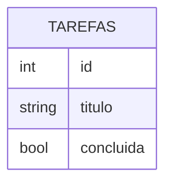

# Encontro 17 - SQLite no dispositivo: modelagem básica

## Objetivos

- Introduzir banco relacional embarcado.
- Modelar tabela simples.
- Compreender relação entre entidade, atributo e registro.

## Conteúdo técnico

SQLite é apropriado quando os dados possuem estrutura definida, relacionamentos e necessidade de consulta. É importante mostrar que, mesmo em ambiente móvel, princípios de modelagem continuam válidos.

```sql
CREATE TABLE tarefas (
  id INTEGER PRIMARY KEY AUTOINCREMENT,
  titulo TEXT NOT NULL,
  concluida INTEGER NOT NULL DEFAULT 0
);
```

## Diagrama conceitual



## Atividade

- Modelar um banco local para lista de tarefas ou catálogo de livros.
- Discutir tipos de dados e chaves primárias.

## Materiais complementares

- SQLite docs: <https://www.sqlite.org/docs.html>
- Expo SQLite: <https://docs.expo.dev/versions/latest/sdk/sqlite/>
