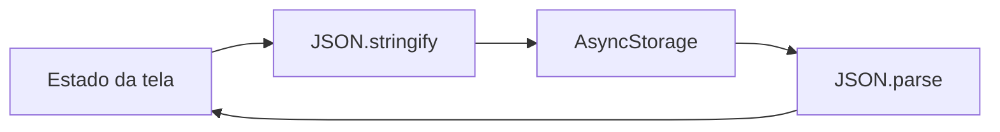
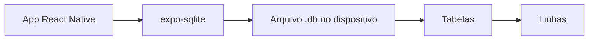
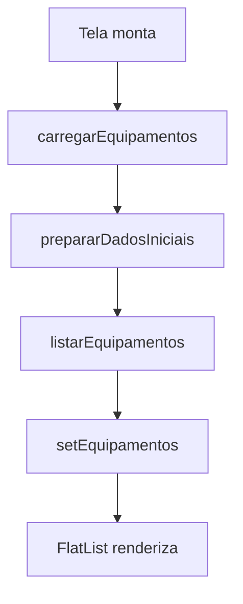

# Encontro 17 - SQLite no dispositivo: modelagem básica

## Visão do encontro

- **Objetivo central:** compreender quando uma coleção local deve ser modelada em SQLite e criar uma primeira tabela persistente no dispositivo usando `expo-sqlite`.
- Ao final deste encontro, você deve ser capaz de diferenciar armazenamento chave-valor de banco relacional, definir uma tabela simples, criar um banco local, inserir dados iniciais, consultar registros e exibir os resultados em uma interface React Native.

## Roteiro

1. Retomada do encontro anterior.
2. Limites do armazenamento chave-valor.
3. Conceitos básicos de SQLite no aplicativo móvel.
4. Modelagem da primeira tabela.
5. Criação do projeto e instalação do `expo-sqlite`.
6. Organização dos arquivos.
7. Criação do banco e da tabela.
8. Inserção de dados iniciais e primeira consulta.
9. Integração da lista com a interface.
10. Checkpoint de persistência.
11. Prática 09.
12. Checklist de validação.
13. Erros comuns.
14. Exercícios de revisão.
15. Exercícios de estudo.
16. Resumo do encontro.

## 1. Retomada do encontro anterior

No encontro anterior, usamos `AsyncStorage` para manter uma lista de rascunhos no dispositivo.

O fluxo era adequado para uma coleção pequena:



Essa solução funciona bem quando o aplicativo precisa salvar poucos valores ou preferências simples.

O problema aparece quando a coleção começa a crescer e precisa ser consultada por partes:

- buscar apenas itens de um setor;
- ordenar por data;
- atualizar um registro específico;
- remover um único item sem regravar a coleção inteira;
- contar registros;
- aplicar filtros combinados.

Nesse caso, armazenar tudo em uma única chave começa a ficar frágil.

O SQLite resolve esse tipo de cenário com tabelas, linhas, colunas e consultas.

## 2. Limites do armazenamento chave-valor

Compare as duas abordagens:

| Necessidade | AsyncStorage | SQLite |
|---|---|---|
| Salvar uma preferência | adequado | possível, mas exagerado |
| Salvar uma lista pequena | adequado | possível |
| Filtrar muitos registros | inadequado | adequado |
| Atualizar uma linha específica | trabalhoso | adequado |
| Ordenar por vários campos | trabalhoso | adequado |
| Relacionar entidades | inadequado | adequado |
| Consultar por SQL | não possui | possui |

No `AsyncStorage`, a unidade principal é a chave:

```text
@app:rascunhos -> "[{...}, {...}, {...}]"
```

No SQLite, a unidade principal é a tabela:

```text
equipamentos
id | nome               | setor          | status
1  | Roteador principal | Laboratorio 1  | ativo
2  | Projetor Epson     | Sala 03        | manutencao
```

### Decisão importante

Use SQLite quando o dado tiver formato de coleção consultável.

Neste encontro, o aplicativo será um **Inventário Local**. Ele guardará equipamentos de uma instituição em uma tabela local chamada `equipamentos`.

## 3. Conceitos básicos de SQLite no aplicativo móvel

SQLite é um banco de dados relacional embarcado. Isso significa que o banco fica dentro do próprio aplicativo, em um arquivo local no dispositivo.

Fluxo geral:



Termos essenciais:

| Termo | Significado |
|---|---|
| Banco | arquivo local que guarda uma ou mais tabelas |
| Tabela | estrutura que organiza registros do mesmo tipo |
| Coluna | campo de uma tabela |
| Linha | registro armazenado na tabela |
| Chave primária | identificador único de cada registro |
| Consulta | comando SQL enviado ao banco |

Exemplo de comando SQL:

```sql
SELECT id, nome, setor, status
FROM equipamentos
ORDER BY nome;
```

### Leitura do código

1. `SELECT` define quais colunas serão retornadas.
2. `FROM equipamentos` informa a tabela consultada.
3. `ORDER BY nome` organiza o resultado pelo nome.

## 4. Modelagem da primeira tabela

Antes de escrever a interface, precisamos decidir o formato dos dados.

O aplicativo terá equipamentos com estes campos:

| Campo no app | Coluna no banco | Tipo SQLite | Obrigatório | Observação |
|---|---|---|---|---|
| `id` | `id` | `INTEGER` | sim | chave primária |
| `nome` | `nome` | `TEXT` | sim | nome do equipamento |
| `setor` | `setor` | `TEXT` | sim | local onde está o equipamento |
| `status` | `status` | `TEXT` | sim | `ativo`, `manutencao` ou `inativo` |
| `criadoEm` | `criado_em` | `TEXT` | sim | data em ISO string |

Em TypeScript, o tipo ficará assim:

```tsx
export type EquipamentoStatus =
  | 'ativo'
  | 'manutencao'
  | 'inativo';

export type Equipamento = {
  id: number;
  nome: string;
  setor: string;
  status: EquipamentoStatus;
  criadoEm: string;
};
```

No banco, a tabela será criada assim:

```sql
CREATE TABLE IF NOT EXISTS equipamentos (
  id INTEGER PRIMARY KEY AUTOINCREMENT,
  nome TEXT NOT NULL,
  setor TEXT NOT NULL,
  status TEXT NOT NULL CHECK (
    status IN ('ativo', 'manutencao', 'inativo')
  ),
  criado_em TEXT NOT NULL
);
```

### Leitura do código

1. `CREATE TABLE IF NOT EXISTS` cria a tabela apenas se ela ainda não existir.
2. `id INTEGER PRIMARY KEY AUTOINCREMENT` cria um identificador numérico automático.
3. `TEXT NOT NULL` exige texto preenchido.
4. `CHECK` limita os valores aceitos em `status`.
5. `criado_em` usa nome comum em banco de dados, enquanto o app usa `criadoEm`.

Essa diferença entre `criado_em` e `criadoEm` é comum. Depois, a consulta fará a conversão com `AS`.

## 5. Criar o projeto e instalar o SQLite

Crie um novo aplicativo:

```bash
npx create-expo-app@latest inventario-sqlite --template blank-typescript
cd inventario-sqlite
```

Instale a biblioteca de SQLite compatível com o Expo:

```bash
npx expo install expo-sqlite
```

Inicie o projeto:

```bash
npx expo start
```

Antes de continuar, abra o aplicativo no Expo Go, emulador ou simulador e confirme que a tela inicial aparece sem erro.

## 6. Organizar os arquivos

Crie a seguinte estrutura:

```text
inventario-sqlite/
  App.tsx
  src/
    database/
      database.ts
      equipamentosRepository.ts
```

Responsabilidade de cada arquivo:

| Arquivo | Responsabilidade |
|---|---|
| `database.ts` | abrir o banco e criar a tabela |
| `equipamentosRepository.ts` | executar consultas relacionadas a equipamentos |
| `App.tsx` | controlar a tela, estados e renderização |

Essa separação evita que a interface fique cheia de comandos SQL.

## 7. Criar o banco e a tabela

Crie o arquivo `src/database/database.ts`:

```tsx
import * as SQLite from 'expo-sqlite';

let database: SQLite.SQLiteDatabase | null = null;

export async function getDb() {
  if (database) {
    return database;
  }

  database = await SQLite.openDatabaseAsync(
    'inventario.db'
  );

  await database.execAsync(`
    PRAGMA journal_mode = WAL;

    CREATE TABLE IF NOT EXISTS equipamentos (
      id INTEGER PRIMARY KEY AUTOINCREMENT,
      nome TEXT NOT NULL,
      setor TEXT NOT NULL,
      status TEXT NOT NULL CHECK (
        status IN ('ativo', 'manutencao', 'inativo')
      ),
      criado_em TEXT NOT NULL
    );
  `);

  return database;
}
```

### Leitura do código

1. `openDatabaseAsync` abre ou cria o arquivo `inventario.db`.
2. A variável `database` guarda a conexão depois da primeira abertura.
3. `execAsync` executa comandos SQL em lote.
4. `PRAGMA journal_mode = WAL` ajusta o modo de escrita do SQLite.
5. `CREATE TABLE IF NOT EXISTS` garante que a tabela exista antes das consultas.

### Observação sobre `execAsync`

Use `execAsync` para comandos internos, definidos pelo próprio aplicativo.

Não coloque texto digitado pelo usuário dentro de uma string SQL montada manualmente. Em consultas com dados externos, use parâmetros com `?`.

## 8. Inserir dados iniciais e consultar registros

Crie o arquivo `src/database/equipamentosRepository.ts`:

```tsx
import { getDb } from './database';

export type EquipamentoStatus =
  | 'ativo'
  | 'manutencao'
  | 'inativo';

export type Equipamento = {
  id: number;
  nome: string;
  setor: string;
  status: EquipamentoStatus;
  criadoEm: string;
};

type TotalRow = {
  total: number;
};

const equipamentosIniciais = [
  {
    nome: 'Roteador principal',
    setor: 'Laboratorio 1',
    status: 'ativo' as const,
  },
  {
    nome: 'Projetor Epson',
    setor: 'Sala 03',
    status: 'manutencao' as const,
  },
  {
    nome: 'Notebook reserva',
    setor: 'Coordenacao',
    status: 'ativo' as const,
  },
];

export async function prepararDadosIniciais() {
  const db = await getDb();

  const resultado = await db.getFirstAsync<TotalRow>(
    'SELECT COUNT(*) AS total FROM equipamentos'
  );

  if (resultado && resultado.total > 0) {
    return;
  }

  for (const equipamento of equipamentosIniciais) {
    await db.runAsync(
      `
      INSERT INTO equipamentos
        (nome, setor, status, criado_em)
      VALUES
        (?, ?, ?, ?)
      `,
      [
        equipamento.nome,
        equipamento.setor,
        equipamento.status,
        new Date().toISOString(),
      ]
    );
  }
}

export async function listarEquipamentos() {
  const db = await getDb();

  return db.getAllAsync<Equipamento>(`
    SELECT
      id,
      nome,
      setor,
      status,
      criado_em AS criadoEm
    FROM equipamentos
    ORDER BY id DESC
  `);
}
```

### Leitura do código

1. `prepararDadosIniciais` consulta quantos registros já existem.
2. Se a tabela já possui registros, a função não insere nada.
3. `runAsync` executa comandos de escrita.
4. Os valores do `INSERT` entram por parâmetros `?`.
5. `getAllAsync<Equipamento>` retorna uma lista tipada.
6. `criado_em AS criadoEm` converte o nome da coluna para o nome usado no app.

### Por que usar parâmetros?

Compare:

```tsx
// Evite
await db.runAsync(`
  INSERT INTO equipamentos (nome)
  VALUES ('${nome}')
`);
```

```tsx
// Prefira
await db.runAsync(
  'INSERT INTO equipamentos (nome) VALUES (?)',
  [nome]
);
```

O segundo formato separa o comando SQL dos valores. Isso evita erros com aspas e reduz risco de injeção de SQL.

## 9. Integrar a lista com a interface

Substitua o conteúdo de `App.tsx`:

```tsx
import { useCallback, useEffect, useState } from 'react';
import {
  ActivityIndicator,
  FlatList,
  Pressable,
  StyleSheet,
  Text,
  View,
} from 'react-native';

import {
  Equipamento,
  listarEquipamentos,
  prepararDadosIniciais,
} from './src/database/equipamentosRepository';

const statusLabel: Record<Equipamento['status'], string> = {
  ativo: 'Ativo',
  manutencao: 'Manutencao',
  inativo: 'Inativo',
};

export default function App() {
  const [equipamentos, setEquipamentos] = useState<
    Equipamento[]
  >([]);
  const [carregando, setCarregando] = useState(true);
  const [erro, setErro] = useState('');

  const carregarEquipamentos = useCallback(async () => {
    try {
      setErro('');
      setCarregando(true);

      await prepararDadosIniciais();

      const lista = await listarEquipamentos();
      setEquipamentos(lista);
    } catch (error) {
      console.error(error);
      setErro(
        'Nao foi possivel carregar o inventario local.'
      );
    } finally {
      setCarregando(false);
    }
  }, []);

  useEffect(() => {
    carregarEquipamentos();
  }, [carregarEquipamentos]);

  return (
    <View style={styles.container}>
      <Text style={styles.titulo}>Inventario Local</Text>
      <Text style={styles.subtitulo}>
        Dados persistidos em SQLite no dispositivo
      </Text>

      {erro ? (
        <View style={styles.aviso}>
          <Text style={styles.avisoTexto}>{erro}</Text>
          <Pressable
            style={styles.botaoSecundario}
            onPress={carregarEquipamentos}
          >
            <Text style={styles.botaoSecundarioTexto}>
              Tentar novamente
            </Text>
          </Pressable>
        </View>
      ) : null}

      {carregando ? (
        <View style={styles.carregando}>
          <ActivityIndicator size="large" color="#2563eb" />
          <Text style={styles.carregandoTexto}>
            Carregando banco local...
          </Text>
        </View>
      ) : (
        <FlatList
          data={equipamentos}
          keyExtractor={(item) => String(item.id)}
          contentContainerStyle={styles.lista}
          ListEmptyComponent={
            <Text style={styles.listaVazia}>
              Nenhum equipamento encontrado.
            </Text>
          }
          renderItem={({ item }) => (
            <View style={styles.card}>
              <View style={styles.cardCabecalho}>
                <Text style={styles.cardTitulo}>
                  {item.nome}
                </Text>
                <Text
                  style={[
                    styles.status,
                    item.status === 'ativo' &&
                      styles.statusAtivo,
                    item.status === 'manutencao' &&
                      styles.statusManutencao,
                    item.status === 'inativo' &&
                      styles.statusInativo,
                  ]}
                >
                  {statusLabel[item.status]}
                </Text>
              </View>

              <Text style={styles.cardTexto}>
                Setor: {item.setor}
              </Text>
              <Text style={styles.cardData}>
                Criado em:{' '}
                {new Date(item.criadoEm).toLocaleString()}
              </Text>
            </View>
          )}
        />
      )}
    </View>
  );
}

const styles = StyleSheet.create({
  container: {
    flex: 1,
    backgroundColor: '#f8fafc',
    paddingHorizontal: 20,
    paddingTop: 64,
  },
  titulo: {
    fontSize: 28,
    fontWeight: '700',
    color: '#0f172a',
  },
  subtitulo: {
    marginTop: 6,
    fontSize: 15,
    color: '#475569',
  },
  aviso: {
    marginTop: 20,
    padding: 14,
    borderRadius: 8,
    backgroundColor: '#fee2e2',
    borderWidth: 1,
    borderColor: '#fecaca',
  },
  avisoTexto: {
    color: '#991b1b',
    marginBottom: 10,
  },
  botaoSecundario: {
    alignSelf: 'flex-start',
    paddingHorizontal: 14,
    paddingVertical: 10,
    borderRadius: 8,
    backgroundColor: '#ffffff',
  },
  botaoSecundarioTexto: {
    color: '#991b1b',
    fontWeight: '700',
  },
  carregando: {
    flex: 1,
    alignItems: 'center',
    justifyContent: 'center',
    gap: 12,
  },
  carregandoTexto: {
    color: '#475569',
  },
  lista: {
    paddingTop: 20,
    paddingBottom: 32,
    gap: 12,
  },
  listaVazia: {
    marginTop: 32,
    textAlign: 'center',
    color: '#64748b',
  },
  card: {
    padding: 16,
    borderRadius: 8,
    backgroundColor: '#ffffff',
    borderWidth: 1,
    borderColor: '#e2e8f0',
  },
  cardCabecalho: {
    flexDirection: 'row',
    justifyContent: 'space-between',
    alignItems: 'flex-start',
    gap: 12,
  },
  cardTitulo: {
    flex: 1,
    fontSize: 17,
    fontWeight: '700',
    color: '#0f172a',
  },
  status: {
    paddingHorizontal: 10,
    paddingVertical: 5,
    borderRadius: 999,
    overflow: 'hidden',
    fontSize: 12,
    fontWeight: '700',
  },
  statusAtivo: {
    color: '#166534',
    backgroundColor: '#dcfce7',
  },
  statusManutencao: {
    color: '#92400e',
    backgroundColor: '#fef3c7',
  },
  statusInativo: {
    color: '#334155',
    backgroundColor: '#e2e8f0',
  },
  cardTexto: {
    marginTop: 10,
    color: '#334155',
  },
  cardData: {
    marginTop: 6,
    fontSize: 12,
    color: '#64748b',
  },
});
```

### Fluxo executado pela tela



### Leitura do código

1. A tela começa em estado de carregamento.
2. `prepararDadosIniciais` garante que a tabela tenha dados para observar.
3. `listarEquipamentos` busca os registros do banco.
4. `setEquipamentos` atualiza a interface.
5. A `FlatList` renderiza a coleção retornada pelo SQLite.

## 10. Checkpoint de persistência

Execute o teste:

1. abra o aplicativo;
2. confirme que os equipamentos iniciais aparecem;
3. use **Reload** no menu de desenvolvimento;
4. confirme que a lista continua aparecendo;
5. encerre completamente o aplicativo;
6. abra novamente;
7. confirme que os registros continuam disponíveis.

O dado não está mais vindo de uma constante da tela. Ele está salvo em uma tabela SQLite.

### Checkpoint técnico

Confirme também:

- a biblioteca `expo-sqlite` foi instalada;
- o arquivo `database.ts` cria a tabela;
- o arquivo `equipamentosRepository.ts` executa consultas;
- a tela não contém SQL diretamente;
- a consulta usa `AS criadoEm` para adaptar o nome da coluna;
- os dados iniciais não são duplicados a cada recarga.

## 11. Prática 09 - Modelagem SQLite local

### Objetivo

Construir um aplicativo chamado **Patrimonio Local** que modele e liste uma coleção persistida em SQLite.

### Requisitos mínimos

1. Criar um projeto Expo com TypeScript.
2. Instalar `expo-sqlite`.
3. Criar uma pasta `src/database`.
4. Criar um arquivo para abrir o banco.
5. Criar uma tabela chamada `patrimonios`.
6. Definir pelo menos cinco colunas.
7. Usar `id INTEGER PRIMARY KEY AUTOINCREMENT`.
8. Usar `TEXT NOT NULL` nos campos obrigatórios.
9. Usar pelo menos um campo com valores controlados por `CHECK`.
10. Criar uma função de preparação de dados iniciais.
11. Inserir pelo menos três registros iniciais.
12. Criar uma função para listar os registros.
13. Renderizar a lista com `FlatList`.
14. Exibir estado de carregamento.
15. Tratar erro de abertura, criação ou consulta.
16. Comprovar que os registros sobrevivem ao reinício do app.

### Campos sugeridos

| Campo | Exemplo |
|---|---|
| `nome` | "Tablet Samsung" |
| `tombo` | "TSI-2026-014" |
| `setor` | "Laboratorio 2" |
| `estado` | "bom", "reparo", "baixado" |
| `criado_em` | data em ISO string |

### Entrega esperada

- aplicativo funcional no Expo Go, emulador ou simulador;
- tabela criada por código;
- dados iniciais persistidos no SQLite;
- lista carregada a partir do banco;
- comandos SQL separados da interface;
- explicação curta da modelagem escolhida.

## 12. Checklist de validação do aluno

- sei explicar por que SQLite é mais adequado que AsyncStorage para coleções consultáveis;
- consigo identificar banco, tabela, coluna e linha;
- criei o projeto com TypeScript;
- instalei `expo-sqlite` com `expo install`;
- abri ou criei o banco com `openDatabaseAsync`;
- criei a tabela com `CREATE TABLE IF NOT EXISTS`;
- defini uma chave primária;
- usei tipos adequados para os campos;
- usei `NOT NULL` em campos obrigatórios;
- usei parâmetros `?` em comandos com valores;
- listei dados com `getAllAsync`;
- exibi carregamento durante a leitura;
- tratei erros com `try/catch`;
- confirmei a persistência após reiniciar o aplicativo.

## 13. Erros comuns

### Recriar dados iniciais a cada abertura

Se a função de preparação inserir dados sem verificar a quantidade atual, a lista cresce a cada recarga.

```tsx
const resultado = await db.getFirstAsync<TotalRow>(
  'SELECT COUNT(*) AS total FROM equipamentos'
);

if (resultado && resultado.total > 0) {
  return;
}
```

### Misturar SQL diretamente no componente

O componente deve cuidar da experiência da tela. Consultas SQL ficam mais organizadas em um arquivo de repositório.

### Montar SQL com texto digitado pelo usuário

```tsx
// Incorreto
`WHERE nome = '${nome}'`
```

Use parâmetros:

```tsx
await db.getAllAsync(
  'SELECT * FROM equipamentos WHERE nome = ?',
  [nome]
);
```

### Esquecer que operações são assíncronas

Chamadas ao SQLite retornam `Promise`. Use `await` dentro de funções `async`.

### Usar nomes diferentes sem mapear

Se a coluna se chama `criado_em`, mas o tipo espera `criadoEm`, use alias:

```sql
SELECT criado_em AS criadoEm FROM equipamentos;
```

### Criar uma tabela sem chave primária

Sem identificador único, atualizar e remover registros no próximo encontro ficará mais difícil.

### Ignorar erro de banco

Banco local também pode falhar. A tela precisa mostrar alguma mensagem quando a consulta não funcionar.

## 14. Exercícios de revisão

1. Qual é a diferença entre AsyncStorage e SQLite?
2. O que é uma tabela?
3. O que é uma linha?
4. O que é uma coluna?
5. Por que uma chave primária é importante?
6. Para que serve `CREATE TABLE IF NOT EXISTS`?
7. Qual é a diferença entre `execAsync`, `runAsync` e `getAllAsync`?
8. Por que valores externos devem entrar por parâmetros?
9. O que `AS criadoEm` faz em uma consulta?
10. Por que dados iniciais não devem ser inseridos sem verificação?
11. Que teste confirma que os registros estão persistidos?
12. Por que a interface não deve conter comandos SQL espalhados?

## 15. Exercícios de estudo

- Adicione uma coluna `observacao` à tabela de equipamentos.
- Inclua um filtro por `status` na função de listagem.
- Crie uma consulta que ordene os equipamentos por `nome`.
- Crie uma consulta que conte quantos equipamentos existem por `status`.
- Explique por que `CHECK` ajuda a manter dados consistentes.
- Pesquise a diferença entre `INTEGER`, `TEXT` e `REAL` no SQLite.
- Desenhe a modelagem de um app de biblioteca com as tabelas `livros` e `emprestimos`.

## 16. Resumo do encontro

Neste encontro, você saiu do armazenamento chave-valor e criou uma primeira estrutura relacional no dispositivo. O aplicativo passou a guardar equipamentos em uma tabela SQLite, com chave primária, campos obrigatórios, valores controlados e consultas assíncronas.

Também separou responsabilidades entre abertura do banco, repositório de dados e interface. Essa base será usada no encontro 18, em que a tabela deixará de ser apenas consultada e passará a receber operações completas de criação, leitura, atualização e remoção.

## Materiais complementares

- Expo docs (`SQLite`): <https://docs.expo.dev/versions/latest/sdk/sqlite/>
- Expo docs (`create-expo-app`): <https://docs.expo.dev/more/create-expo/>
- SQLite docs (`CREATE TABLE`): <https://www.sqlite.org/lang_createtable.html>
- SQLite docs (`Datatypes`): <https://www.sqlite.org/datatype3.html>
- SQLite docs (`SELECT`): <https://www.sqlite.org/lang_select.html>
- SQLite docs (`INSERT`): <https://www.sqlite.org/lang_insert.html>
