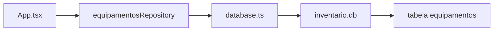
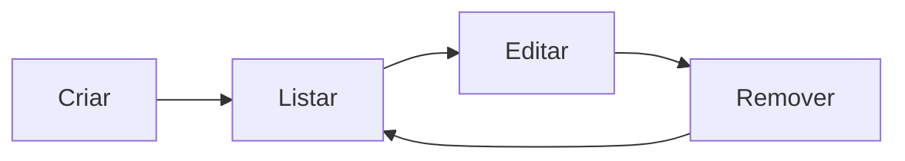
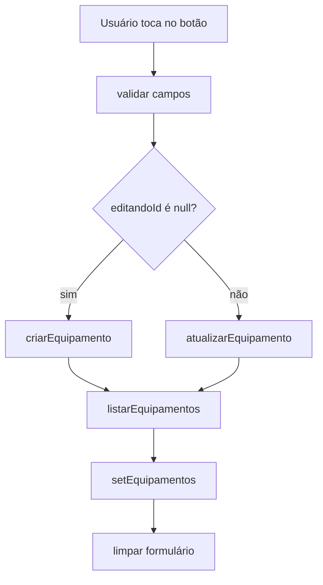

# Encontro 18 - CRUD local com camada de repositório

## Visão do encontro

- **Objetivo central:** evoluir o projeto SQLite do encontro 17 para um CRUD local completo, mantendo os comandos SQL isolados em uma camada de repositório.
- Ao final deste encontro, você deve ser capaz de criar, listar, atualizar e remover registros no SQLite, validar dados antes da gravação, atualizar a interface após cada operação e organizar a persistência local sem acoplar SQL ao componente visual.

## Roteiro

1. Retomada do encontro 17.
2. O que significa CRUD.
3. Papel da camada de repositório.
4. Tipos de entrada e tipos de retorno.
5. Implementação das operações de criação e listagem.
6. Implementação das operações de atualização e remoção.
7. Integração com formulário controlado.
8. Modo de edição.
9. Checkpoint CRUD.
10. Prática: checkpoint CRUD local.
11. Checklist de validação.
12. Erros comuns.
13. Exercícios de revisão.
14. Exercícios de estudo.
15. Resumo do encontro.

## 1. Retomada do encontro 17

No encontro anterior, criamos uma tabela SQLite chamada `equipamentos` e carregamos registros iniciais no aplicativo.

O fluxo ficou assim:



A interface já conseguia listar dados reais do banco, mas ainda não permitia ao usuário modificar a coleção.

Neste encontro, vamos completar o ciclo:



## 2. O que significa CRUD

CRUD é o conjunto básico de operações sobre dados:

| Letra | Operação | SQL comum | Exemplo no app |
|---|---|---|---|
| C | Create | `INSERT` | cadastrar equipamento |
| R | Read | `SELECT` | listar equipamentos |
| U | Update | `UPDATE` | editar setor ou status |
| D | Delete | `DELETE` | remover equipamento |

Um aplicativo simples pode parecer completo quando só lista dados. Mas uma coleção local realmente útil precisa permitir que o usuário mantenha esses dados atualizados.

## 3. Papel da camada de repositório

A camada de repositório é o ponto único de acesso aos dados de uma entidade.

No nosso caso:

```text
App.tsx
  chama criarEquipamento()
  chama listarEquipamentos()
  chama atualizarEquipamento()
  chama removerEquipamento()

equipamentosRepository.ts
  conhece SQL
  conhece tabela
  conhece colunas
  conhece conversões
```

Vantagens:

- a tela fica mais legível;
- o SQL fica centralizado;
- mudanças na tabela afetam menos arquivos;
- fica mais fácil testar regras de dados;
- o código fica preparado para projetos maiores.

### Regra prática

O componente deve perguntar:

```tsx
await criarEquipamento(dados);
```

Ele não deve montar:

```tsx
await db.runAsync(
  'INSERT INTO equipamentos ...'
);
```

## 4. Tipos de entrada e tipos de retorno

O tipo que vem do banco tem `id` e `criadoEm`:

```tsx
export type Equipamento = {
  id: number;
  nome: string;
  setor: string;
  status: EquipamentoStatus;
  criadoEm: string;
};
```

Mas, ao criar um equipamento, o usuário ainda não informa `id` nem `criadoEm`. Esses valores são definidos pela aplicação.

Por isso, criaremos tipos separados:

```tsx
export type NovoEquipamento = {
  nome: string;
  setor: string;
  status: EquipamentoStatus;
};

export type AtualizarEquipamento = {
  nome: string;
  setor: string;
  status: EquipamentoStatus;
};
```

Separar tipos evita preencher campos que ainda não existem.

## 5. Atualizar o repositório

Substitua o conteúdo de `src/database/equipamentosRepository.ts`:

```tsx
import { getDb } from './database';

export type EquipamentoStatus =
  | 'ativo'
  | 'manutencao'
  | 'inativo';

export type Equipamento = {
  id: number;
  nome: string;
  setor: string;
  status: EquipamentoStatus;
  criadoEm: string;
};

export type NovoEquipamento = {
  nome: string;
  setor: string;
  status: EquipamentoStatus;
};

export type AtualizarEquipamento = NovoEquipamento;

type TotalRow = {
  total: number;
};

const equipamentosIniciais: NovoEquipamento[] = [
  {
    nome: 'Roteador principal',
    setor: 'Laboratorio 1',
    status: 'ativo',
  },
  {
    nome: 'Projetor Epson',
    setor: 'Sala 03',
    status: 'manutencao',
  },
  {
    nome: 'Notebook reserva',
    setor: 'Coordenacao',
    status: 'ativo',
  },
];

export async function prepararDadosIniciais() {
  const db = await getDb();

  const resultado = await db.getFirstAsync<TotalRow>(
    'SELECT COUNT(*) AS total FROM equipamentos'
  );

  if (resultado && resultado.total > 0) {
    return;
  }

  for (const equipamento of equipamentosIniciais) {
    await criarEquipamento(equipamento);
  }
}

export async function listarEquipamentos() {
  const db = await getDb();

  return db.getAllAsync<Equipamento>(`
    SELECT
      id,
      nome,
      setor,
      status,
      criado_em AS criadoEm
    FROM equipamentos
    ORDER BY id DESC
  `);
}

export async function criarEquipamento(
  equipamento: NovoEquipamento
) {
  const db = await getDb();

  const resultado = await db.runAsync(
    `
    INSERT INTO equipamentos
      (nome, setor, status, criado_em)
    VALUES
      (?, ?, ?, ?)
    `,
    [
      equipamento.nome.trim(),
      equipamento.setor.trim(),
      equipamento.status,
      new Date().toISOString(),
    ]
  );

  return resultado.lastInsertRowId;
}

export async function atualizarEquipamento(
  id: number,
  equipamento: AtualizarEquipamento
) {
  const db = await getDb();

  const resultado = await db.runAsync(
    `
    UPDATE equipamentos
    SET
      nome = ?,
      setor = ?,
      status = ?
    WHERE id = ?
    `,
    [
      equipamento.nome.trim(),
      equipamento.setor.trim(),
      equipamento.status,
      id,
    ]
  );

  if (resultado.changes === 0) {
    throw new Error('Equipamento nao encontrado.');
  }
}

export async function removerEquipamento(id: number) {
  const db = await getDb();

  const resultado = await db.runAsync(
    'DELETE FROM equipamentos WHERE id = ?',
    [id]
  );

  if (resultado.changes === 0) {
    throw new Error('Equipamento nao encontrado.');
  }
}
```

### Leitura do código

1. `criarEquipamento` executa `INSERT`.
2. `listarEquipamentos` executa `SELECT`.
3. `atualizarEquipamento` executa `UPDATE`.
4. `removerEquipamento` executa `DELETE`.
5. `resultado.lastInsertRowId` informa o `id` criado pelo banco.
6. `resultado.changes` informa quantas linhas foram afetadas.
7. Se `changes` for `0`, o registro não foi encontrado.

### Por que verificar `changes`?

Um comando pode rodar sem erro SQL e ainda assim não alterar nenhum registro.

Exemplo:

```sql
DELETE FROM equipamentos WHERE id = 9999;
```

Se não existir equipamento com `id = 9999`, o comando é válido, mas não remove nada. Verificar `changes` permite avisar que o dado não foi encontrado.

## 6. Planejar a interface do CRUD

A tela terá:

- campos `nome` e `setor`;
- seleção de `status`;
- botão para cadastrar;
- modo de edição;
- lista de equipamentos;
- ação de editar;
- ação de remover;
- estados de carregamento, gravação e erro.

Estados principais:

```tsx
const [nome, setNome] = useState('');
const [setor, setSetor] = useState('');
const [status, setStatus] =
  useState<EquipamentoStatus>('ativo');
const [editandoId, setEditandoId] =
  useState<number | null>(null);
```

Quando `editandoId` for `null`, o formulário cria um novo registro.

Quando `editandoId` tiver um número, o formulário atualiza o registro correspondente.

## 7. Integrar com `App.tsx`

Substitua o conteúdo de `App.tsx`:

```tsx
import { useCallback, useEffect, useState } from 'react';
import {
  ActivityIndicator,
  Alert,
  FlatList,
  Pressable,
  StyleSheet,
  Text,
  TextInput,
  View,
} from 'react-native';

import {
  Equipamento,
  EquipamentoStatus,
  atualizarEquipamento,
  criarEquipamento,
  listarEquipamentos,
  prepararDadosIniciais,
  removerEquipamento,
} from './src/database/equipamentosRepository';

const statusOptions: EquipamentoStatus[] = [
  'ativo',
  'manutencao',
  'inativo',
];

const statusLabel: Record<EquipamentoStatus, string> = {
  ativo: 'Ativo',
  manutencao: 'Manutencao',
  inativo: 'Inativo',
};

export default function App() {
  const [equipamentos, setEquipamentos] = useState<
    Equipamento[]
  >([]);
  const [nome, setNome] = useState('');
  const [setor, setSetor] = useState('');
  const [status, setStatus] =
    useState<EquipamentoStatus>('ativo');
  const [editandoId, setEditandoId] =
    useState<number | null>(null);
  const [carregando, setCarregando] = useState(true);
  const [salvando, setSalvando] = useState(false);
  const [erro, setErro] = useState('');

  const carregarEquipamentos = useCallback(async () => {
    try {
      setErro('');
      setCarregando(true);

      await prepararDadosIniciais();

      const lista = await listarEquipamentos();
      setEquipamentos(lista);
    } catch (error) {
      console.error(error);
      setErro('Nao foi possivel carregar os dados.');
    } finally {
      setCarregando(false);
    }
  }, []);

  useEffect(() => {
    carregarEquipamentos();
  }, [carregarEquipamentos]);

  function limparFormulario() {
    setNome('');
    setSetor('');
    setStatus('ativo');
    setEditandoId(null);
  }

  async function salvarEquipamento() {
    const nomeLimpo = nome.trim();
    const setorLimpo = setor.trim();

    if (!nomeLimpo || !setorLimpo) {
      Alert.alert(
        'Atenção',
        'Informe nome e setor do equipamento.'
      );
      return;
    }

    try {
      setSalvando(true);
      setErro('');

      if (editandoId === null) {
        await criarEquipamento({
          nome: nomeLimpo,
          setor: setorLimpo,
          status,
        });
      } else {
        await atualizarEquipamento(editandoId, {
          nome: nomeLimpo,
          setor: setorLimpo,
          status,
        });
      }

      limparFormulario();
      const lista = await listarEquipamentos();
      setEquipamentos(lista);
    } catch (error) {
      console.error(error);
      setErro('Nao foi possivel salvar o equipamento.');
    } finally {
      setSalvando(false);
    }
  }

  function iniciarEdicao(equipamento: Equipamento) {
    setNome(equipamento.nome);
    setSetor(equipamento.setor);
    setStatus(equipamento.status);
    setEditandoId(equipamento.id);
  }

  function confirmarRemocao(equipamento: Equipamento) {
    Alert.alert(
      'Remover equipamento',
      `Deseja remover "${equipamento.nome}"?`,
      [
        { text: 'Cancelar', style: 'cancel' },
        {
          text: 'Remover',
          style: 'destructive',
          onPress: () => excluirEquipamento(equipamento.id),
        },
      ]
    );
  }

  async function excluirEquipamento(id: number) {
    try {
      setSalvando(true);
      setErro('');

      await removerEquipamento(id);

      if (editandoId === id) {
        limparFormulario();
      }

      const lista = await listarEquipamentos();
      setEquipamentos(lista);
    } catch (error) {
      console.error(error);
      setErro('Nao foi possivel remover o equipamento.');
    } finally {
      setSalvando(false);
    }
  }

  const textoBotao = editandoId === null
    ? 'Cadastrar'
    : 'Salvar edição';

  return (
    <View style={styles.container}>
      <Text style={styles.titulo}>Inventario Local</Text>
      <Text style={styles.subtitulo}>
        CRUD com SQLite e camada de repositorio
      </Text>

      <View style={styles.formulario}>
        <Text style={styles.label}>Nome</Text>
        <TextInput
          style={styles.input}
          placeholder="Ex.: Tablet Samsung"
          value={nome}
          onChangeText={setNome}
          editable={!salvando}
        />

        <Text style={styles.label}>Setor</Text>
        <TextInput
          style={styles.input}
          placeholder="Ex.: Laboratorio 2"
          value={setor}
          onChangeText={setSetor}
          editable={!salvando}
        />

        <Text style={styles.label}>Status</Text>
        <View style={styles.statusLinha}>
          {statusOptions.map((opcao) => (
            <Pressable
              key={opcao}
              style={[
                styles.statusOpcao,
                status === opcao && styles.statusOpcaoAtiva,
              ]}
              onPress={() => setStatus(opcao)}
              disabled={salvando}
            >
              <Text
                style={[
                  styles.statusOpcaoTexto,
                  status === opcao &&
                    styles.statusOpcaoTextoAtivo,
                ]}
              >
                {statusLabel[opcao]}
              </Text>
            </Pressable>
          ))}
        </View>

        <View style={styles.acoesFormulario}>
          <Pressable
            style={[
              styles.botaoPrimario,
              salvando && styles.botaoDesabilitado,
            ]}
            onPress={salvarEquipamento}
            disabled={salvando}
          >
            <Text style={styles.botaoPrimarioTexto}>
              {salvando ? 'Salvando...' : textoBotao}
            </Text>
          </Pressable>

          {editandoId !== null ? (
            <Pressable
              style={styles.botaoSecundario}
              onPress={limparFormulario}
              disabled={salvando}
            >
              <Text style={styles.botaoSecundarioTexto}>
                Cancelar
              </Text>
            </Pressable>
          ) : null}
        </View>
      </View>

      {erro ? (
        <Text style={styles.erro}>{erro}</Text>
      ) : null}

      {carregando ? (
        <View style={styles.carregando}>
          <ActivityIndicator size="large" color="#2563eb" />
          <Text style={styles.carregandoTexto}>
            Carregando banco local...
          </Text>
        </View>
      ) : (
        <FlatList
          data={equipamentos}
          keyExtractor={(item) => String(item.id)}
          contentContainerStyle={styles.lista}
          ListEmptyComponent={
            <Text style={styles.listaVazia}>
              Nenhum equipamento cadastrado.
            </Text>
          }
          renderItem={({ item }) => (
            <View style={styles.card}>
              <View style={styles.cardCabecalho}>
                <Text style={styles.cardTitulo}>
                  {item.nome}
                </Text>
                <Text style={styles.statusTag}>
                  {statusLabel[item.status]}
                </Text>
              </View>

              <Text style={styles.cardTexto}>
                Setor: {item.setor}
              </Text>
              <Text style={styles.cardData}>
                Criado em:{' '}
                {new Date(item.criadoEm).toLocaleString()}
              </Text>

              <View style={styles.cardAcoes}>
                <Pressable
                  style={styles.botaoLista}
                  onPress={() => iniciarEdicao(item)}
                  disabled={salvando}
                >
                  <Text style={styles.botaoListaTexto}>
                    Editar
                  </Text>
                </Pressable>

                <Pressable
                  style={[
                    styles.botaoLista,
                    styles.botaoRemover,
                  ]}
                  onPress={() => confirmarRemocao(item)}
                  disabled={salvando}
                >
                  <Text
                    style={[
                      styles.botaoListaTexto,
                      styles.botaoRemoverTexto,
                    ]}
                  >
                    Remover
                  </Text>
                </Pressable>
              </View>
            </View>
          )}
        />
      )}
    </View>
  );
}

const styles = StyleSheet.create({
  container: {
    flex: 1,
    backgroundColor: '#f8fafc',
    paddingHorizontal: 20,
    paddingTop: 56,
  },
  titulo: {
    fontSize: 28,
    fontWeight: '700',
    color: '#0f172a',
  },
  subtitulo: {
    marginTop: 6,
    fontSize: 15,
    color: '#475569',
  },
  formulario: {
    marginTop: 20,
    padding: 16,
    borderRadius: 8,
    backgroundColor: '#ffffff',
    borderWidth: 1,
    borderColor: '#e2e8f0',
  },
  label: {
    marginBottom: 6,
    fontSize: 13,
    fontWeight: '700',
    color: '#334155',
  },
  input: {
    minHeight: 46,
    marginBottom: 14,
    paddingHorizontal: 12,
    borderRadius: 8,
    borderWidth: 1,
    borderColor: '#cbd5e1',
    color: '#0f172a',
    backgroundColor: '#ffffff',
  },
  statusLinha: {
    flexDirection: 'row',
    flexWrap: 'wrap',
    gap: 8,
    marginBottom: 16,
  },
  statusOpcao: {
    paddingHorizontal: 12,
    paddingVertical: 9,
    borderRadius: 8,
    borderWidth: 1,
    borderColor: '#cbd5e1',
    backgroundColor: '#ffffff',
  },
  statusOpcaoAtiva: {
    backgroundColor: '#2563eb',
    borderColor: '#2563eb',
  },
  statusOpcaoTexto: {
    color: '#334155',
    fontWeight: '700',
  },
  statusOpcaoTextoAtivo: {
    color: '#ffffff',
  },
  acoesFormulario: {
    flexDirection: 'row',
    gap: 10,
  },
  botaoPrimario: {
    flex: 1,
    minHeight: 46,
    alignItems: 'center',
    justifyContent: 'center',
    borderRadius: 8,
    backgroundColor: '#2563eb',
  },
  botaoDesabilitado: {
    opacity: 0.6,
  },
  botaoPrimarioTexto: {
    color: '#ffffff',
    fontWeight: '700',
  },
  botaoSecundario: {
    minHeight: 46,
    alignItems: 'center',
    justifyContent: 'center',
    paddingHorizontal: 14,
    borderRadius: 8,
    backgroundColor: '#e2e8f0',
  },
  botaoSecundarioTexto: {
    color: '#334155',
    fontWeight: '700',
  },
  erro: {
    marginTop: 12,
    color: '#b91c1c',
    fontWeight: '700',
  },
  carregando: {
    flex: 1,
    alignItems: 'center',
    justifyContent: 'center',
    gap: 12,
  },
  carregandoTexto: {
    color: '#475569',
  },
  lista: {
    paddingTop: 18,
    paddingBottom: 32,
    gap: 12,
  },
  listaVazia: {
    marginTop: 24,
    textAlign: 'center',
    color: '#64748b',
  },
  card: {
    padding: 16,
    borderRadius: 8,
    backgroundColor: '#ffffff',
    borderWidth: 1,
    borderColor: '#e2e8f0',
  },
  cardCabecalho: {
    flexDirection: 'row',
    alignItems: 'flex-start',
    justifyContent: 'space-between',
    gap: 12,
  },
  cardTitulo: {
    flex: 1,
    fontSize: 17,
    fontWeight: '700',
    color: '#0f172a',
  },
  statusTag: {
    paddingHorizontal: 10,
    paddingVertical: 5,
    borderRadius: 999,
    overflow: 'hidden',
    fontSize: 12,
    fontWeight: '700',
    color: '#1e3a8a',
    backgroundColor: '#dbeafe',
  },
  cardTexto: {
    marginTop: 10,
    color: '#334155',
  },
  cardData: {
    marginTop: 6,
    fontSize: 12,
    color: '#64748b',
  },
  cardAcoes: {
    flexDirection: 'row',
    gap: 10,
    marginTop: 14,
  },
  botaoLista: {
    minHeight: 38,
    justifyContent: 'center',
    paddingHorizontal: 14,
    borderRadius: 8,
    backgroundColor: '#e0f2fe',
  },
  botaoListaTexto: {
    color: '#075985',
    fontWeight: '700',
  },
  botaoRemover: {
    backgroundColor: '#fee2e2',
  },
  botaoRemoverTexto: {
    color: '#991b1b',
  },
});
```

### Leitura do fluxo de salvamento



A tela não decide qual SQL executar. Ela decide qual ação de negócio deve acontecer.

## 8. Modo de edição

O modo de edição depende de três passos:

1. copiar os dados do item para o formulário;
2. guardar o `id` do item em edição;
3. trocar a ação do botão principal.

Trecho central:

```tsx
function iniciarEdicao(equipamento: Equipamento) {
  setNome(equipamento.nome);
  setSetor(equipamento.setor);
  setStatus(equipamento.status);
  setEditandoId(equipamento.id);
}
```

Quando o usuário salva:

```tsx
if (editandoId === null) {
  await criarEquipamento(dados);
} else {
  await atualizarEquipamento(editandoId, dados);
}
```

Para cancelar:

```tsx
function limparFormulario() {
  setNome('');
  setSetor('');
  setStatus('ativo');
  setEditandoId(null);
}
```

### Comportamento esperado

- cadastrar deixa `editandoId` como `null`;
- editar preenche `editandoId` com o `id` do item;
- cancelar limpa o formulário;
- remover o item que está em edição também limpa o formulário.

## 9. Checkpoint CRUD

Execute os testes:

1. abra o aplicativo;
2. cadastre um novo equipamento;
3. confirme que ele aparece no topo da lista;
4. reinicie o aplicativo;
5. confirme que o equipamento continua na lista;
6. edite o nome, setor ou status;
7. reinicie novamente;
8. confirme que a edição foi preservada;
9. remova o equipamento;
10. reinicie mais uma vez;
11. confirme que o item removido não voltou.

Esse teste valida o ciclo completo:

- `INSERT`;
- `SELECT`;
- `UPDATE`;
- `DELETE`.

## 10. Prática - Checkpoint CRUD local

### Objetivo

Entregar um CRUD local funcional usando SQLite e camada de repositório.

### Tema sugerido

Escolha um dos temas:

- patrimônio de laboratório;
- chamados técnicos;
- livros de uma biblioteca;
- visitas de campo;
- tarefas de manutenção;
- reservas de equipamentos.

### Requisitos mínimos

1. Criar ou reutilizar um projeto Expo com TypeScript.
2. Instalar `expo-sqlite`.
3. Criar uma tabela SQLite com pelo menos cinco colunas.
4. Criar uma chave primária autoincremental.
5. Criar um arquivo responsável por abrir o banco.
6. Criar um arquivo de repositório para a entidade principal.
7. Implementar função de criação.
8. Implementar função de listagem.
9. Implementar função de atualização.
10. Implementar função de remoção.
11. Usar parâmetros nos comandos com valores.
12. Criar formulário controlado.
13. Validar campos obrigatórios.
14. Implementar modo de edição.
15. Confirmar antes de remover.
16. Atualizar a lista após cada operação.
17. Tratar carregamento e erro.
18. Comprovar persistência após reiniciar o aplicativo.

### Entrega esperada

- aplicativo executando no Expo Go, emulador ou simulador;
- CRUD completo funcional;
- SQL isolado da interface;
- código TypeScript organizado;
- breve descrição da tabela criada;
- demonstração da persistência após reinício.

## 11. Checklist de validação do aluno

- consigo explicar o significado de CRUD;
- criei funções separadas para criar, listar, atualizar e remover;
- a tela chama funções do repositório, não SQL direto;
- usei `INSERT` para criação;
- usei `SELECT` para listagem;
- usei `UPDATE` com `WHERE id = ?`;
- usei `DELETE` com `WHERE id = ?`;
- validei campos obrigatórios antes de gravar;
- usei `try/catch` nas operações assíncronas;
- desabilitei ações durante gravação quando necessário;
- atualizei a lista após salvar ou remover;
- confirmei remoção com `Alert`;
- testei o app depois de reiniciar;
- verifiquei que itens removidos não voltam.

## 12. Erros comuns

### Atualizar sem `WHERE`

```sql
UPDATE equipamentos
SET status = 'inativo';
```

Esse comando atualiza todos os registros. Para editar um item específico:

```sql
UPDATE equipamentos
SET status = ?
WHERE id = ?;
```

### Remover sem `WHERE`

```sql
DELETE FROM equipamentos;
```

Esse comando apaga todos os registros da tabela.

### Esquecer de recarregar a lista

Depois de `INSERT`, `UPDATE` ou `DELETE`, a tela precisa refletir o banco:

```tsx
const lista = await listarEquipamentos();
setEquipamentos(lista);
```

### Deixar a interface montar SQL

O componente deve chamar o repositório. Isso mantém a tela focada em estado, eventos e renderização.

### Não validar entrada do usuário

Campos vazios podem gerar dados ruins mesmo quando o banco aceita o comando. Valide antes de chamar o repositório.

### Não tratar `changes`

Se `UPDATE` ou `DELETE` afetar zero linhas, provavelmente o registro não existe mais.

### Misturar criação e edição sem indicador

Sem `editandoId`, a tela não sabe se deve inserir ou atualizar.

## 13. Exercícios de revisão

1. O que significa CRUD?
2. Qual comando SQL cria um novo registro?
3. Qual comando SQL lê registros?
4. Qual comando SQL atualiza registros?
5. Qual comando SQL remove registros?
6. Por que `UPDATE` e `DELETE` quase sempre precisam de `WHERE`?
7. Para que serve `resultado.changes`?
8. Para que serve `resultado.lastInsertRowId`?
9. Por que a camada de repositório melhora a organização?
10. Como a tela sabe que está em modo de edição?
11. Por que recarregar a lista após salvar?
12. Qual teste comprova que o CRUD é persistente?

## 14. Exercícios de estudo

- Adicione uma busca por texto na função de listagem.
- Ordene os registros por nome em ordem crescente.
- Crie uma função `buscarEquipamentoPorId`.
- Adicione um campo `atualizado_em` à tabela.
- Atualize `atualizado_em` sempre que o registro for editado.
- Crie uma função para remover todos os registros depois de confirmação.
- Descreva como dividiria esse app em telas usando navegação.
- Explique como esse CRUD local poderia ser sincronizado com uma API no futuro.

## 15. Resumo do encontro

Neste encontro, você completou o ciclo de manipulação local de dados com SQLite. A tabela criada no encontro 17 passou a receber operações de criação, leitura, atualização e remoção, todas centralizadas em uma camada de repositório.

Também construiu uma interface com formulário controlado, modo de edição, confirmação de remoção, recarregamento da lista, validação mínima e tratamento de erro. Com isso, o app deixou de ser apenas uma consulta local e passou a ser uma pequena aplicação de dados persistentes. No encontro 19, a atenção muda do banco local para dados remotos recebidos por HTTP em formato JSON.

## Materiais complementares

- Expo docs (`SQLite`): <https://docs.expo.dev/versions/latest/sdk/sqlite/>
- SQLite docs (`INSERT`): <https://www.sqlite.org/lang_insert.html>
- SQLite docs (`SELECT`): <https://www.sqlite.org/lang_select.html>
- SQLite docs (`UPDATE`): <https://www.sqlite.org/lang_update.html>
- SQLite docs (`DELETE`): <https://www.sqlite.org/lang_delete.html>
- React Native docs (`Alert`): <https://reactnative.dev/docs/alert>
- React Native docs (`TextInput`): <https://reactnative.dev/docs/textinput>
