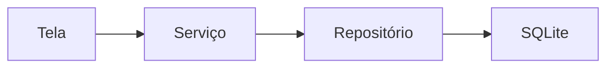

# Encontro 18 - CRUD local com camada de repositório

## Objetivos

- Implementar operações de criar, ler, atualizar e remover.
- Organizar acesso a dados em uma camada de repositório.
- Separar UI de persistência.

## Explicação didática

Quando a tela conhece todos os detalhes do banco, o código fica rígido. A camada de repositório encapsula consultas e permite trocar a fonte de dados no futuro. Esse é um ponto importante de engenharia de software aplicado ao contexto móvel.

```ts
export const tarefaRepository = {
  async listar() {},
  async criar(titulo: string) {},
  async atualizar(id: number, concluida: boolean) {},
  async remover(id: number) {},
};
```

## Exemplo de fluxo



## Atividade

- Construir um CRUD de tarefas.
- Exibir lista atualizada após cada operação.
- Discutir o que muda se a origem passar a ser remota.

## Materiais complementares

- Repository pattern overview.
- Expo SQLite transactions: <https://docs.expo.dev/versions/latest/sdk/sqlite/>
