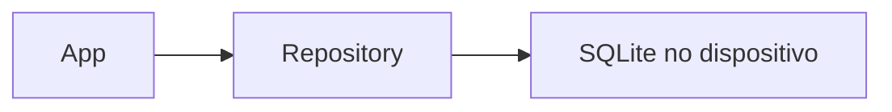
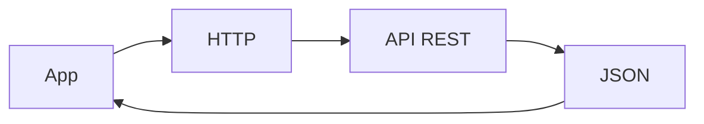
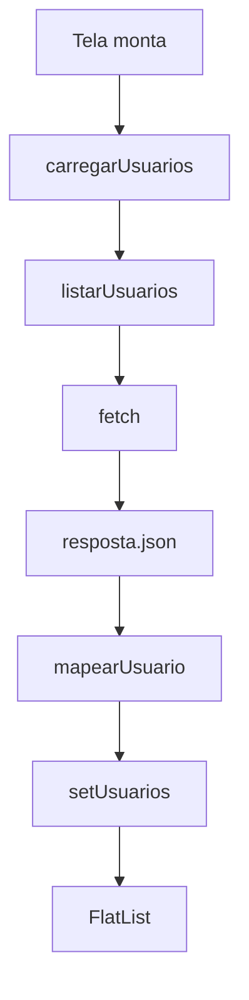

# Encontro 19 - HTTP, JSON e consumo de API REST

## Visão do encontro

- **Objetivo central:** compreender o fluxo de comunicação entre aplicativo móvel e API REST, consumir dados remotos em JSON com `fetch` e renderizar esses dados em uma interface React Native.
- Ao final deste encontro, você deve ser capaz de explicar o papel de HTTP, URL, método, status, corpo e cabeçalhos, transformar uma resposta JSON em objetos TypeScript e separar o consumo de API da interface do aplicativo.

## Roteiro

1. Retomada dos encontros 17 e 18.
2. Dado local x dado remoto.
3. Fundamentos de HTTP.
4. JSON como formato de troca.
5. Primeiro teste de uma API REST.
6. Criação do projeto.
7. Serviço de API com `fetch`.
8. Integração com a interface.
9. Envio básico com `POST`.
10. Checkpoint de consumo REST.
11. Prática 10.
12. Checklist de validação.
13. Erros comuns.
14. Exercícios de revisão.
15. Exercícios de estudo.
16. Resumo do encontro.

## 1. Retomada dos encontros 17 e 18

Nos encontros anteriores, trabalhamos com dados locais:



Esse fluxo funciona mesmo sem internet, porque o dado fica no próprio aparelho.

Agora o dado virá de outro lugar:



O aplicativo passa a depender de comunicação em rede.

## 2. Dado local x dado remoto

| Aspecto | SQLite local | API REST |
|---|---|---|
| Onde o dado está | no dispositivo | em um servidor |
| Precisa de internet | não | geralmente sim |
| Formato de consulta | SQL | HTTP |
| Formato de troca | objetos internos | JSON |
| Latência | baixa | variável |
| Falhas comuns | erro de banco | rede, servidor, status HTTP |
| Uso típico | offline, cache, dados locais | sincronização, dados compartilhados |

Aplicativos reais costumam combinar os dois:

- SQLite guarda dados offline;
- API REST compartilha dados entre usuários e dispositivos;
- uma camada de sincronização conecta os dois mundos.

Neste encontro, o foco será entender o lado remoto.

## 3. Fundamentos de HTTP

HTTP é o protocolo usado para pedir e receber recursos na web.

Uma requisição costuma ter:

| Parte | Exemplo | Função |
|---|---|---|
| URL | `https://api.exemplo.com/users` | endereço do recurso |
| Método | `GET` | ação desejada |
| Headers | `Content-Type: application/json` | metadados da requisição |
| Body | `{ "titulo": "Teste" }` | dados enviados |

Uma resposta costuma ter:

| Parte | Exemplo | Função |
|---|---|---|
| Status | `200` | resultado da requisição |
| Headers | `Content-Type` | metadados da resposta |
| Body | JSON | dados retornados |

### Métodos comuns

| Método | Uso |
|---|---|
| `GET` | buscar dados |
| `POST` | criar recurso |
| `PUT` | substituir recurso |
| `PATCH` | alterar parte de um recurso |
| `DELETE` | remover recurso |

### Classes de status

| Classe | Significado |
|---|---|
| `2xx` | sucesso |
| `3xx` | redirecionamento |
| `4xx` | erro causado pela requisição |
| `5xx` | erro no servidor |

Exemplos frequentes:

| Status | Leitura prática |
|---|---|
| `200` | deu certo |
| `201` | criado com sucesso |
| `400` | requisição inválida |
| `401` | não autenticado |
| `403` | sem permissão |
| `404` | recurso não encontrado |
| `500` | erro interno do servidor |

## 4. JSON como formato de troca

JSON é um formato textual usado para transportar dados.

Exemplo de resposta:

```json
{
  "id": 1,
  "name": "Leanne Graham",
  "email": "leanne@example.com",
  "company": {
    "name": "Romaguera-Crona"
  }
}
```

Em JavaScript, a resposta precisa ser interpretada:

```tsx
const resposta = await fetch(url);
const dados = await resposta.json();
```

### Atenção ao TypeScript

O TypeScript ajuda durante o desenvolvimento, mas não valida automaticamente o JSON recebido em tempo de execução.

Este tipo descreve o formato esperado:

```tsx
type UsuarioApi = {
  id: number;
  name: string;
  email: string;
  phone: string;
  website: string;
  company: {
    name: string;
  };
};
```

Mas a API ainda pode retornar algo diferente. Em projetos reais, validações adicionais podem ser necessárias.

## 5. Primeiro teste de uma API REST

Neste encontro, usaremos a API pública JSONPlaceholder.

Endpoint:

```text
https://jsonplaceholder.typicode.com/users
```

Abra esse endereço no navegador. Você deve ver uma lista JSON de usuários.

Também é possível testar um recurso específico:

```text
https://jsonplaceholder.typicode.com/users/1
```

O objetivo não é criar uma conta ou alterar dados reais. Essa API é apropriada para testes didáticos.

## 6. Criar o projeto

Crie um novo aplicativo:

```bash
npx create-expo-app@latest contatos-api --template blank-typescript
cd contatos-api
```

Inicie o projeto:

```bash
npx expo start
```

Não é necessário instalar uma biblioteca extra para este encontro. O `fetch` já está disponível no ambiente React Native.

## 7. Criar o serviço de API

Crie a estrutura:

```text
contatos-api/
  App.tsx
  src/
    services/
      usuariosApi.ts
```

Crie o arquivo `src/services/usuariosApi.ts`:

```tsx
const API_URL =
  'https://jsonplaceholder.typicode.com/users';

export type Usuario = {
  id: number;
  nome: string;
  email: string;
  telefone: string;
  site: string;
  empresa: string;
};

type UsuarioApi = {
  id: number;
  name: string;
  email: string;
  phone: string;
  website: string;
  company: {
    name: string;
  };
};

function mapearUsuario(usuario: UsuarioApi): Usuario {
  return {
    id: usuario.id,
    nome: usuario.name,
    email: usuario.email,
    telefone: usuario.phone,
    site: usuario.website,
    empresa: usuario.company.name,
  };
}

export async function listarUsuarios() {
  const resposta = await fetch(API_URL);

  if (!resposta.ok) {
    throw new Error(
      `Erro HTTP ${resposta.status}`
    );
  }

  const dados = await resposta.json() as UsuarioApi[];

  return dados.map(mapearUsuario);
}
```

### Leitura do código

1. `API_URL` centraliza o endpoint.
2. `UsuarioApi` representa o formato recebido da API.
3. `Usuario` representa o formato usado pela tela.
4. `mapearUsuario` adapta nomes em inglês para nomes usados no app.
5. `fetch` faz a requisição HTTP.
6. `resposta.ok` indica se o status está na faixa de sucesso.
7. `resposta.json()` interpreta o corpo da resposta.

### Por que mapear dados?

A API usa campos como `name`, `phone` e `website`.

A interface pode preferir `nome`, `telefone` e `site`.

Manter essa conversão no serviço evita espalhar detalhes externos pela tela.

## 8. Integrar com a interface

Substitua o conteúdo de `App.tsx`:

```tsx
import { useCallback, useEffect, useState } from 'react';
import {
  ActivityIndicator,
  FlatList,
  Pressable,
  StyleSheet,
  Text,
  View,
} from 'react-native';

import {
  Usuario,
  listarUsuarios,
} from './src/services/usuariosApi';

export default function App() {
  const [usuarios, setUsuarios] = useState<Usuario[]>([]);
  const [carregando, setCarregando] = useState(true);
  const [erro, setErro] = useState('');

  const carregarUsuarios = useCallback(async () => {
    try {
      setErro('');
      setCarregando(true);

      const lista = await listarUsuarios();
      setUsuarios(lista);
    } catch (error) {
      console.error(error);
      setErro(
        'Nao foi possivel carregar os contatos remotos.'
      );
    } finally {
      setCarregando(false);
    }
  }, []);

  useEffect(() => {
    carregarUsuarios();
  }, [carregarUsuarios]);

  return (
    <View style={styles.container}>
      <View style={styles.cabecalho}>
        <View>
          <Text style={styles.titulo}>Contatos API</Text>
          <Text style={styles.subtitulo}>
            Dados remotos em JSON
          </Text>
        </View>

        <Pressable
          style={styles.botaoAtualizar}
          onPress={carregarUsuarios}
          disabled={carregando}
        >
          <Text style={styles.botaoAtualizarTexto}>
            Atualizar
          </Text>
        </Pressable>
      </View>

      {erro ? (
        <View style={styles.aviso}>
          <Text style={styles.avisoTexto}>{erro}</Text>
        </View>
      ) : null}

      {carregando ? (
        <View style={styles.carregando}>
          <ActivityIndicator size="large" color="#2563eb" />
          <Text style={styles.carregandoTexto}>
            Buscando dados da API...
          </Text>
        </View>
      ) : (
        <FlatList
          data={usuarios}
          keyExtractor={(item) => String(item.id)}
          contentContainerStyle={styles.lista}
          ListEmptyComponent={
            <Text style={styles.listaVazia}>
              Nenhum contato retornado.
            </Text>
          }
          renderItem={({ item }) => (
            <View style={styles.card}>
              <Text style={styles.nome}>{item.nome}</Text>
              <Text style={styles.empresa}>
                {item.empresa}
              </Text>

              <View style={styles.linha}>
                <Text style={styles.rotulo}>Email</Text>
                <Text style={styles.valor}>{item.email}</Text>
              </View>

              <View style={styles.linha}>
                <Text style={styles.rotulo}>Telefone</Text>
                <Text style={styles.valor}>
                  {item.telefone}
                </Text>
              </View>

              <View style={styles.linha}>
                <Text style={styles.rotulo}>Site</Text>
                <Text style={styles.valor}>{item.site}</Text>
              </View>
            </View>
          )}
        />
      )}
    </View>
  );
}

const styles = StyleSheet.create({
  container: {
    flex: 1,
    backgroundColor: '#f8fafc',
    paddingHorizontal: 20,
    paddingTop: 60,
  },
  cabecalho: {
    flexDirection: 'row',
    alignItems: 'flex-start',
    justifyContent: 'space-between',
    gap: 16,
  },
  titulo: {
    fontSize: 28,
    fontWeight: '700',
    color: '#0f172a',
  },
  subtitulo: {
    marginTop: 6,
    fontSize: 15,
    color: '#475569',
  },
  botaoAtualizar: {
    minHeight: 42,
    justifyContent: 'center',
    paddingHorizontal: 14,
    borderRadius: 8,
    backgroundColor: '#2563eb',
  },
  botaoAtualizarTexto: {
    color: '#ffffff',
    fontWeight: '700',
  },
  aviso: {
    marginTop: 18,
    padding: 14,
    borderRadius: 8,
    backgroundColor: '#fee2e2',
    borderWidth: 1,
    borderColor: '#fecaca',
  },
  avisoTexto: {
    color: '#991b1b',
  },
  carregando: {
    flex: 1,
    alignItems: 'center',
    justifyContent: 'center',
    gap: 12,
  },
  carregandoTexto: {
    color: '#475569',
  },
  lista: {
    paddingTop: 20,
    paddingBottom: 32,
    gap: 12,
  },
  listaVazia: {
    marginTop: 32,
    textAlign: 'center',
    color: '#64748b',
  },
  card: {
    padding: 16,
    borderRadius: 8,
    backgroundColor: '#ffffff',
    borderWidth: 1,
    borderColor: '#e2e8f0',
  },
  nome: {
    fontSize: 18,
    fontWeight: '700',
    color: '#0f172a',
  },
  empresa: {
    marginTop: 4,
    color: '#475569',
  },
  linha: {
    marginTop: 12,
  },
  rotulo: {
    fontSize: 12,
    fontWeight: '700',
    color: '#64748b',
    textTransform: 'uppercase',
  },
  valor: {
    marginTop: 2,
    color: '#1e293b',
  },
});
```

### Fluxo da tela



### O que mudou em relação ao SQLite

No SQLite, a consulta era local:

```tsx
const lista = await listarEquipamentos();
```

Agora a função ainda parece simples para a tela:

```tsx
const lista = await listarUsuarios();
```

Mas, por dentro, ela depende de uma requisição HTTP.

Essa semelhança é intencional. A interface não precisa saber se o dado veio de banco local, API ou outro serviço. Ela precisa receber uma lista pronta para renderizar.

## 9. Envio básico com POST

Além de buscar dados com `GET`, APIs REST geralmente recebem dados com `POST`.

Crie o arquivo `src/services/postsApi.ts`:

```tsx
const POSTS_URL =
  'https://jsonplaceholder.typicode.com/posts';

type NovoPost = {
  titulo: string;
  corpo: string;
  usuarioId: number;
};

type PostCriado = {
  id: number;
  title: string;
  body: string;
  userId: number;
};

export async function criarPostExemplo(
  post: NovoPost
) {
  const resposta = await fetch(POSTS_URL, {
    method: 'POST',
    headers: {
      'Content-Type': 'application/json',
    },
    body: JSON.stringify({
      title: post.titulo,
      body: post.corpo,
      userId: post.usuarioId,
    }),
  });

  if (!resposta.ok) {
    throw new Error(
      `Erro HTTP ${resposta.status}`
    );
  }

  return resposta.json() as Promise<PostCriado>;
}
```

### Leitura do código

1. `method: 'POST'` informa que o app quer criar um recurso.
2. `headers` avisa que o corpo está em JSON.
3. `JSON.stringify` transforma o objeto em texto JSON.
4. `body` carrega os dados enviados.
5. `resposta.json()` interpreta o JSON retornado pelo servidor.

### Observação importante

No JSONPlaceholder, operações de escrita são simuladas. A API retorna uma resposta como se tivesse criado o recurso, mas não altera permanentemente o servidor.

Isso é suficiente para aprender o formato de uma requisição.

## 10. Checkpoint de consumo REST

Execute os testes:

1. abra o endpoint `/users` no navegador;
2. confirme que a resposta é uma lista JSON;
3. execute o app;
4. confirme que a lista aparece no dispositivo;
5. toque em **Atualizar**;
6. desligue temporariamente a internet do dispositivo ou emulador;
7. toque em **Atualizar** novamente;
8. observe a mensagem de erro;
9. reative a internet;
10. toque em **Atualizar** e confirme a recuperação.

Esse teste mostra que dados remotos exigem tratamento de rede.

O encontro 20 aprofundará esse ponto com estratégias mais completas de carregamento, erro, `fetch`, Axios e estados de interface.

## 11. Prática 10 - Consumo de API REST

### Objetivo

Construir um aplicativo chamado **Mural Remoto** que consuma uma API REST pública e renderize dados JSON.

### Endpoint sugerido

```text
https://jsonplaceholder.typicode.com/posts
```

### Requisitos mínimos

1. Criar um projeto Expo com TypeScript.
2. Criar uma pasta `src/services`.
3. Criar um serviço para acessar a API.
4. Centralizar a URL base.
5. Definir um tipo para o JSON recebido.
6. Definir um tipo para o dado usado na tela.
7. Mapear os dados recebidos para o formato da interface.
8. Buscar dados com `fetch`.
9. Verificar `resposta.ok`.
10. Interpretar a resposta com `resposta.json()`.
11. Renderizar a lista com `FlatList`.
12. Exibir estado de carregamento.
13. Exibir mensagem simples de erro.
14. Criar botão para atualizar os dados.
15. Testar a API no navegador antes de usar no app.
16. Explicar quais campos vieram da API.

### Extensões opcionais

- filtrar posts por `userId`;
- exibir detalhes de um post selecionado;
- buscar comentários de um post;
- criar uma simulação de `POST`;
- comparar o formato recebido com o formato renderizado.

### Entrega esperada

- app funcional consumindo dados remotos;
- serviço de API separado da tela;
- lista renderizada a partir de JSON;
- tratamento básico de carregamento e erro;
- explicação curta do endpoint usado;
- print ou demonstração do app carregando dados da internet.

## 12. Checklist de validação do aluno

- consigo explicar a diferença entre dado local e dado remoto;
- sei identificar URL, método, status, headers e body;
- entendo para que serve `GET`;
- entendo para que serve `POST`;
- testei o endpoint no navegador;
- criei um serviço separado para acessar a API;
- usei `fetch` com `await`;
- verifiquei `resposta.ok`;
- converti a resposta com `resposta.json()`;
- defini tipos TypeScript para o formato recebido;
- mapeei dados externos para o formato da tela;
- renderizei a lista com `FlatList`;
- exibi carregamento durante a requisição;
- exibi erro quando a API não respondeu corretamente;
- consigo explicar por que rede pode falhar mesmo com o código correto.

## 13. Erros comuns

### Esquecer o `await` antes de `resposta.json()`

```tsx
const dados = resposta.json();
```

Nesse caso, `dados` será uma `Promise`, não a lista pronta.

Use:

```tsx
const dados = await resposta.json();
```

### Confiar apenas no tipo TypeScript

O tipo descreve o que esperamos, mas não garante que a API enviou exatamente aquilo.

### Não verificar `resposta.ok`

Uma resposta `404` ou `500` ainda pode chegar ao `fetch`. Verifique o status antes de usar os dados.

### Misturar URL e renderização

Evite espalhar endpoints dentro do componente. Centralize em um serviço.

### Usar campos da API diretamente em toda a tela

Se a API usa `name`, mas o app usa `nome`, faça a conversão em um ponto só.

### Ignorar ausência de internet

O app precisa continuar compreensível quando a rede falha. Pelo menos uma mensagem de erro deve aparecer.

### Enviar objeto no `body` sem JSON

```tsx
body: {
  title: 'Teste',
}
```

O corpo HTTP precisa ser texto ou outro formato aceito pela API:

```tsx
body: JSON.stringify({
  title: 'Teste',
})
```

## 14. Exercícios de revisão

1. O que é HTTP?
2. O que é uma URL?
3. Qual é a função do método `GET`?
4. Qual é a função do método `POST`?
5. O que significa um status `2xx`?
6. O que significa um status `4xx`?
7. O que significa um status `5xx`?
8. Para que serve o header `Content-Type`?
9. O que `JSON.stringify` faz antes de um envio?
10. O que `resposta.json()` faz depois de uma resposta?
11. Por que criar um serviço de API separado da tela?
12. Por que dados remotos exigem estado de carregamento?

## 15. Exercícios de estudo

- Consuma `https://jsonplaceholder.typicode.com/posts?userId=1`.
- Crie uma tela simples de detalhes para um post.
- Busque comentários de um post com `/posts/1/comments`.
- Crie uma função de serviço para buscar um usuário por `id`.
- Compare `GET`, `POST`, `PUT`, `PATCH` e `DELETE`.
- Pesquise o que é autenticação por token.
- Explique como uma resposta remota poderia ser salva em SQLite para uso offline.
- Descreva quais melhorias de erro e loading seriam necessárias em um app real.

## 16. Resumo do encontro

Neste encontro, você passou do dado local para o dado remoto. Estudou os elementos básicos de HTTP, interpretou JSON recebido de uma API REST, criou um serviço com `fetch`, mapeou o formato externo para o formato da interface e renderizou uma lista remota em React Native.

Também observou que requisições podem falhar por status HTTP, ausência de internet ou formato inesperado. No encontro 20, esse conhecimento será aprofundado com tratamento de erros, estados de loading mais cuidadosos e comparação entre `fetch` e Axios.

## Materiais complementares

- React Native docs (`Networking`): <https://reactnative.dev/docs/network>
- MDN (`Using the Fetch API`): <https://developer.mozilla.org/docs/Web/API/Fetch_API/Using_Fetch>
- MDN (`HTTP response status codes`): <https://developer.mozilla.org/docs/Web/HTTP/Reference/Status>
- MDN (`JSON`): <https://developer.mozilla.org/docs/Web/JavaScript/Reference/Global_Objects/JSON>
- JSONPlaceholder (`Guide`): <https://jsonplaceholder.typicode.com/guide/>
