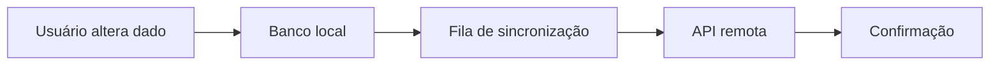

# Encontro 21 - Sincronização local-remoto

## Objetivos

- Integrar dados persistidos localmente com uma API remota.
- Discutir conflitos, fila de envio e estados offline.
- Compreender sincronização como problema de consistência.

## Explicação técnica

Sincronizar dados significa decidir quem é a fonte de verdade em cada momento. Em apps móveis, latência e ausência de conexão tornam esse problema mais interessante. Vale comparar o modelo "offline first" com o modelo estritamente online para entender vantagens e limitações de cada abordagem.



## Exemplo conceitual

```ts
type RegistroSincronizacao = {
  idLocal: string;
  status: 'pendente' | 'sincronizado' | 'erro';
};
```

## Atividade

- Marcar registros pendentes.
- Simular sincronização ao tocar em um botão.
- Discutir o que fazer em caso de conflito.

## Materiais complementares

- Estratégias offline first.
- TanStack Query offline examples: <https://tanstack.com/query/latest>
