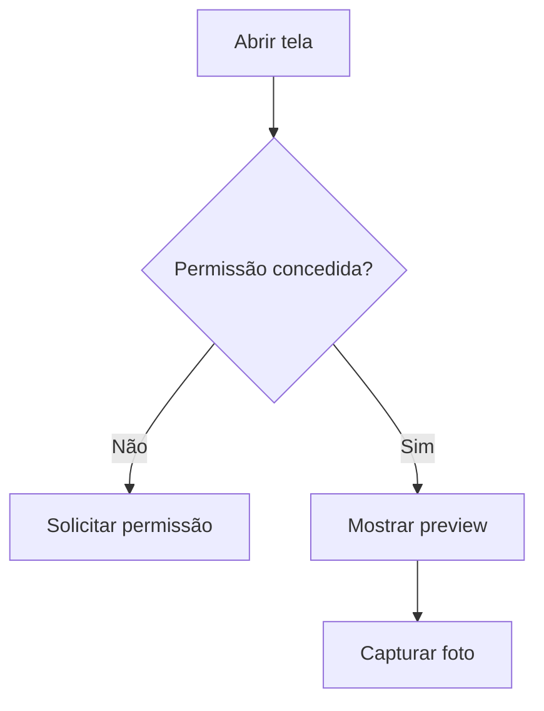

# Encontro 23 - Câmera: captura, preview e permissão

## Objetivos

- Solicitar permissão de câmera.
- Capturar imagem.
- Discutir preview, compressão e privacidade.

## Conteúdo técnico

Recursos embarcados exigem negociação explícita com o sistema operacional. O estudante deve aprender que permissão negada não é exceção improvável; é fluxo normal da aplicação e precisa ser tratado com interface clara.

```tsx
const [permission, requestPermission] = useCameraPermissions();

if (!permission?.granted) {
  return <Button title="Permitir câmera" onPress={requestPermission} />;
}
```

## Imagem ou diagrama sugerido



## Atividade

- Criar tela de captura de avatar.
- Salvar URI da imagem para uso posterior.

## Materiais complementares

- Expo Camera: <https://docs.expo.dev/versions/latest/sdk/camera/>
- Permissões Android: <https://developer.android.com/training/permissions/requesting>
