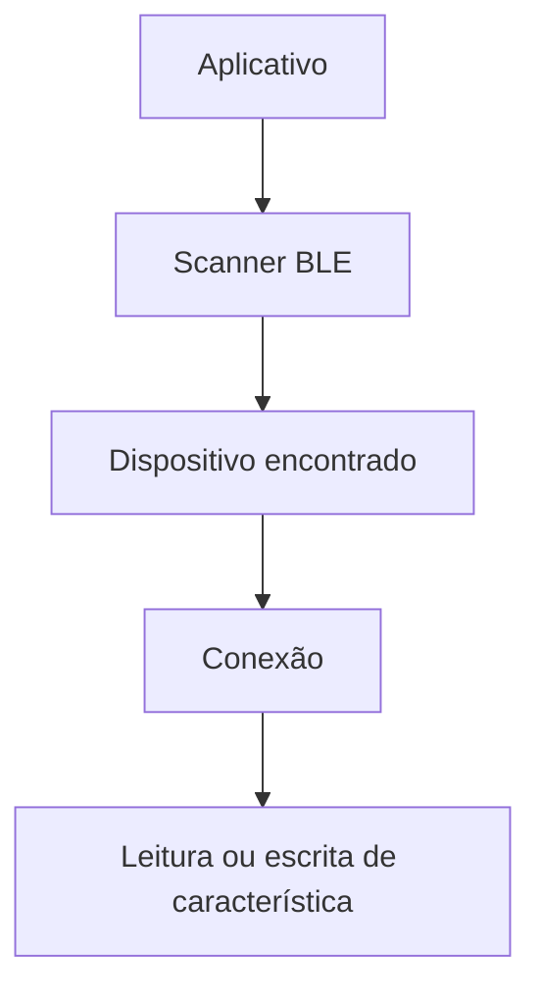

# Encontro 25 - Bluetooth: conceitos, limites e casos de uso

## Objetivos

- Introduzir Bluetooth clássico e BLE.
- Discutir cenários de uso em apps móveis.
- Entender limitações práticas e de compatibilidade.

## Explicação didática

Bluetooth em desenvolvimento móvel costuma aparecer em integrações com sensores, beacons, dispositivos vestíveis e automação. O mais importante aqui é construir repertório técnico e senso crítico, porque a implementação real depende bastante de plataforma, hardware e bibliotecas.

## Tópicos para aprofundamento

- descoberta de dispositivos;
- serviços e características;
- consumo de bateria;
- permissões e privacidade.

## Atividade

- Analisar estudo de caso de app conectado a sensor.
- Mapear quais etapas seriam necessárias para um protótipo real.

## Materiais complementares

- Android BLE overview: <https://developer.android.com/develop/connectivity/bluetooth/ble/ble-overview>
- Core Bluetooth overview: <https://developer.apple.com/documentation/corebluetooth>
